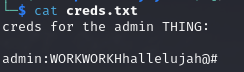

# PORT SCAN
* **21** &#8594; FTP
* **22**  &#8594; SSH
* **53**  &#8594; DNS (BIND 9.11.3)
* **80**  &#8594; HTTP (APACHE 2.4.29)
* **139 / 445**  &#8594; SAMBA
* **443**  &#8594; HTTPS

   

# ENUMERATION & USER FLAG
The  HTTP page is pretty simple and static

Pretty strange services right here, not want to be involved to be honest lol. The HTTPS page returned a not found error but checking the certificate we have something a possible domain that end with `.red`

After adding the record to the host file we can access the HTTPS website!

Now I fired up some web enumeration and while they are cooking I checked the other protocols, FTP is closed to anonymous access but SAMBA have something for people without credentials like me!

The only file that I have found was `/general/creds.txt`, the other directories where empty or need credentials

I tought the "admin thing" was the path portal that can be found on `/admin` discovered with GoBuster but was an empty directory with no file inside it, pretty bad but maybe we can use this credentials something else. Bruteforcing subdomains return nothin so I played a little with the DNS service and requesting AXFR records we have a new VHOSTs

We have a good amount of domains to add at the host file, on **administrator1** subdomain we have a panel where we can try to use our credentials

After the login we are redirected on a dashboard with a simple PHP code that allows to view images specifying them on a GET variable, this sounds pretty goof

The image requested would be used inside a HTML img tag

Pretty interesting stuff, the static path where the img is extracted is on `/images` and through the `uploads.friendzone.red` domain we are able to upload image files 

Somehow the uploaded files are not stored in `/images`, pretty bad. If we look closely to the example GET parameters we have there is also the **pagename** variable that is set to **timestamp** as default. Converting the timestamp returned the current time, pretty strange. Given the name of the GET variable I visited `/timestamp.php` which is simply the same output we have on the dashboard page, this mean a LFI is possible!

To leverage this we can return back to SMB where we can access 2 folders : 1 where we found the credentials file and `Development` which is empty but allowed an anonymous user to upload some files, BINGO! On the first screenshoot of SAMBA you can see that the location of folder seems to be `/etc/[folder_name]`. Is everything we need to get a reverse shell, I created the malicious PHP file, uploaded on Development SAMBA directory and than access it through the LFI assigning `/etc/Development/re.php` to the **pagename** after that the reverse shell will popup!

Now we are free to grab the user flag!

   

# PRIVILEGE ESCALATION
Find some credentials for SSH was not an hard task, inisde `/var/www/mysql_data.conf` we have a pair of credentials of a system user, always check web related directories ehehe

Enumeration on the system revealed not many information as I wanted so is worth to run **<u>pspy</u>** and see if some cron job is running behind the curtains, this apper to be the case

There is not much here and we have no permission to modify it but we have the `import os` line that can turn usefull. Runnin `/usr/bin/python -v` I was able to retrieve the path of the OS library

What's interesting is that we can modify it, if there is a method to execute a command when the python library is imported would be great! This technique exist and is called **<u>Python library Hijacking</u>**. In python a library is simply a set of function definitions and when imported the whole code is executed so during runtime that functions can be used. this everything we need to know, we can add a line directly inside the library (`os.py`) that add a SUID bit to the `/bin/bash` binary. I used `system("chmod 4777 /bin/bash")` and when the script would be executed again the magic happens!

We are out of the friendzone I think...or we simply owned it? 
