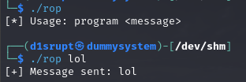
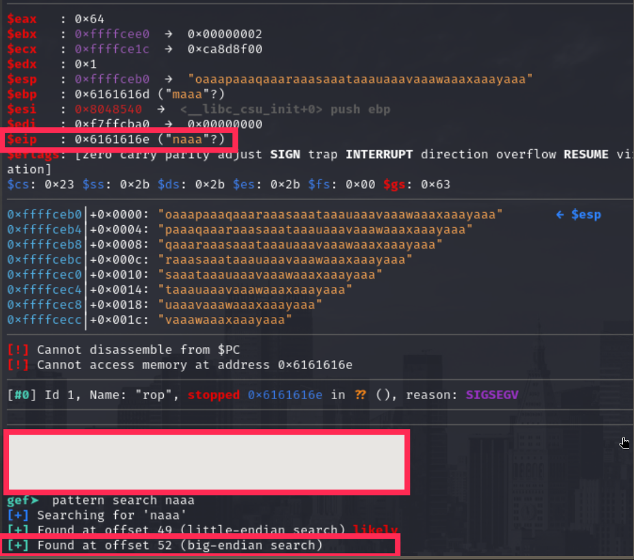

# PORT SCAN
* **22** &#8594;SSH
* **139 / 445** &#8594; SAMBA
* **1800** &#8594; HTTP (NODEJS)
* **9999** &#8594; HTTP (NGINX)

   

# ENUMERATION & USER FLAG
Pretty strange port mapping, on port **9999** we have a standard nginx page

I tried to visit port `1880` but return "Server Not Found" error but using curl I am able to see the code source, pretty bad stuff but maybe SMB can give us something....

Even here in this protocl, nothing, cool is time to web enumeration!  
The first thinf I found is `/admin` with a simple login form with only 3 attempts available (just reload the page will reset the attempts), here I tried some simple SQL injection but apparently is not the case also no way to do some bruteforcing so I waited for some other results from the dirbusting.
`/test` is a simple PHPINFO page and `/dev` is not accessible (probably we will be redirected there after the login form). Just a lil bit of patience and `/backup` will popup

The credentials are not working, probably the password has been changed but the username sems to be valid. About `/backup/loop` and `/loop` we receive error **403** so again it can maybe suggest we can access it only after crednetials have been found. I have slammed my head on my wall for how much stupid was this. I checked the source code and the login form is linked to the `login.js` script which well, is not that secure. Look at this LOL!

After the login I was understood how much ironic this machine creator is

Doesn't seems a random string probably is a peculiar encoder in play, with some research **<u>Ook</u>** is the encoder used and with this [online tool](https://www.splitbrain.org/services/ook) we can retrieve the plaintext

Now I went on the path specified on the obfuscated string and we have another encoded string

We can barely see what this base64 "contains" but it seems is a base64 of a file, my (little) experience suggest to try with `.zip` but saving in a file without extension and use `file`

Gottch'a, if we want to extract the file we need a password and is a child-play with **john the ripper utilities**

Very very fun, another encoding string this time is in HEX, which is a base64 which is....ehm idk what is

Here I had to watch the writeup, this is **<u>brainfuck</u>** string and we can use the same tool used on previous encoded string to get the plaintext

Uhmmm actually not fun lol. I have returned back to enumeration and try to dirbusting `/loop` and `/dev`, in the latter I have found the path `/dev/backup` path with a juicy information

We have a good number of password to try and `admin:idkwhatispass` worked, now we are inside the application and RCE is easy to establish.
The version of **PlaySMS is 1.4** and thanks to a lack of input sanitiztion using `import.php` we can execute OS commands, [this PoC](https://github.com/jasperla/CVE-2017-9101) summarize everything in a python script

Now we can spawn a reverse shell and get the user flag!

   

# PRIVILEGE ESCALATION

I have grabbed the credentials stored in `/var/www/html/playsms/config.php` and used to login into mysql searching for some other password but nothing new has been found but we have an interesting SUID binary

The name is pretty self-explainatory so I have uploaded on my machine and made a quick blind test on what this binary does

Now I used the `checksec` function of **GDB** to have the type of security measures in play

Cool the stack is not executable so a **<u>ret2libc</u>** is the objective (I have checked that ASLR is disabled on the target machine) so now we can move on and find the offset to reach the Stack pointer

The offset is 52, next step is to identify the `libc address` on the target system, `ldd` can accomplished that easily

This is the base address that will be added to our **<u>gadgets</u>**, about that we need `system`, `sh` and `exit` (the last one was not obvious at the start after looking at few writeup I understand what I was missing). For `system` and `exit` a `readelf -s` in combination with `grep` on the libc is enough. For `sh` we need to run strings and grep as well

With all of these relative address we have to add the base address of the libc library, the payload is pretty easy `OFFSET + SYSTEM + EXIT + SH`

