# PORT SCAN
* **53** &#8594; DNS
* **80** &#8594; HTTP (IIS 10.0)
* **88** &#8594; KERBEROS
* **135** &#8594; MSRPC
* **139/445** &#8594; SMB
* **389/636** &#8594; LDAP
* **5985** &#8594; EvilWinRM

   

# ENUMERATION & USER FLAG
Finally another Active Directory boxes let's get started. The NMAP scan revealed teh name of the doamin which is `fabricorp.local` while the FQDN is `Fuse.fabricorp.local`, we should start from here!

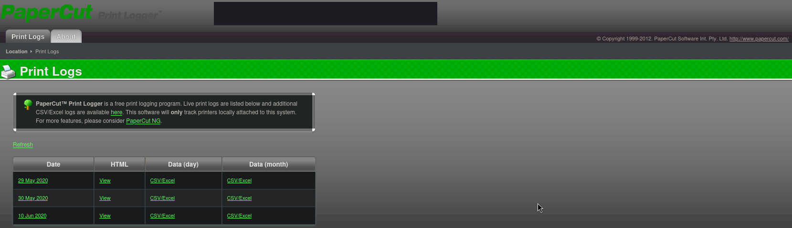

That's cool, the webserver is hosting a free print logging service called `PaperCut`, with this we can collect some precious usernames (I checked with 	`getNPUsers` if some of them was vulnerable to kerberoasting but none of them is), interesting!
I have nothing that look like a password so I started simple using the name of the domain to create a wordlist based on the word `fabricorp` and use it for password spraying

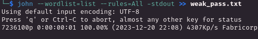

After a while we have our first result

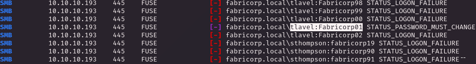

Cool let me try only with this password so we can check the situation of other accounts

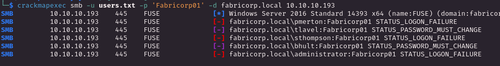

Ok cool stuff ut we can access if the password "Must Change" before the login, probably the policy for accounts use a weak password as first which should changed on the first login, makes sense but how can we circumnavigate this issue?

Well the naive method was using a RDP protocol but we have a lack off it in this enviroment, reading some blogs article show me the `smbpasswd` tool which is used for this purpose and I was able to change password of one of the accounts that need the change of the passwd.
The SMB shares are not usefull, there is nothing interesting so we can move on the RPC client and I was able to enumerate the domain users 

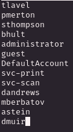

Knowing the servicerunning on port 80 and the presence of 2 user related to printers (`svc-scan` / `svc-print`) we can use RPC to enumerate the printers and we have something!
We have the printer `HP-MFT01` with hardcoded password into the description: `$fab@s3Rv1ce$1`. Time to password spraying!

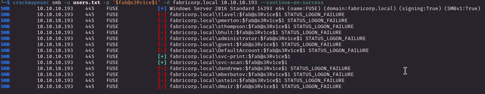

`svc-print` is the only one of the 2 accounts found that allows login through WinRM and have access to the user flag!

   

# PRIVILEGE ESCALATION

We have some interesting privileges on this account, all related to printers

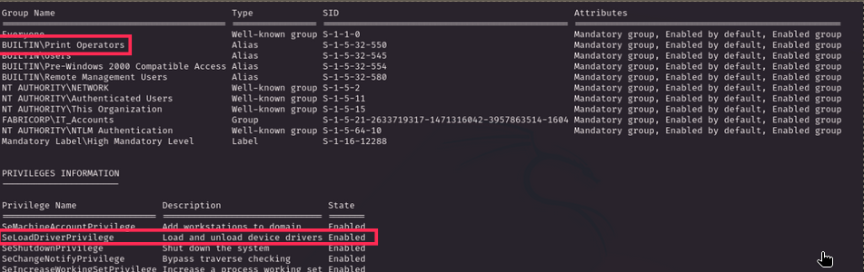

Cool, on this [article](https://www.tarlogic.com/blog/seloaddriverprivilege-privilege-escalation/#0x02_%E2%80%93_SeLoadDriverPrivilege_and_Access_Tokens) we can find something interesting about the groups we are in and the permission

> The print operators group may seem quite innocuous to the naked eye, however it has the ability to load device drivers in domain controllers as well as manage printer-type objects in the active directory. Additionally, this group has the capabilities to authenticate itself in a domain controller, so it is of special interest to verify the membership of users in this group.

This is a pretty dangerous privilege to assign because allows the user to load kernel drivers (which would run as `NT\SYSTEM`), cool our path is well defined and ready to be walked, let's get rolling!

 

1) I have created a reverse exe with `msfvenom` and uploaded on the target, will be usefull later
2) I read [this page](https://www.tarlogic.com/blog/seloaddriverprivilege-privilege-escalation/) which makes a good explanation of how to abuse this privilege and [here](https://github.com/FuzzySecurity/Capcom-Rootkit/blob/master/Driver/Capcom.sys) I downloaded a malicious driver ready to be used (`capcom.sys`)
3) Now we need to create a executable that loads the driver in the registry, [TarLogic have a PoC for us](https://raw.githubusercontent.com/TarlogicSecurity/EoPLoadDriver/master/eoploaddriver.cpp) but is a good practice to compile everything in windows as much as possible so fire up my windows VM, create a C++ project and paste the PoC, the code makes the check if the right permission is enabled and simply permit to load a driver in the selected registry. I built it and move it on the kali host machine in order to be moved on the window machine with the `capcom.sys`
4) I was a little titubant about which registry should host the driver but I looked at the code and it simply create a brand new registry so we don't need to explore further for an existing registry. Now we can shoot the exe file!
 
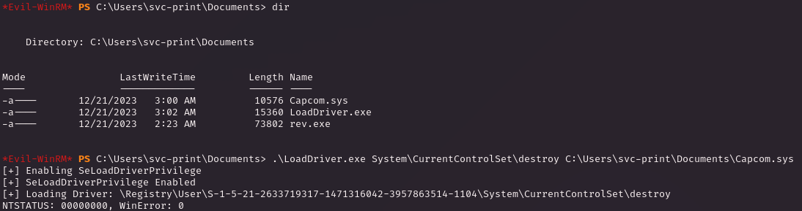
 
Obviously with the lack of GUI we can't check 100% that the registry has been locked and loaded but the `NTSTATUS` tell us that everything went smooth and successfull
 
5) Now we need the last piece of the puzzle, the way we trigger the malicious driver! shoutout too `tandasat` which made [ExploitCapcom](https://github.com/tandasat/ExploitCapcom/tree/master/ExploitCapcom), I have downloaded and open the project. After checking that it compiles without error we need to make a small change because the naive version oepn a new CMD with high privilege but we have no GUI so we need to make it execute the reverse shell we have uploaded at (1)
 

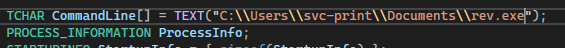

 

6) Last step, we need to rebuild the solution, move it on the target and just trigger it. The results is what we wanted a `NT Authority\System` shell!
 

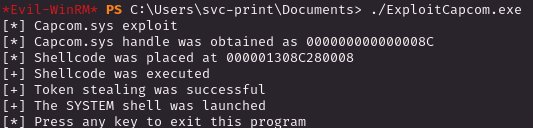

 

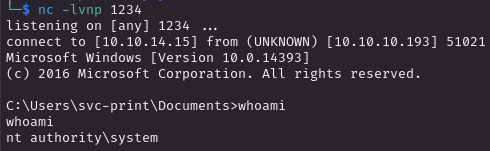

  

Interesting machine, there was also possible to do the same thing with metasploit but I prefered the manual way to get more keen with Visual Studio and also a good opportunity to take a look at some C++ code!
