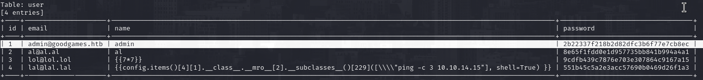
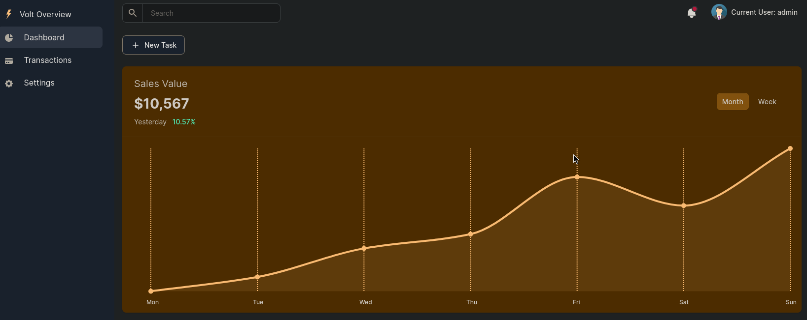
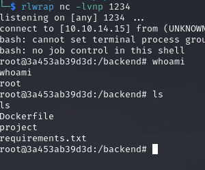
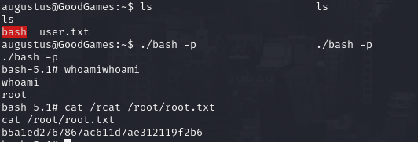

# PORT SCAN
* **80** &#8594; HTTP (APACHE 2.4.51)

   

# ENUMERATION & USER FLAG
HTTP port run `Werkzeug 2.0.2 with Flask` acting as a videogmae site with blog and store section (this last section is "under construction")

We can create an account and login displaying information about the user, maybe i can try to perform some STTI injection in the username field...when we try to login after using `{{7*7}}` as username return **<u>error 500</u>** maybe is not the right place to perform this type of attack. I need to enumerate more before try some attack vectors.

I have tried some dirbusting and vhost enumeration but output was empty or not usefull at all so I tried to perform some SQL injection with `sqlmap` (I know this tool is for noob but I am really tired at the moment, I am not a pro and I am not here to teach!) and we perform the full dump of the database especially of the `user` table also we can see my fallimentary attack attempts

The password was in MD5 format so really easy to crack, **superadministrator** is the plaintext! Now we can login as admin and `settings section` appear on the top left redirecting to **internal-administrator** subdomain where we can use the same credentials and enter in the **admin dashboard**. Let's see how we can fool the system now

In the dashboard we can change the username of the user and guess what happen when I use `{{7*7}}`....

Cool Stuff now we can try to use the STTI to perform some RCE and get a shell (retrieve a remote shell and exevute it)

`{{request.application.__globals__.__builtins__.__import__('os').popen('[command]]').read()}}`

Strange thing we are root on wherever we are spawned. It didn't take much to understand we are inside a docker container, cool!

The userflag is located here in the home directory so we can move on PE

   

# PRIVILEGE ESCALATION
Interesting, finally I can get in touch with docker and here we need to escape the docker box
Using `ifconfig` we  can say the interal docker IP address is **172.19.-0.2** and pinging 172.19.0.1 is successfull so is the host system and we can login as `augustus`

This is pretty cool, we can now copy `/bin/bash` in the home augustus folder (which is shared with the docker instance) than return back to the docker image as root and add the SUID bit (before you need to change the owner with `chown`). After that back jump back again in host amchine and you can execute the bash with `-p` flag to gain root!

