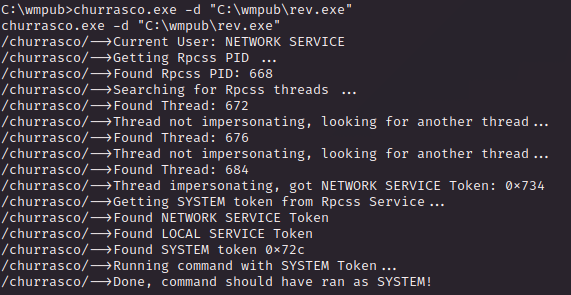

# PORT SCAN
* **80** &#8594; HTTP (IIS 6.0)

   

# ENUMERATION & USER FLAG
This should be a different version of Granny machine, I expect to have outdated OS and services that are really easy to exploit both for foothold and PE.

IIS 6.0 can be considered outdated and again the victim is using WebDAV no need to saying more but let's be cautious even if an easy machine and check the webpage

Again this banner is pretty equal to Granny for now but the shortname scanner didn't worked. This was expected because this flaw work for IIS 7.5 (a try was worth), going on I tried both `cadaver` and `davtest` but was not what I expected both tools are not usefull for now

Interesting, my intuition suggest me to focus on the IIS version
and I found an interesting exploit which can let us put our first step on the victim ground.
 

Cool, the exploit is a simple ROP chain that allows attacker to return RCE. With some research the CVE is **<u>CVE-2017-7269</u>** (CVS score 10, ouch!) and we can both use thi [PoC](https://github.com/danigargu/explodingcan) or the module `exploit/windows/iis/iis_webdav_scstoragepathfromurl` on metasploit, I opted with the latter to refresh my confidence with metasploit.

Metasploit was pretty mean with me today, somehow didn't create a session for me even changing payloads
 
 
 
No need to slam our head on the wall again I opted to the POC found on github, the execution is pretty simple we need first to generate a raw shellcode with msfvenom

Than just run the exploit but another error occurd, strange/ I check other writeup and this was exactly the way to exploit it, I checked the reviews and people complaints about the machine being very laggy and unstable so I restarted and every method works, metasploit too!

Shit happen especially with this old machine (this one was created in 2017) just some patience and everything will be fine

> Hacking teach me everyday what is patience and why is important, I don't wanna sound like a philosopher but is real if this thing happened 3 years ago I would hve already get angry for no reason, hacking is fun! :)
 
 Like granny we are inside as `nt authority\ network service` and we have the so dangerous `SeImpersonatePrivilege`
 
 
 
 We can't have any flag now so I am moving on the next section
 
   

# PRIVILEGE ESCALATION

This should be simple like grandma but I would to try a different way instead of running some exploit from metasploit. I discovered `churrasco.exe` which exploit **<u>MS09-12</u>**

> The vulnerabilities could allow elevation of privilege if an attacker is allowed to log on to the system and then run a specially crafted application. The attacker must be able to run code on the local machine in order to exploit this vulnerability. An attacker who successfully exploited any of these vulnerabilities could take complete control over the affected system.

So I used impacket to create a local SMB server on kali and uploaded churrasco and test if work as intended

Perfect! now is simple I uploaded a reverse shell exe file and execute with burrasco (with the `-d` flag because I was corious to see what happen behind teh curtains)

We have what we deserve

