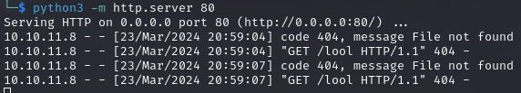

# PORT SCAN
* **22** &#8594; SSH
* **5000** &#8594; HTTP

   

# ENUMERATION & USER FLAG
The web port is really really simple

These thing seems pretty useless but with some enumeration I came across `/dashboard` that unlucky return a <u>401 error</u>.

Coll stuff, using burp to intercept the request we can see an interesting cookie is sent!

Strange cookie...using the Burp Decoder we can se the plaintext with base64 decode

Cool stuff, now I tried to send a simple **img tag** that point to my attacker http server to check if some XSS is possible but the creator of the box were pretty aware of this possibility....

My mind was tickling about poisoning one of the header records with the same malicious IMG tag, redo the detection with same payload and see the results. Luckly it worked

This is cool now the plan s simple, since this report would be seen by an administrator (and I assume would be seen inside the browser) we can try to inject inside the user agent an XSS payload like this ``. To intercept the request I use a simple PHP server (otherwise we would not be able to see the cookies), after I sent the poisoned request it took a few minutes before receive the request!

Now I can use this cookie to reach the `/dashboard`

I have played a little bit with the <u>health report</u> request and found a OS injection vulnerability

With this we are able to get a reverse shell and read the first flag

   

# PRIVILEGE ESCALATION

Even if we have control of a service user a special sudo permission on a costum bash script is allowed to be used

The bash script just check some basics system health value but a small section of the code is interesting because execute a SH script in the same directory the command is run called `initdb.sh`

Nothing more to say we have a way to execute OS command as root, I create a one-liner script that just spawn an interactive shell process that we can use it as root, after running back the costum script with SUDO we can read the flag!

