# PORT SCAN
* **80** &#8594; HTTP (IIS)
* **135** &#8594; MSRPC
* **445** &#8594; SMB
* **5985** &#8594; WinRM

   

# ENUMERATION & USER FLAG
The webpage is a (beautiful) login pagess

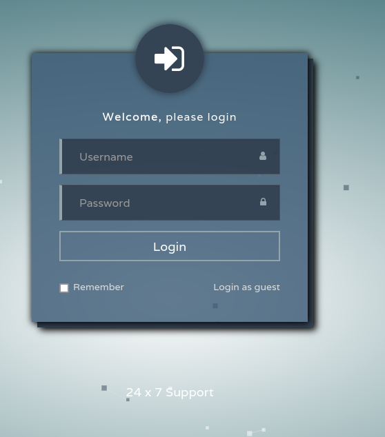

No worries we can `login as guest` 

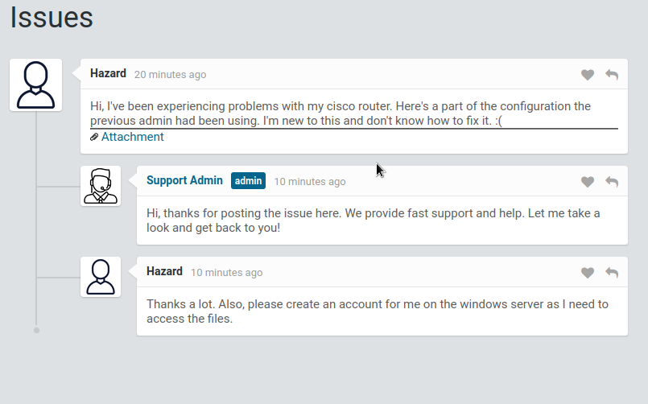

We have an issues thread started from user `Hazard` who also attached a file. The file is the configuration file of a cisco router containing a password hash

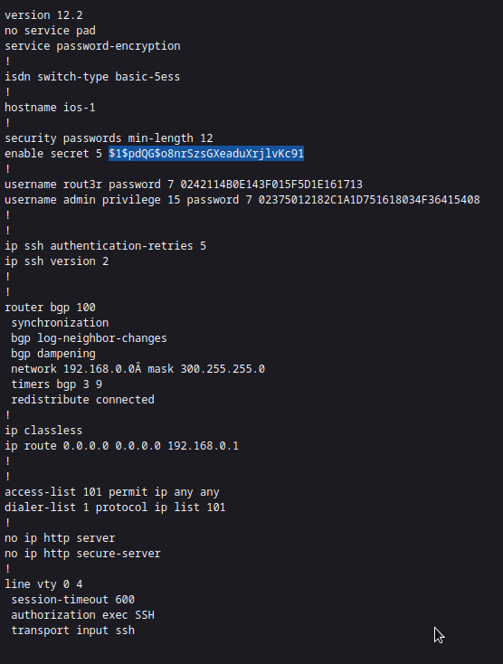

The password obtained is a **type 5** (in cisco) which is a simple MD5 hash, hashcat ready to crack this and take a plaintext password

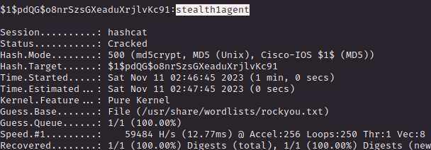

I try to use this password with the username `Hazard` on WinRM but no access, maybe we need more user enumeration

I used the impacket script `lookupSID` to get some users and we have a cool list now 

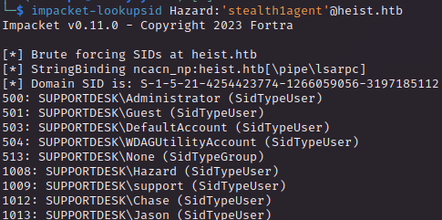

Using crackmapexec we have no other match if not the same user we  already have control off

Checking the Cisco File we have some **<u>type 7 passwords</u>** both `rout3r` and `admin`. The **<u>type 7</u>**  has been cracked in 1995 and are easy reversible even for a [online tool](https://www.networkers-online.com/tools/cisco-type7-password-decrypt/) like this. The 2 passwords are `Q4)sJu\Y8qz*A3?d` and 
`$uperP@ssword` is time for a second run of CME.

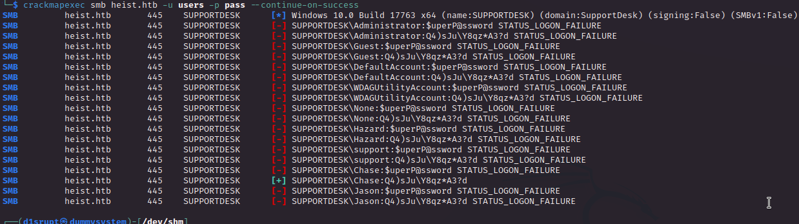

Hello Chase, thanks for your account which have access to winRM and on the desktop rely the user flag :)

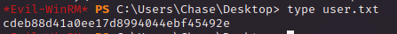

   

# PRIVILEGE ESCALATION
With my surprise we have `Mozilla Firefox` inside the `Program Files` directory, cool we are dealing with a widely used browser here

I spend some time surfing the web searching for something cool and I have encountered [this medium article](https://kylemistele.medium.com/stealing-saved-browser-passwords-your-new-favorite-post-exploitation-technique-c5e72c86159a) which cover how to retrieve firefox saved passwords, I followed the steps and retrieve the `key4.db` but is not working somehow.
I found a new tool (which I will add to my arsenal the only downise is its not lightweight at all) called [LaZagne](https://github.com/AlessandroZ/LaZagne/tree/master) which retrieve all password that it can using different technique. I get no credentials here BUT I was able to understand that the firefox password database was empty (in short no passwords are stored). 

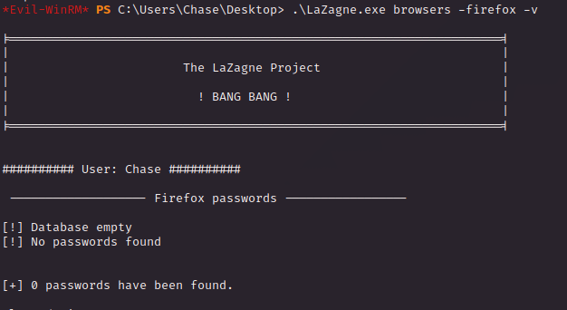

We have no options but to perfrom a memory dump, first let's see if firefox is running while we are playing with the box

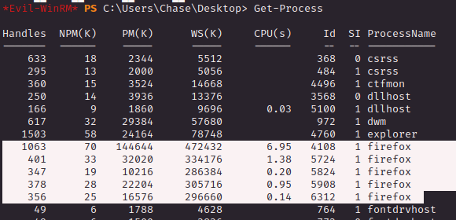

Cool stuff now we can use `ProcDump` to get a dump (lol) and use it on the PID of firefox (with `-ma` to retrieve all data in memory and metadata) retrieved with `Get-Process`. Than uploaded locally and just a `strings+grep` combo was enough to retrieve the password for a user with `admin@support.htb` email.

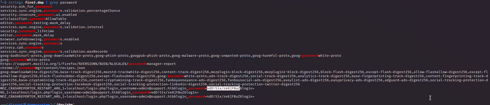

We know is the same password of the Administrator user = box pwned!

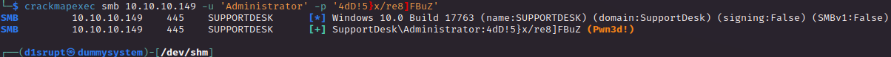
