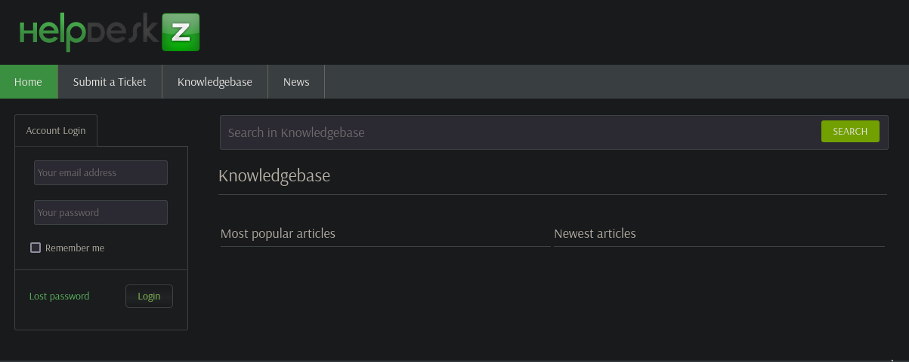
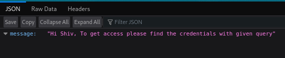
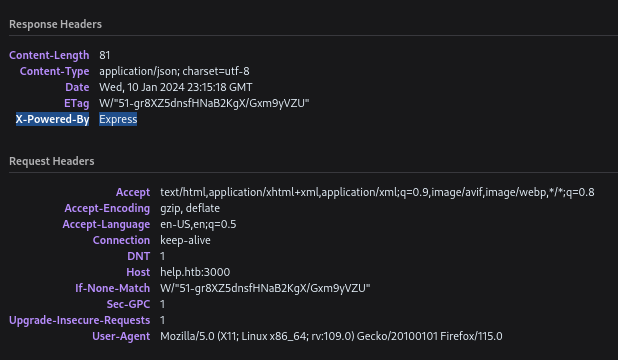
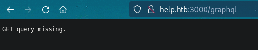
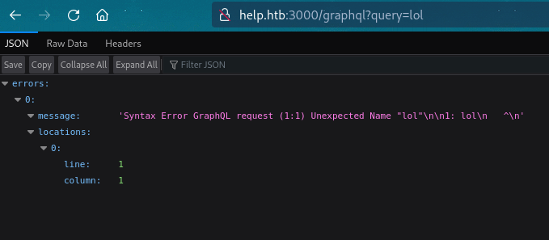
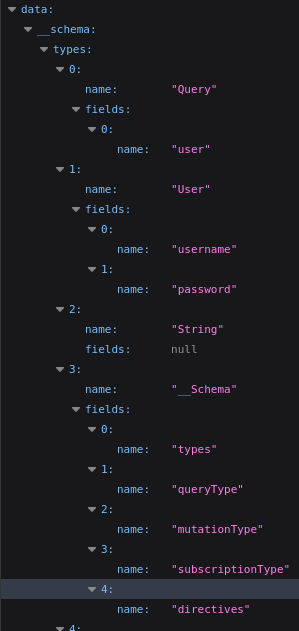
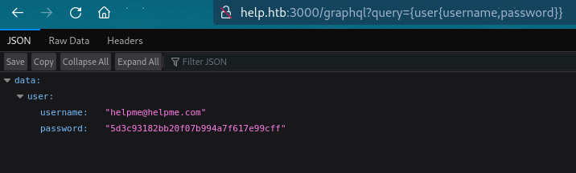
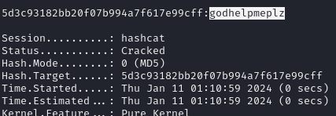
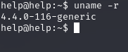
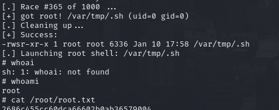

# PORT SCAN
* **22** &#8594; SSH
* **80** &#8594; HTTP (APACHE 2.54.18)
* **3000** &#8594; NodeJS Express

   

# ENUMERATION & USER FLAG
The port 80 is the standard Apache page but with some neumeration the `/support` path has been found which is actually more interestng!

before going in port 300 is interesting as weel!

Ok pretty uncommon but we have a (potential) username right now. I think this port is actually more interesting so I will focus here now starting from the `Header` which contains a interesting `X-Powered-By` field

The online search point all to **<u>GraphQL</u>** endpoint creation with NodeJS, cool stuff is pretty rare to get in touch with this type of database because is (relative) new.
When we try to access the endpoint `/graphql` we have a cool error message

And this happen when we ad the GET parameter

Now with some GraphQL standard queries we can enumerate what we can read starting from the schema with `{__schema{types{name,fields{name}}}}`

Pretty simple now we can just query to extract the Shiv password with `{user{username,password}}`

It sounds pretty complicated at the start but after a few minutes reading documentation is actually simple, good thing to get in touch with different database type. Now we can crack it (MD5) and extract get the plaintext

The credential don't work on SSH but for sure it worked on the HTTP helpdesk service, there is a file at `/UPGRADING.txt` telling us the version which is <u>1.0.2</u> and is vulnerable to [(Authenticated) SQLi](https://www.exploit-db.com/exploits/41200). We need to create a t least 1 ticket with an attachments because the attachment table musn't be empty if we want the attack to be successfull.

So I intercept the request and add the and `1=1 -- -` to check the SQLi is present and luckly it is!

So the parameter `param[]` is the weak ring of the chain, we can use SQLMap to force the injection right there. SQLMap confirmed the injection so we can use it to dump the database contents
I was able to retrieve the password of `admin` user which is **Welcome1**.
Now I use some diffrent username like shiv, helpme, root, help, support (ecc...). The credentials `help:Welcome1` worked on SSH and we can grab the flag with that!

   

# PRIVILEGE ESCALATION
Pretty clean filesystem with nothing usefull at all so the onbly choice here is some kernel exploit, as always check the version with `uname -r`

I have found [CVE-2017-5899 (Snail)](https://www.exploit-db.com/exploits/47172) which througt a directory traversal vulnerability in **S-nail** allowing writing to arbitary file. Just upload the exploit and run it to get root access!

