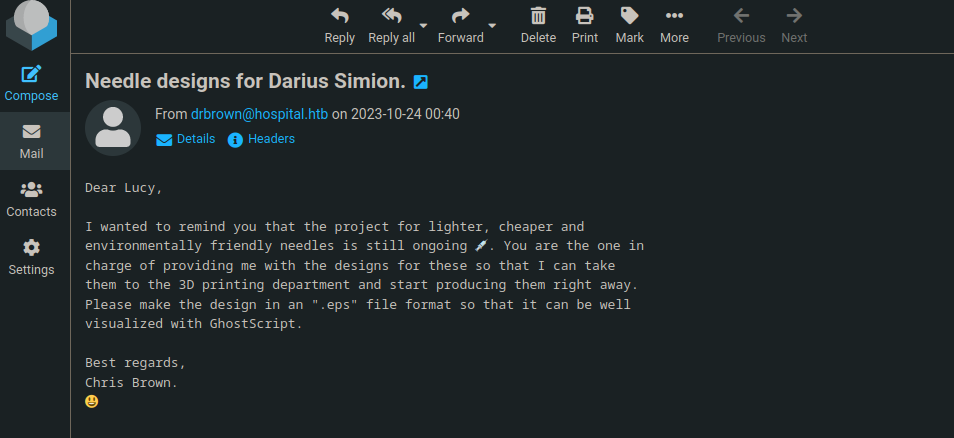

# PORT SCAN
* **53** &#8594; DNS
* **88** &#8594; KERBEROS
* **135** &#8594; MSRPC
* **139 / 445** &#8594; SMB
* **443** &#8594; HTTPS
* **593** &#8594; MSPRC over HTTP
* **636** &#8594; LDAP/SSL
* **2179** &#8594; Microsoft RPD for VMs
* **3269** &#8594;LDAP using Global Catalog
* **3389** &#8594; RDP
* **5985** &#8594; WinRM
* **8080** &#8594; HTTP

   

# ENUMERATION & USER FLAG
What we have here is a Domain Controller on the domain **HOSPITAL** called `DC.hospital.htb`.

The HTTPS port redirect us on Login Page

Searching just the word "webmail" on duckduckgo I found a software with the same logo

Searching the logo we have the software **<u>Roundcube Webmail</u>** an opensource email service probably can turn useful later.

At port `8080` we have a standard login page with the possibility to register, after creating an account we have just a upload functions

I tried to upload pdf and svg file and both are accepted probably there is no restriction and with some little guessing we can find all the files on `/uploads` directory and obviously PHP files are restricted from being uploaded. I spent some time trying with some PHAR files and it worked! I uploaded this [cool shell](https://github.com/flozz/p0wny-shell) (with **.phar** extension) and now we are inside 

We are inside a Linux machine (the nmap scan prepared me with this), I get a shell on my terminal and we have a user inside this box called **<u>drwilliams</u>**, let's not this as potential user.

With a check it actually is a user on the windows machine (check with AS-REP ROASTING)

Coll, I think we should retrieve some credentials on this box that can be used on the Windows box

Inside the `www` folder I found the `config.php` file with hardcoded credentials stored inside 

Inside the database I found 2 bcrypt hashes an I exported in order to crack it 

On password is `123456` and the other one is taking a lot to crack but after 15 minutes I get `patient`, this is probably an (intended) bunny hole, cool!

Checking with some tools returned that this Ubuntu version is vulnerable to [CVE-2023-2640](https://nvd.nist.gov/vuln/detail/CVE-2023-2640)

AAAAAH BEAUTIFUL!

Executed [this POC](https://github.com/g1vi/CVE-2023-2640-CVE-2023-32629) and I have a root shell

Cool, now I can get inside the **<u>drwilliams</u>** user and there is....nothing, lol

I pick the shadow files and take the drwilliams hash. Cracked easily

Is not valid for email but we can use it to login on SMB

But most important the email inbox

Is time to fish, the intended way here was to reply to the email and send the esp file but this time will be poisoned thanks to [this PoC](https://github.com/jakabakos/CVE-2023-36664-Ghostscript-command-injection)

Just wait 2 seconds and we have the user flag, this is cool!

   

# PRIVILEGE ESCALATION
Inside the folder Documents of the user we have a bat script wih inside the hardcoded credentials of the user, usefull because we can now use EvilWinRM

Now, I tink this was unintended way to escalate this machine but the script `ghostscript.bat` can be changed by our user and run as administrator every time a new file is sent to the email, simple and smooth I have changed the content with a powershell reverse shell, send the email with attachment, trigger the script and we have a shell as `SYSTEM`

