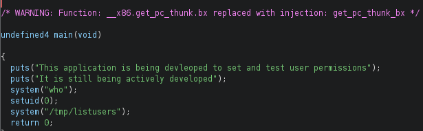

# PORT SCAN
* **22** &#8594; SSH
* **80** &#8594; HTTP (APACHE 2.4.10)
* **111** &#8594; RPCBIND
* **6697 / 8067 / 65534** &#8594; UNREALIRC (Admin email djmardov@irked.htb)
* **58385**
* **60239**

   

# ENUMERATION & USER FLAG
Cool port scan, is not usual to see IRC open ports, this sounds fun! This is the port 80 homepage

The admin should be really frastruated eheheh let's try to trigger him more. I run th usual web enumeration bruteforcing tool while I investigate on the next services. RPC was not usefull at all, sometimes we can find some NFS with anonymous access but this time is not the case. We can try to connect to the IRC chat, I used `hexchat irc://irked.htb` and now we are inside 

I have nostalgia for a period that I wasn't able to live, the time where IRC chat where an actual thing sounds fun! By the way returning back to the job, we have a version on thewelcome output `Unreal 3.2.8.1` which is not acutally vulnerable to a vulnerability but [a Trojan Horse was extenally introduced](https://lwn.net/Articles/392201/) in one of the software macro allowing the use of the backdoor for spawning a shell and metasploit have a module just for that!

We can't access the flag yet so we need to enumerate and the **Unreal** directory sounds a good place to start but I found nothing at all. We have access to read everything (but not the flag) in `/home/djmardov` and in documents there is a "hidden file" called **<u>.backup</u>** and when we look the content...

Interesting stuff, but this password doesn;t work with the djmardov user....uhm sounds ok as a thing because the "<u>steg</u>" part of the sentence. Stegography are used with image and this means that one the password was actually in front of us in the homepage, we where "watching" the password since the start!
So I downloaded the homepage image and use steghide to extract the information, we have the password and what it reveals is the **<u>djmardov</u>** password

Now we are free to SSH into the machine and get the user flag!

   

# PRIVILEGE ESCALATION

We have a costum binaries whit SUID bit set!

`viewuser` sounds an interesting target to put some effort in it

At the end of the ouput the binary try to access the `/tmp/listusers` after creating it I relaunch the command but the file is still empty

I was not sure what was happening behind the curtains so I unleashed the **<u>Ghidra</u>** and luckly was pretty simple and I was able to retrieve the full code.

Uau, pretty simple now we can create the temporary file as a bash script that just spawn a brand new bash, in this case will run as root thanks the SUID

PWNED!
