# PORT SCAN
* **53** &#8594; DNS
* **88** &#8594;KERBEROS
* **135** &#8594; MSRPC
* **139 / 445** &#8594; SMB
* **389 / 636** &#8594; LDAP
* **5222** &#8594; JABBER (Ignite Realtime Openfire Jabber 3.10)
* **5269** &#8594; XMPP
* **5276** &#8594; SSL/JABBER
* **7443** &#8594; HTTPS

   

# ENUMERATION & USER FLAG
We have a new (for me) service we need to deal with (at least this is what the box name suggest me). **XMPP** (eXtensible Messaging and Presence Protocol) also known as **<u>Jabber</u>** (Jabber is the protocol, programming Jabber softwaare means programming XMPP software) is a instang messaging service located in the application layer of OSI stack. The core of XMPP is the modularity and extendibility of such technology so thing like videocall or more complex appliation can be build upon this software base (for instance Zoom). The HTTPS contains a single anchor that redirect to [XEP-0124](https://xmpp.org/extensions/xep-0124.html) documentation. I used PidGin to create an account into the jabber server

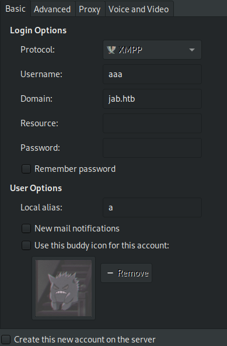

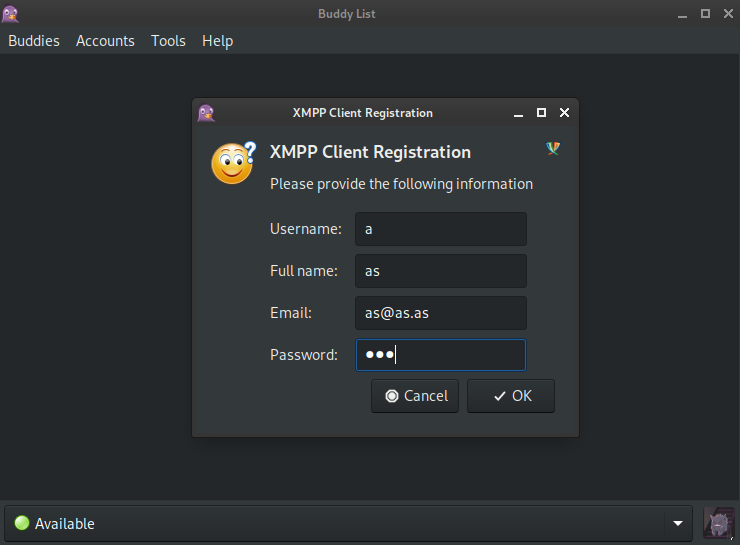

No we can get the list of all the available rooms (subdomain is `conference.jab.htb`), we have just 2 room **test** and **test2** but only the latter can be accessed wihout authentication and user `bdavis` can be found

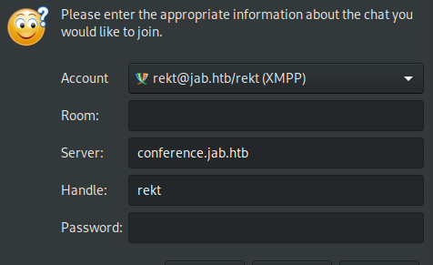

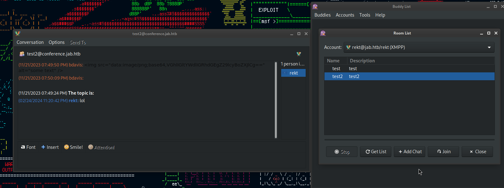

Just a single message and nothing more, I decided to get a user list with kerbrute (which is really long) and I tried to make some ASREP roasting. Just the user `jmontgomery` returned a plaintext at the end of this process 

Now tthat we have a credential I reused it back to pidgin and impersonate this user on the Jabber where a new room called **<u>2003 Third Party Pentest Discussion</u>**

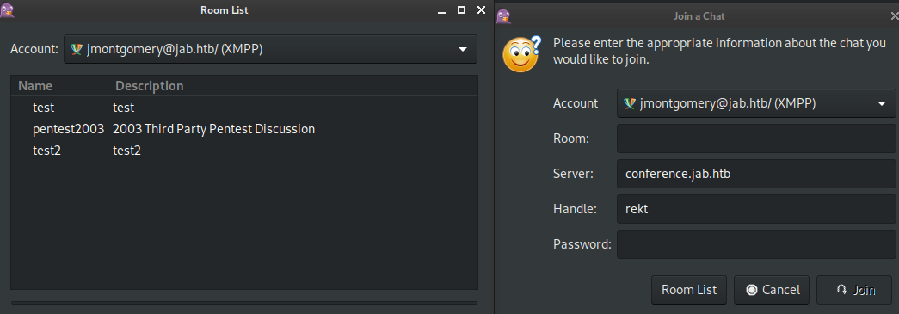

Inside there is an hashcat output containg plaintext password of `svc_openfire` that will be really usefull for us!

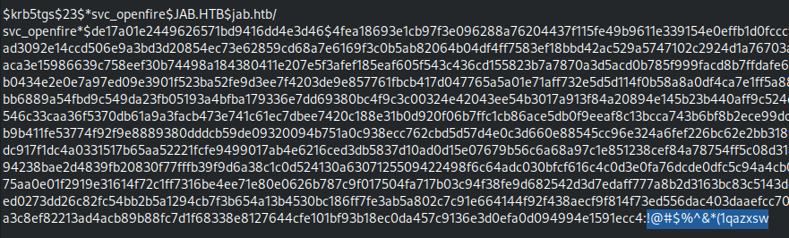

I don't have enough information but I can use bloodhound (python version) and grab all the info about users and computers inside the domain, now we have a way because we can abuse ExecuteDCOM object privilege to get a shell.

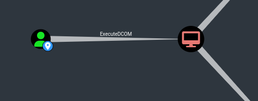

In details we are using **MMC20** (Microsoft Management Console) object, the most common in recent windows version and run a reverse shell that will be catched by metasploit web delivery module

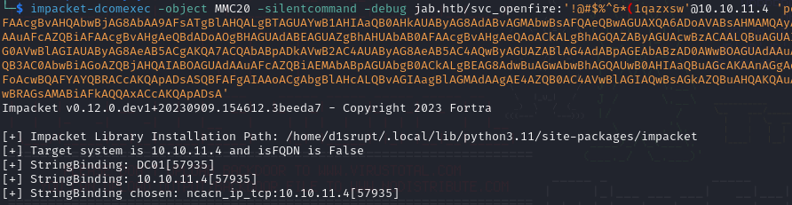

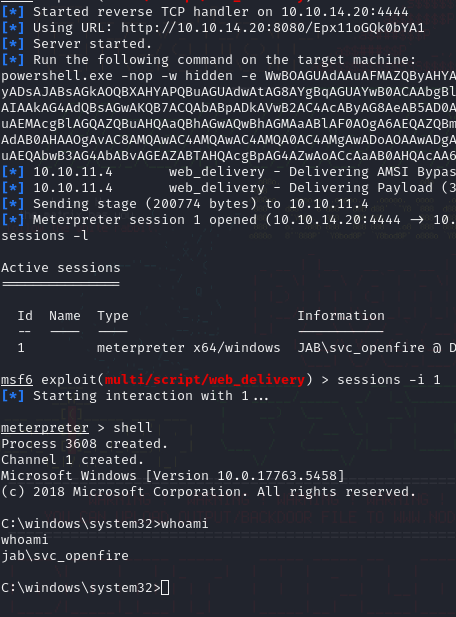

Now we can greb the user flag and move on the PE

   

# PRIVILEGE ESCALATION

Inside openfire directory we can read the XML configuration file and understand the port where is running locally which is the `9090` 

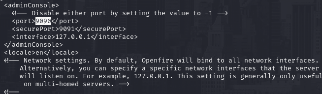

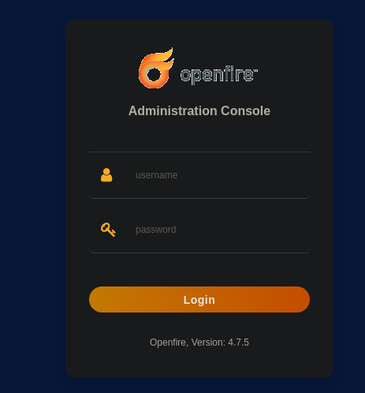

I used the credentials of the same user I am impersonating through the reverse shell and we have access to administrator panel.
I found this [PoC for CVE-2023-32315](https://github.com/miko550/CVE-2023-32315), the first part is about authentication bypass but we don't have to worry about since we already have valid credentials but we can upload the `openfire-management-tool-plugin.jar` in plugin&#8594;upload plugin and than we can access it in server&#8594;server settings&#8594;management tool where we can execute OS command through the textbox, not a surpires that we are executing commands as `NT AUTHORITY/SYSTEM` 

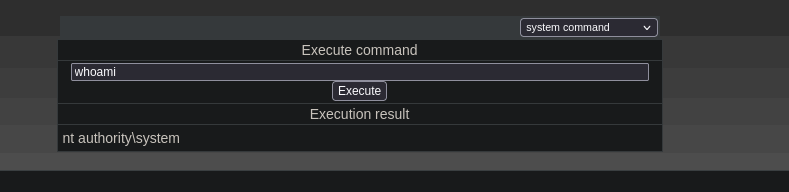

Now the job is done, we can inject a reverse shell and enoy our high privilege shell. The root flag is owned!

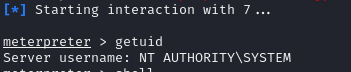
