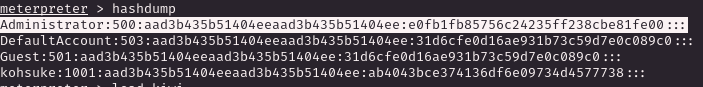

# PORT SCAN
* **80** &#8594; HTTP (IIS 10.0)
* **135** &#8594; MSRPC
* **445** &#8594; SMB
* **50000** &#8594; Jetty

   

# ENUMERATION & USER FLAG
Jump directly into the website and we have something really funny, a search bunny that whatever the input is redirect me to an image with a error message

Well actually this is usefull we have some versions of the software and .NET, uhm cool. Reviewing the source code we are not sending any request and the value of the textfield is actually not used (but required) and when we click on search we are directly redirect to `/error.html` so we will just take this picture as information.

The SMB is unbrachable without a credentials sets so we are left with the Jetty port. Jetty is a Web Server based on Java and on this port we don't have much just an 404 error

THat link jusr redirect us on the [Jetty official website](https://eclipse.dev/jetty/) but give use the version is running

While I was enumerating I tought was fine to run a scan hunting for shortnames in IIS and we have some cool results

Error and index have been already visited but we have the `/ask-je(?).jpg` shortname, I just google **Jeeves** (same thing can be done searching the logo on the search bar I suppose) and I get as first results [askjeevees official site](https://www.askjeeves.net/) (now called ask.com)

Running some bruteforcing (depending on the tool you would need different wordlists) I have found on port 50000 the directory `/askjeeves` which contains the dashboard of **<u>Jenkins Dashboard</u>**

Metasploit allow us to get usefull information about the Jenkins service 

We have a lot of access as anonymous, the most interesting that can also turn to be our way inside the network is the `Script Console`, nothing usefull than that! Let's make a malicious script and intercept that shell with nc

Than I get a meterpeter shell with web delivery and we are ready to go and catch the user flag!

   

# PRIVILEGE ESCALATION
Really boring, again the base user have `SeImpersonatePrivilege` enabled so I run juicy and get access as **SYSTEM**

We have the fl...WAIT A SECOND!

UHM, probably we have to access the SMB file share. First we need to retrieve the NTLM hash, we have 2 ways to do it thanks the fact we are root

1) `hashdump` command on meterpeter 

2) `kiwi` meterpeter module using `lsa_dump_sam`

Here the check that both works as well 

Cool, this seems a standard SMB

Actually after login I decide to move on `C` directory sharin and going inside the Administrator directory. Why on SMB, because I know a way to read alternative data stream with `allinfo`

WE GOTTA IT but I fell stupid lol, I know this way to read different data channels but there was a way to do it directly on the command prompt with `dir /R`

Well was not the intended way but I am happy of two things

1) I learned a new (small) thing
2) I used my knowledge to get over an obstacle in the way seems wrong but I get myself to get hash and access the SMB, not the easiest and efficent way but the important is pwn the machine not how you pwn the machine ;(
