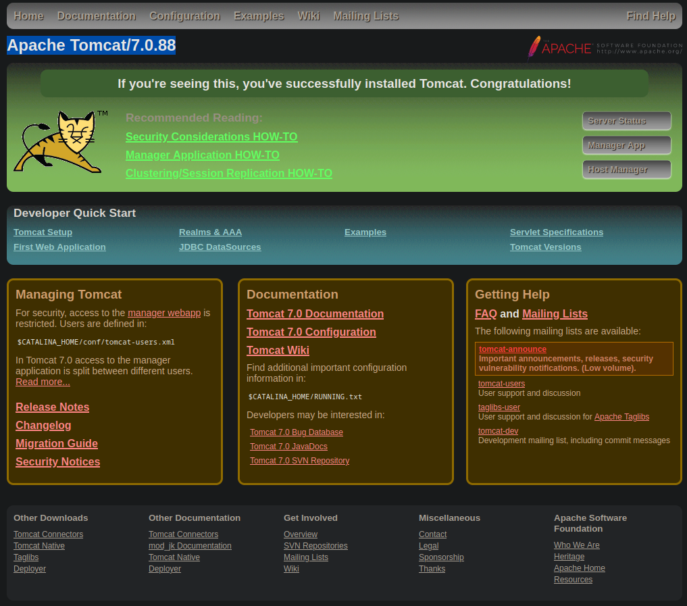
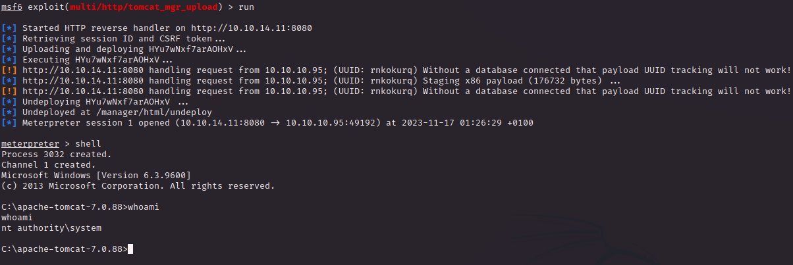

# PORT SCAN 
* **8080** 8594; Apache Tomcat

   

# USER FLAG & ROOT FLAG
This sounds pretty easy on port 8080 we have the default tomcat page

Obviously will be good to access on the `/manager/html` page but require credentials.

Some quick research (or brute force) the credentials `tomcat:s3cret` gave us access.

Usually on tomcat application we can get a shell through uploading a **<u>malicious WAR file</u>**. I tried with the metasploit module `exploit/multi/http/tomcat_mgr_upload` changing the target to `Windows Universal` and the payload to `windows/meterpeter/reverse_http`.

It worked really smooth and we receive a shell as `nt authority\system` in other words we have completed this box, lol

Never understood why make really easy machine like that which are more a PoC than a real machine but is good to know that tomcat can become your worst enemy if badly configured (also path traversal is pretty common in such service)
