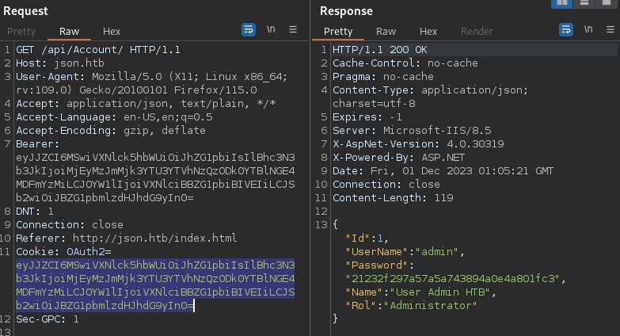
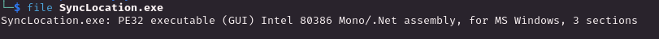

# PORT SCAN
* **21** &#8594; FTP
* **80** &#8594; HTTP (IIS 8.5)
* **135** &#8594; RPC
* **139 / 445** &#8594; SMB
* **5985** &#8594; WinRM

   

# ENUMERATION & USER FLAG
From the Nmap scan, the OS appears to be `Windows Server 2008 R2` and look what we have in the webapp

HackTheBox clone, cool. No anonymous access both in FTP and SMB but we known thanks to **Wappalyzer** that is runing `ASP.NET`.

BY the way after all the enumeration that I can th only tought is to bruteforce and after some attempts somehow the admin page just flash before return back on the login page whe try to access `index.html`, strange and I am starting to think that we don't need to get acess, at least for now.
I have made 2 relevant discovery after some time

* We can access the `/files/password.txt` file

* We can play with the **API which give token** back to the user (look on the left we have the MD5 hash of the `admin` word)

This last one is pretty interesting while the first actually give me nothing at all, the box is called JSON and this API is actually using JSON. We have another API which do the opposite given the `OAuth2` will return back the user information

This last one is pretty ineresting, is a deserialization so maybe we can exploit that with `ysoserial` (I used [this version](https://github.com/pwntester/ysoserial.net) according to multiple writeups is the best choice)

> Note that we can delete the OAuth2 and the API ill still work because what is checking is the <u>**Bearer**</u> 

Now I can jump on windows and try to create a **deserialization payload**

Cool now I've just base encoded and changed the **Bearer token** and give a try, if it works we would receive a connection on the dummy SMB share we have created. We gotta it!

Than I have ust used a **powershell reverse shell** (base64 encoded version) as payload and we get the shell!

This user is enough for the user flag

   

# PRIVILEGE ESCALATION
Now the first thing to check are obviously groups and privileges and woth to notewe have `SeImpersonatePrivilege` enabled 

Good but I want to enumerate further because we have something missing, the <u>`FTP`</u> protocol

Inside `Program Files` we have the **<u>Sync2Ftp</u>** program, inside we have hte configuration file with some base64 credentials

But actually credentials seems to be encrypted somehow

So what I can do here is to upload the exe file and chek with the `file` command

Cool is a .NET assembly is time for **<u>dnSpy decompilation</u>** and here we are we have the code for the Decryption

For a faster resoultution thanks to bard I was able to create a quick and dirty script in python that will decrypt both username and password since we have the key in cleartext is just a time of a prompt (another way can be to use dotnetfiddle.com or directly debug the executable)

With this credentials we can access to the FTP which have full access to the disk, root flag included!
