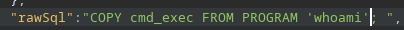

# PORT SCAN
* **22** [SSH]
* **80** [HTTP]

  

# ENUMARATION & FOOTHOLD
We have a cool website (8/10 in my opinion lol)

I found the name of member of this team (which can lead to ap otential username) called **Amanda Stone** 

We can contact the space team at **/contact.html**

In **/services.html** a list of the services provided by the oganizzation

**/portfolio.html** gave us some of the photos made by the orgs

**/about.html** just basic info of the team

Here we have a static website so tool like **nikto** will be useless, this is really tough. First time working with a static website so I need to understand how the web-server work and if there is something else than this 

After few minutes I decide to make a subenumeration and here is what I discovered

But all of them redirect to the standard domain (jupiter.htb) but I would retry with a specific wordlist using `wfuzz` and the **seclists** and we have something new

Let's find out what we have here, we got a <u>**Grafana**</u> page. Grafana is a web-app for statistic and data visualization. [Hacktricks](https://book.hacktricks.xyz/network-services-pentesting/pentesting-web/grafana) (and [this blog](https://exploit-notes.hdks.org/exploit/web/grafana-pentesting/)) give us a few tips on pentest Grafana webapp.
The `grafana.ini` file can't be reached but analyzing the API called when requesting the homepage we can get some usefull information

* The webapp use prometheus

* We send some raw SQL query to get data at `/api/ds/query`

We can abuse this changing the query to `select * from user;` we get a username (grafana_viewer)

With `SELECT table_name FROM INFORMATION_SCHEMA.TABLES` we camn retrieve all the tables inside the database.

Now we can enumarate everything in the database or get a reverse shell, will be pretty easy because we have <u>full controll</u> of the **raw sql query** :

1) **create a table** with a single collumn 

2) **insert** the output of a bash command (ex :/ `whoami`)

3) **select** the table results

With this RCE we can do the same approach for a reverse shell

  

# USER FLAG

Now we need to leverage from the service account to the user account
(I found a juno SUID bash binary on /tmp but probably is made by someone else so I will avoid to use it)

So the `/dev/shm/network-simulation.yml` is used by the **juno** user. This is the content

The purpose of the file itself is irrelevant what would help us climb the mountain is the fact that is editable by the service account we are using and we can ue the `path` and `args` to inject a OS command.

What I did first was to copy `/bin/bash` in `/dev/shm` and we will use the yaml file to change the permission of bash giving the SUID of juno

(I've copied the entire YML locally makes teh change and use the output redirect of `echo` inside theyml file, somehow sed wasn't permitted and nano is weird in this type of shell).

Just wait few minuites the cron job do his job and than you can run the bash binary edited and gain access as **juno**

Now I just add the RSA kay in order to get access through ssh and have persistence. We can now have the user flag!

  

# PRIVILEGE ESCALATION #1
NOw we got another user inside the **/home** directory checking the current user id with the **jovian** we can not that jovin is a member of the `sudo` group so makes sense to get root through this second account

We can check that `jovian` is running **jupyter notebook**, I have played enough HTB to get this info as a hint so I decide to focus here at first

So the jupyter notebook is running the file `/opt/solar-flares/flares.ipynb`

Looking inside the code I see the document can run python code will be cool to modify the document and write a reverse shell but is writable just by **jovian**

Inside we have the directory **[.ipynb_checkpoints](https://stackoverflow.com/questions/46421663/what-are-jupyter-notebook-checkpoint-files-for)** 

Also inside the logs we can see how to access the notebooks

Cool stuff! So at port 8888 in the victim host is running the notebook so we can make a tunnel and look what we have here.

Just use `ssh -i id_rsa -L 8888:127.0.0.1:8888 juno@10.10.11.216` to make the tunnel and access on your browser

Here we have a login page >:( but we can use the `/opt/solar-flares/start.sh` script to get a new log inside the **logs** folder and retrieve the a link with a valuable token (similar to the above one) and will be rdirect to this page

And now we can access to jupyter notebook files and take the reverse shell!

  

# PRIVILEGE ESCALATION #2

Ok cool now we are in the **sudo** group so first thing first `sudo -l`

I've googled `sattrack` and the first results was a "Sattelite Tracking" makes sense with the theme of the machine

When I used the binary I got this error

   

Analyzing the binary I note the use of `/tmp/config.json`

The config.json file content can be found in the share version of sattrack

What's going on here is store the `tlesources` files (retrieved via web) inside `/tmp/tle` so we can change the sources file to retrieve the **root.txt** (or the rsa key so we can use persistence)

So I created a version of the configuration file (in **/tmp**) changing the "tlesources" in `file:///root/root.txt`

Than just execute the sattrack command with sudo, ignore the warning and go in the `tle` directory and enjoy your flag

