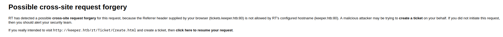

# PORT SCAN
* **22** [ssh]
* **80** [http]
* **8080**
* **8282** simple http server

  

# FIRST ENUMARATION 

This is the website at port 80

Clicking the anchor will redirect at the subdomain `tickets.keeper.htb` at the path `/rt` and we have a login form

On the bottom right we have some info about usefull for **<u>enumaration</u>** the webapp is running **[Best Pratical Solutions](https://bestpractical.com/) Request Tracker** a open source ticketing system (here the [official repository](https://github.com/bestpractical/rt))

I search online some resources that can help me first to understand what this software is used to and second if some default credentials are available to us and after short time I found this forum post

Let's ignore the problem this guy issued but the fact is the default password of RT is actually **password**. After some try the credentials `root:password` allow us to get inside!

  

# FOOTHOLD
Well the first thing we should try is to create a ticket and see what's happening we can do it from this 2 sections on the main page 

And look at the output when we create a ticket

The hostname configured is the first homepage and when the ticket is created RT (correctly) alert the user.

Intercepting the request and changing the **Refeerer** we have successfully created a queue

Ok cool, I've already noted the existence of another queue so now will be a good idea to check some info about it.

The history gave u some juicy info

Cool, we have a potential user called **<u>lnorgaard</u>** (Lise Norgaard). Unfortunately the attachment has been removed and since it was a Keepass dump should gave us important information.

Let's see if we can check some information about this new user discovered, in the **Admin** panel we can check the user information 

Let's go try this username and password in SSH, it worked we got the user flag!

  

# PRIVILEGE ESCALATION
Inside the home directory of lnorgaard I found (as expected) a zip file which is the attachment of the original ticket queue. I've download it localy and unzipped it. We have 2 files `KeePassDumpFull.dmp` and `passcodes.kdbx`

The dump file is useless, right? Well it isn't also is there for a reasone. Checking online on how to analyze a Keepass Dump ful returned me a [CVE-2023-32784](https://github.com/vdohney/keepass-password-dumper), in short when we insert a password inide keepass a leftover is [created in memory](https://sysdig.com/blog/keepass-cve-2023-32784-detection/) (and so will be stored in dump) for example when we type `TEST` the leftover will be `•E`, `••S` and `•••T` (the fist character can't be retrieved but is fine at the worst case scenario we just have to brute force). Inside the dump file there is a chance to retrieve the edit boxes passwords too (with the risk to recover the content of the boxes).

The creator of the PoC make a great job creating a cool tool that examines the pattern explained above but is not really reliable at 100% so there is a chance the password is retrieve partially.

I've installed and configured the PoC and the results are impressive

 In red we have our candidate, seems something in another language let's copy and paste on the browser return a potential password [rødgrød med fløde](https://www.thespruceeats.com/rodgrod-med-flode-danish-red-berry-pudding-2952748) based on a danish sweet.
 
 As we said previously we can access the kepass box (the other file unzipped) using [kpcli](https://kpcli.sourceforge.io/) and the password.
 
 In `/passcodes/Network/keeper.htb` we have the root password :)

Cool we can access as root and retrieve the flag....NOP the password is wrong but we have a key file which can help us.

We can convert it in openSSH using **<u>puttygen</u>**

I used this to autenticate with SSH and I rooted the machine!
