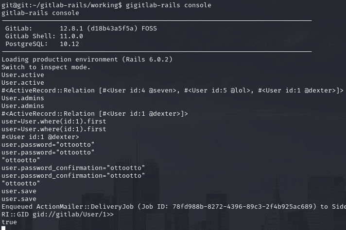

# PORT SCAN
* **22** &#8594; SHH
* **80** &#8594; HTTP (APACHE 2.4.41)
* **443** &#8594; HTTPS (APACHE 2.4.41)

   

# ENUMERATION & USER FLAG
From the nmap scan the port 443 reveals the subdomain `git.laboratory.htb`  that redirect to a login page so we need to find credentials first. On the default domain we have some username that potentially are valid for gitlab login

I tried to use **Hydra** and while it was working I have created an account (the email provided should end with `@laboratory.htb`) and well dexter user actually exists

The GitLab version is `12.8.1` which is vulnerable to an [Arbitary File Read vulnerability](https://nvd.nist.gov/vuln/detail/CVE-2020-10977) that allows to read sensitive files. Is common to read the [secrets.yml](https://github.com/anjai94/gitlab-file-read-exploit/blob/main/exploitv3.py#L25) file which contains interesting stuff!

This can become a [RCE](https://github.com/vandycknick/gitlab-cve-2020-10977) because we can use the `secret_key_base` and used to sign a new `experimentation_subject_id` cookie which is vulnerable to deserialization vulnerability and execute OS command on the target host!

Cool stuff, `/home` doesn't contains any folder and this makes me suspicious. On the root directory we have the file `.dockerenv` so we are inside a docker container. We are spawned as `gitlab` user and maybe we can change passwords or permissions, with some research I have found [this page](https://linuxcent.com/reset-gitlab-password-from-cli/) and learned to use the `gitlab-rails console` to accomplish this task. 

Now we can login as `dexter` (a stelthier way could be to leverage our now account to) and we can see the **<u>SecureDocker</u>** repository

Navigating this repositroy I have found a private RSA key that can be used to log on the target through SSH! The user flag is waiting for us and we can move on privilege escalation phase!

   

# PRIVILEGE ESCALATION

The `docker-security` binary  ahve the SUID bit enabled, interesting because is the only little crack that I found on the system. When I run it no output has been provided but maybe something is happening behind the curtains. I searched online and appear to be a custom script, at first I tough was an official one, Tracing the libraries we have something more more interesting

Well this is pretty clean, obviously mkes no sense to change the `/usr/bin/docker` because the lack of permission but hey hey hey `chmod` is called without specifyin the absolute path, this mean we can hijack the **<u>PATH</u>** variable  to inject a malicious `chmod` command that will just spawn a new shell,. After running the binary we have our root shell!

