# PORT SCAN
* **21** &#8594; FTP
* **22** &#8594; SSH
* **80** &#8594; HTTP (NodeJS Express)
* **443** &#8594; HTTPS (NodeJS Express)

   

# ENUMERATION & USER FLAG
The 2 web ports are pretty interesting, something different from standard static HTML page used as brochure lol

<u>Port 80</u>

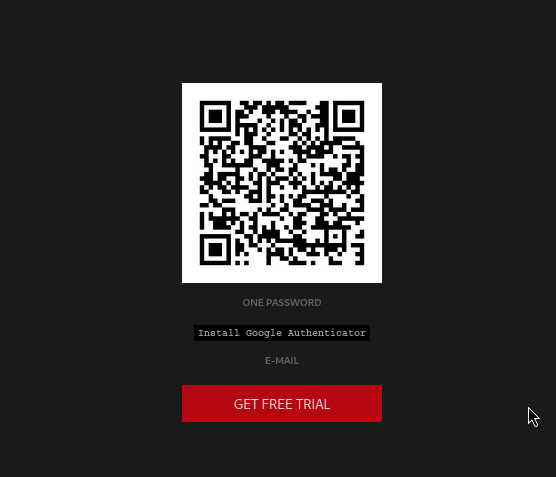

<u>Port 443</u>

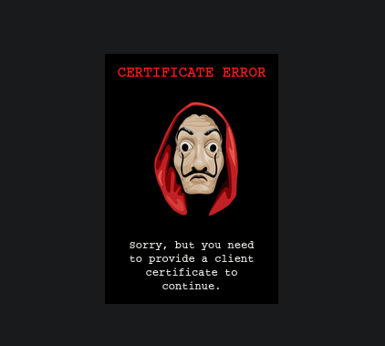

Interesting but I have no idea how to approach this so I wanted to focus on FTP before move on the web part. Even on FTP nothing much to do since no anonymous credentials can be used to login. The version of **<u>VSFTPD</u>** is `2.3.4` and with some search online I found this specific version is [backdoored](https://www.exploit-db.com/exploits/49757), this is cool!

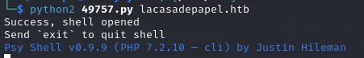

> This is pretty similar to a backdoored version of PHP where attacker maliciously added this backdoor on the source code of the software

The shell is a PHP and act pretty strange

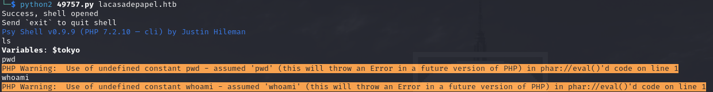

Again, online I searche for [Psy Shell](https://psysh.org/) and is a debug PHP shell so we need some trick to execute OS command. I try first with a post I found online but another restriction is in play

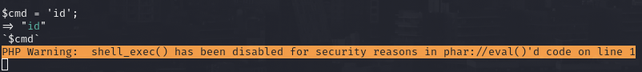

`shell_exec()` is disabled, this is the case when `disabled_functions` is in play, pretty bad news. We can use other PHP function to dig further inside the target system and `scandir()` is pretty usefull for this

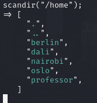

I have listed all the contents of the users directory and we have something that can be usefull for us

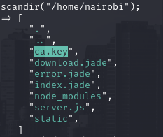

A certificate is what we need to access port 443 so is a good idea to get the contents of that file with `file_get_contents`

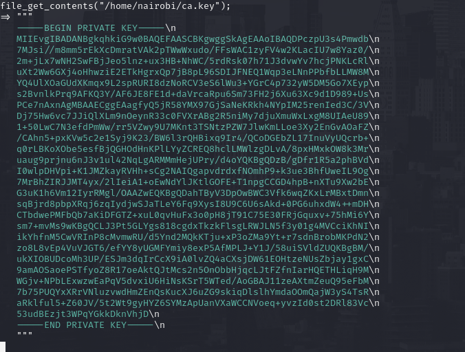

Pretty cool now is time to craft the client certificate, we have our first ingredient which is the CA certificate. From here we can extract the public key using openssl (saved under `ca.crt`)

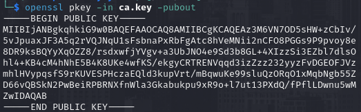

Than we have to create a RSA key using `openssl genrsa -out papel.key 4096` and from that a new **certificate signing request**

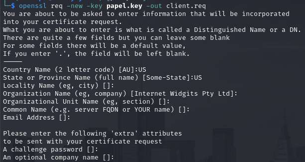

Now is time to sign it using what we exfiltrate from the target system

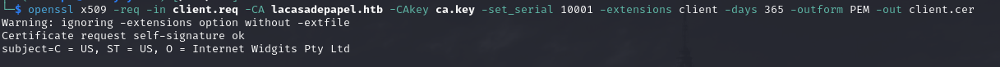

Last step is to converting in a format acceptable by firefox with `openssl pkcs12 -export -inkey client.key -in client.cer -out client.p12`, now we just need to import it

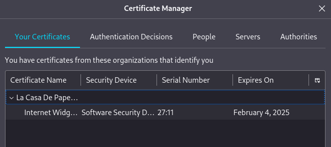

Now we are inside the restricted area which permits to select a season and a episode of the TV show and download it

When we take, for instance season 1 the URL will add the PHP variable `?path=SEASON-1` so what if I changed to `../../../../../../home/nairobi`? Well a LFI will occur!

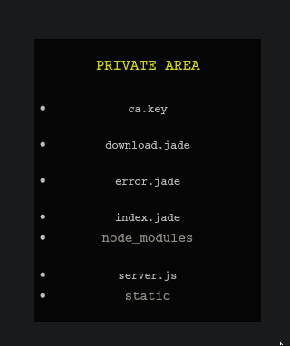

Interesting, in the PSY shell I was not able to grab other file but the `ca.key` but maybe doing directly with the webapp (which can run as a different user/permissions) we can take something else. Well inside **berlin** directory we have a key to open the SSH door!

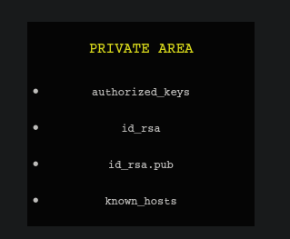

Cool but we can't interract with it directly with the UI so maybe we can hijack a POST request to download a normal episode and direct it to download the ssh key instead. The POST request use base64 string to specify the file to download

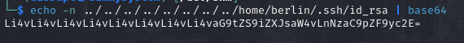

When I visited the URL `/file/[BASE64-SSH]` I was able to retrieve the SSH key. This key doesn't work with **berlin** user but after a few tries it works for **professor**!

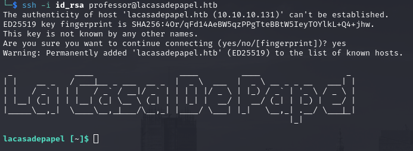

With this user I can't look through the `user.txt` file because the lack of permission so I redo the previous process but for the user flag, now we can move on privilege escalation

   

# PRIVILEGE ESCALATION
We have something interesting files inside the professor home folder

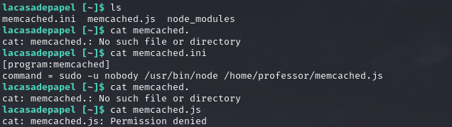

I try to execute the `sudo` command thinking it was possible to use without password but is not the case unluckly.  I ran **pspy** so maybe I can take a look at what the root user is doing and if some cronjob are can help us to get root access, between some default linux process we have what we wanted

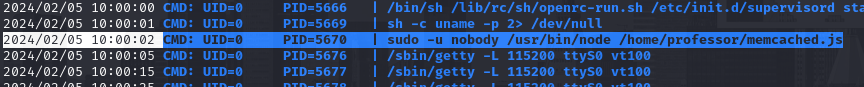

Like I tought the command I have found is ran by root every few minutes, I have no wirte or read permission on the JS file executed but what it bugs me is the `.ini` file, in pspy output I can see a lot of `supervisord` instance before the sudo command start. Probably the `supervisord` deamon knows what to run using that `.ini` file. Doesn't care if we can modify the file or not I just renamed and create a new `memcached.ini` file that will spawn a reverse shell 

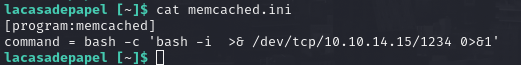
 
 After a minute we have our reverse shell lock and loaded!
 
 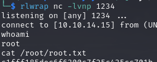
 
 
