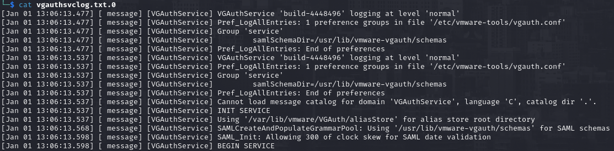
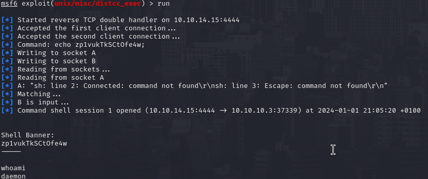
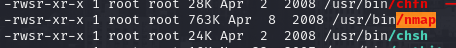
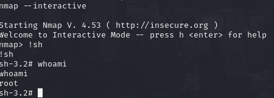

# PORT SCAN
* **21** &#8594; FTP
* **22** &#8594; SSH
* **139/445** &#8594; SAMBA
* **3632** &#8594; DISTCC

   

# ENUMERATION & USER FLAG
> This is a piece of history, is the first ever machine by HackTheBox!

First of all I wanted to check the contents of FTP since anonymous request are well accepted but is empty, maybe will turn usefull later on, in SAMBA we can also login as anonymous and there are 2 directory which are not standard: `opt` (access denied) and `tmp` where we can just retrieve the file `vgauthsvclog.txt.0` which is a log file of VGAUTH, responsible for virtual machine tickets, VM communication and SAML authentication 

What's interesting about this log file is the presence of a configuration file at `/etc/vmware-tools/vgauth.conf`.
We have a `DISTCC` service at **3632**, this particular service is a tool for speeding up compilation of source code using throug unused processing power on other machine (distributed). There is a module in metasploit called `exploit/unix/misc/distcc_exec` which try to execute C commands to obtain RCE, we are lucky enough that it works and we have access to the user flag!

   

# PRIVILEGE ESCALATION

I found that NMAP have the **<u>SUID but enabled</u>**, that's a good news because we can run it in interractive mode and use it to spawn a shell. 

With the permission of nmap binary we will spawn as root!

Really simple, really smooth!
