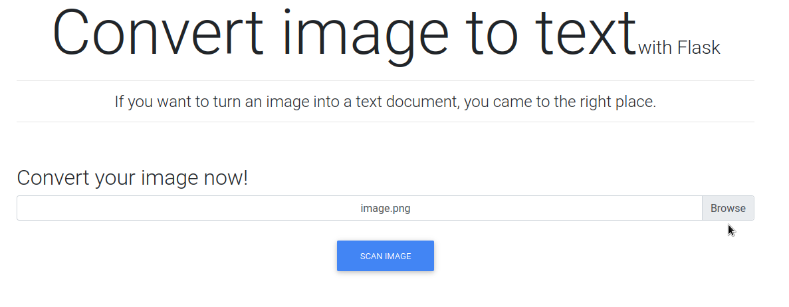
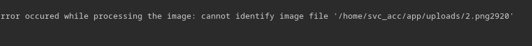
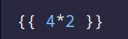
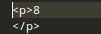
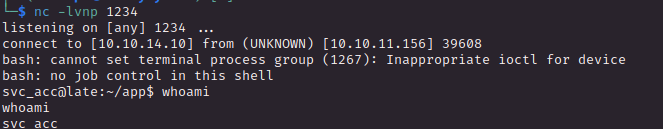
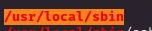
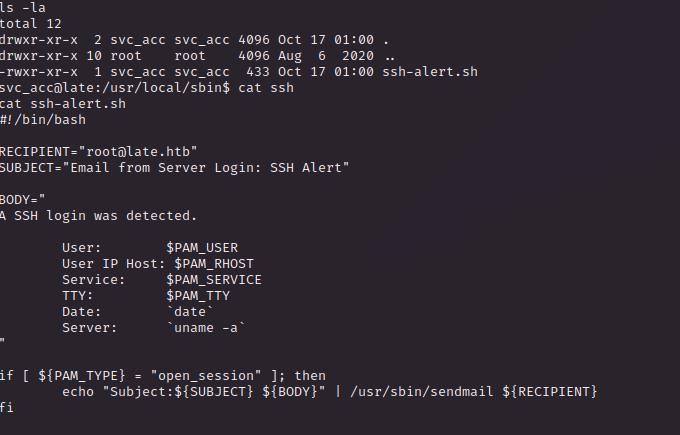
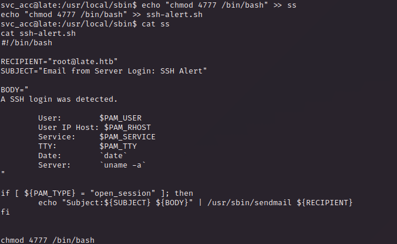
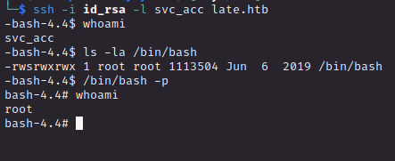

# PORT SCAN	
* **22** &#8594: SSH
* **80** &#8594; HTTP (nginx 1.14)

   

# ENUMERATION & USER FLAG
The homepage is a simple presentation apge but we have a link that redirect to `images.late.htb`

Cool, what we have is a web tool that translate the image to text, and is running with flask according to the website heading

I try some different stuff, the function of the machine is really interesting for a CTF box, I think there should be a way to make a SSTI somehow and somewhere

In my first project at university (Data Science) I have encountered `tessereact` and probably is the same thing running in the background and giving us results (is just my assumption)

Sending multiple request unlocked me the vision on how the file is stored (already tried path traversal but doesn't work, same thing on SSTI the input is sanitized enough to stop me to use the file name as abuse tool)

Well, I do something that in my childish play will be cool af if it works I take this image and check the output

OMG, let's se the results

Makes sense, I would try with some more payload to check the consistency and work of this cool stuff. The only issue here is that is really hard for whatever is translating the image to text to understand the difference between `_` and `__`.

After some tial and error (and ask to AI chatbot to create a script to create clear image with a text provided) I was able to get a shell (I will not go through all the process of SSTI as I have explained like 4 time, is something often present in HTB I usually follow this [guide](https://0xedeon-pentest-notes.deno.dev/exploit/web/framework/python/flask-jinja2-pentesting/))

Just grab the flag and let's move on

   

# PRIVILEGE ESCALATON

We have an obvious attack vector here

We have this script inside 

Is using `sendmail 8.10.1` and apparently is vulnerable to a CVE but we have permission to add data inside the script, ez play here

The script is running as root and is active whenever we access with ssh

Now I can grab the ssh key of the user and try to access on victim through port 22, if everything is cool we will get a SUID on bash 

Gotch'a
