# PRELUDE
This ismy first windows box after a long time, I decide to reset my knowledge in windows and start with simple machine, taking my time and re-learn step-by-step this caothic and really confusing (for me) OS. My objective is to learn AD pentest and learning windows is the basic of the basics

   

# PORT SCAN
* **80** &#8594; HTTP
* **135** &#8594; MSRPC
* **139** &#8594; NETBIOS-SSN
* **443** &#8594; HTTPS
* **445** &#8594; SMB
* **3306** &#8594; MYSQL
* **5000** &#8594; HTTP (403 forbidden)
* **5040** &#8594; UNKNOWN
* **5985** &#8594; WINRM
* **5986** &#8594; WINRM 2.0
* **7680** &#8594; PANDO (?)
* **49664-49670** &#8594; MW RPC

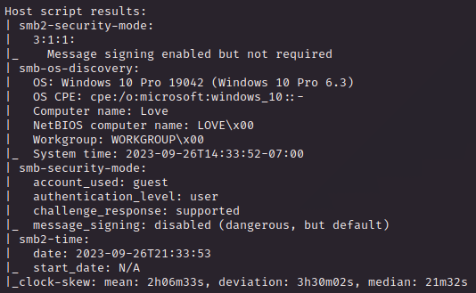

 

   

# ENUMERATION
I decide to start enumerate SMB

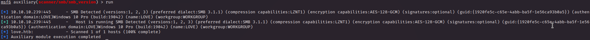

We have a `Windows 10 Pro` machine here, good to know and the SMB have a optional signatures, while I run an hydra dictionary attack on the SMB service in order to (potentially) retrieve some credentials 

 

About the webapp this is what we have here

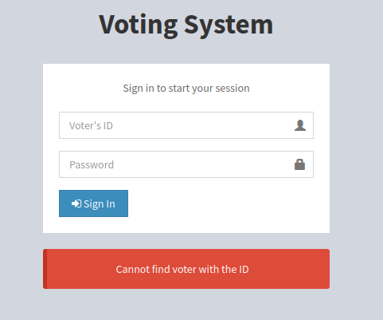

And here the `dirb` results

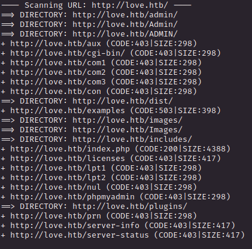

In the `/admin` page we have a simple login page (username:password)

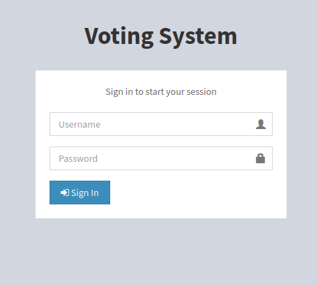

Trying some common weak credentials on the admin panel but nothing, I moved on the **<u>HTTPS</u>** part of the sites in order to view the certificate (I have a `403` error)

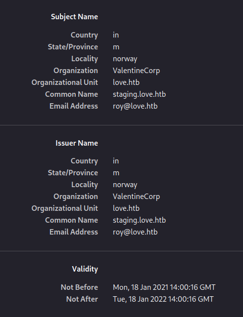

Cool, we have a new domain and email address, good to know gonna add the `staging.love.htb` to hosts file and navigate there

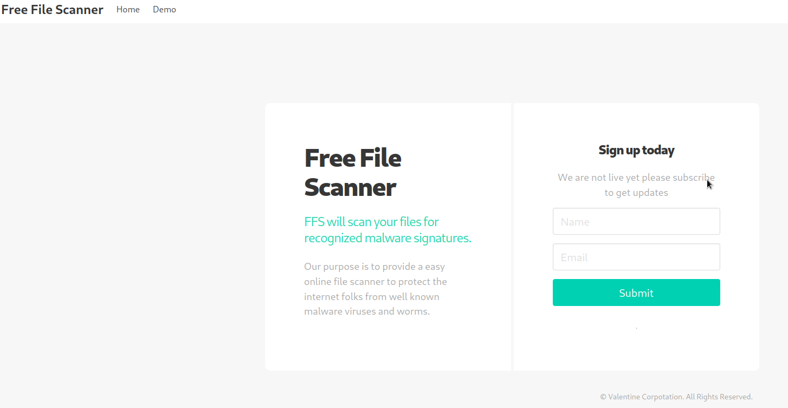

Good, even here a login page (weak credentials did not work obv) and if we press on `demo` we can use this free file scanner

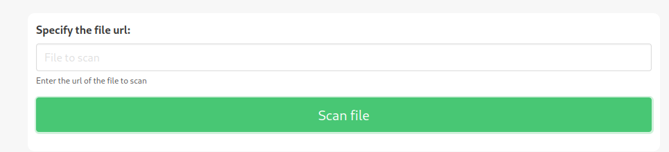

Cool, I run a python3 server on my local machine and a test file but no one accessing that when I give the URL, weird! What's fun is when I set `127.0.0.1:80` as URL

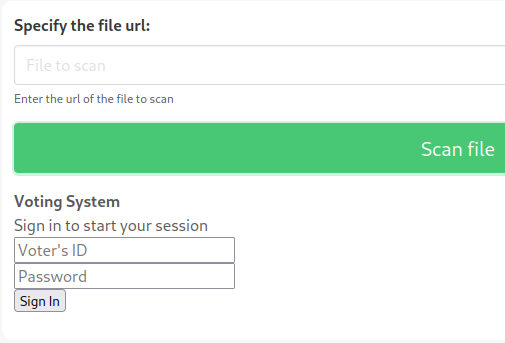

COOOOOOOL! How we can use it? We have a **HTTP** port on `5000` that is forbidden for us

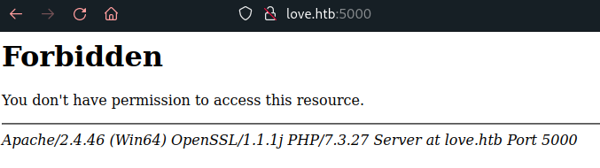

Let's see if the free file scanner have the permission that I am missings

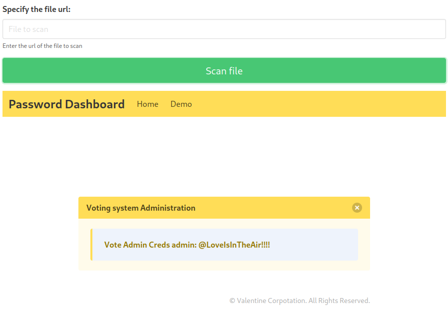

Cool stuff! Using the credential we are inside the **<u>Voting System</u>** dashboard as **Neovic Devierte**

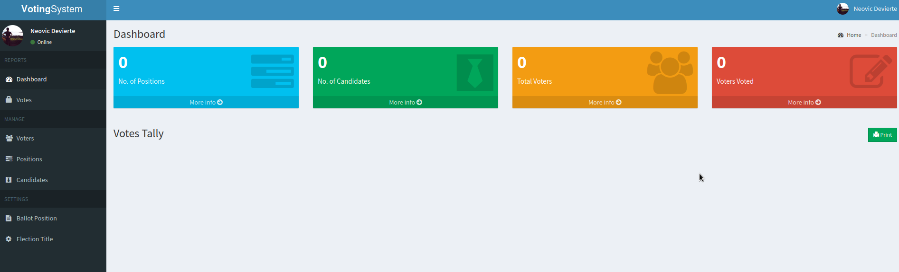

In the bottom there is somethin that make me trigger

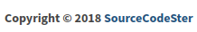

WOW, at first I tought the this web-service was costum and actually is not! So I searchd for a vulnerability online an I found this [Authenticated RCE](https://www.exploit-db.com/exploits/49445) 

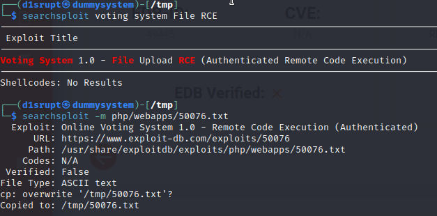

Making some changes to the exploit and starting the listener I was able to pop up a shell and get the flag

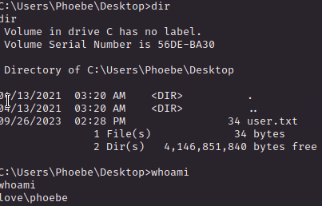

   

# PRIVILEGE ESCALATION
Now is the hard part, I'm gonna take my time searching resource online on how to use windows bash to find valuable resources.

I tried some of the commands (like [this ones](https://book.hacktricks.xyz/windows-hardening/basic-cmd-for-pentesters)) but nothing peculiar at least with the basic knowledge I have

 

I exported and use **<u>winPEAS</u>** and analyze the output

This is interesting

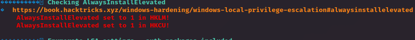

**<u>HKCU</u>** (**HKEY_CURRENT_USER**) and **<u>HKLM</u>** (**HKEY_LOCAL_MACHINE**) are Windows Registry

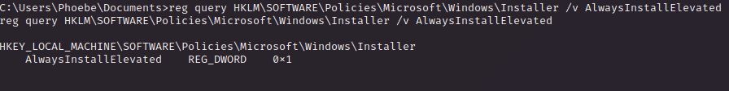

The AlwaysInstallElevated is set to 1 in both the register explained above, this mean we can use msi (Windows installer package file) with `System` privilege

  

Good I have everything clear and now I will first make some research and search online some examples on how to exploit this vulnerability and than try on my on

Them method is to create a malicious msi with `msfvenom`

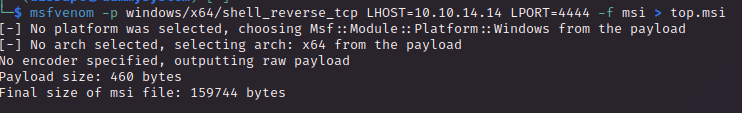

Than I upload on the victim the malicious msi and executed it 

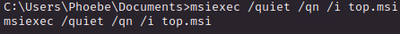

And on my listener I catch a `System` shell yaoooh!

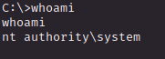

On the desktop of Administrator User we have the flag

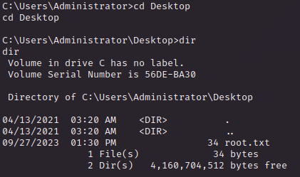
