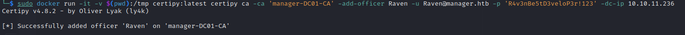

# PORT SCAN
* **53** &#8594; DNS
* **80** &#8594; HTTP
* **88** &#8594; KERBEROS
* **135** &#8594; RPC mapper
* **139** &#8594; SMB over NBT
* **389** &#8594; LDAP
* **445** &#8594; SMB over TCP
* **593** &#8594; RPC
* **636** &#8594; LDAP/SSL
* **1433** &#8594; MS-SQL
* **3268** &#8594; LDAP
* **3269** &#8594; LDAP/SSL
* **5985** &#8594; WinRM

The domain is `manager.htb`

   

# ENUMERATION & USER FLAG
I started with LDAP but without anonymous authentication is impossibile to enumerate within the machine. At the same time the webapp host a simple HTML page as presentation page of the company.

Than I decide to pentest the `MSSQL`, this is my first time on this service and this is a good thing time to learn new stuff!

I need a valide user or even a list of users so I am gonna try some brute force and spraying around the machine. Checking SMB we have access as anonymous and get a quick sight of the shares 

I have luck to enumerate user with crackmapexec using `--rid-brute` (new method learned!)

We have the list of users we need, I've performed some ASREP roasting but none of the user seems vulnerable to it.

I tried some bruteforce (rockyou and generated wordlist based on "manager" word using `john`) both on MSSQL and SMB, after some trial and error the `Operator` user with password `operator` works on MSSQL.

I used `auxiliary/admin/mssql/mssql_ntlm_stealer` with Responder to get the password hash (I don't know if is usefull but as soon as is possible is good to have it)

The database was empty and `xp_cmdshell` was disable so I need to find a way to get around this and find a way to abuse MSSQL. After some enumeration I have discovered that I have permission to execute `xp_dirtree`

This is a good news, `xp_dirtree` is a function for list files inside a directory but also support **UNC path** reading remote files (for example a SMB server), I try to do some relay attack but they are not working somehow (also the SMB share have signing enabled and required so no way it works here).

Despite that, we can enumerate from the inside checking for some files that we can try to get access somehow. I have learned this method to read files and not only directories using `xp_dirtree` parameters, I a doing that on the standard path of IIS

Thanks to this we have the a zip file that we can directly download using the browser, I will unzip it and if we are lucky enough we can find some credentials.

Finger cross, unzip the file and we have a xml files called `.old-conf.xml` wih credentials inside for user **Raven**!

Grab the flag and move on!

   

# PRIVILEGE ESCALATION

I have made consistent enumeration on the machine, I try kerberoasting and DCSync but it was not working (DcSync was a surprise to me because bloodhound told the permission were available).

Is time to try with certificates maybe we can find something vulnerable with `certipy` / `certify`

Cool we know the name of the CS running on Manager and 11 vulnerable certificate

The user `Raven` have **<u>ManageCA</u>** permissions on <u>Authenticated User</u> (any domain account, administrator included), in certipy is `ESC7`, gonna take my time and studying (starting [here](https://github.com/ly4k/Certipy#esc7)) how to abuse this

What we need is :
1) **<u>Manage Certificates</u>** permission (that we can achieve later turning on `EDITF_ATTRIBUTESUBJECTALTNAME2` ) allows the attacker to <u>issue certificates that are pending approval</u>
2) **<u>ManageCA</u>** which we already have, used to turn on **SAN** (Subject Alternative Name) to template managed by CA. This extension allows us to request a certificate even for every domain account
3) **<u>SubCA</u>** template enabled
This specific template (Subordinate CA) are tipically built inside browser or OS to safeguard the root CA because the unsecurity of communications channels (private keys should be protected at all costs!) issuing end-entity certificates. The root CA sign this SubCA and use it to sign end-etity certificates (SSL/TLS for web servers for instance). We can see that as a administrative employee for the root CA

With the prerequisite above we can issue a <u>pending certificate request</u> enrolling the SubCA, request will be in pending status and issued by the manager user (ManageCertificates permission, now we know why the machine is called like this). 

Now the requirements (2) and (3) are satisfied but not (1) but can easily be obtained using certipy

Cool, now enable the `SubCA` (usually is activated by default)

Now we request the certificate 

Yes, it failed but this is how should behave we are ok because is pending. Take not of the ID and go on (quickly because there is a cron job that reset the configuration) 

Now with the permission we have we can issue the certificate with same ID

Lastly we unlock the issued certificate with the permission already gained

Now we can authneticate with the `.pfx` fle that we have but a error occured

For this I have disabled automatic ntpdate with `timedatectl set-ntp 0` than `ntpdate manager.htb` and now the clock skew should be fixed 

Redo the authentication and we should grab the Administrator hash

Cool, just pass the hash with evilwinrm and we got ROOOOT!

