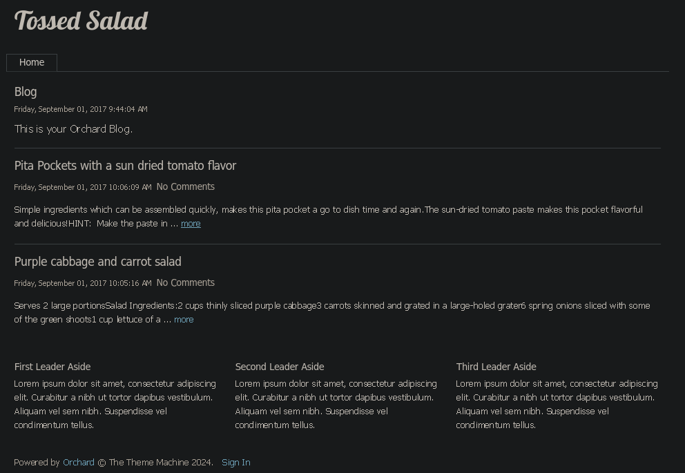
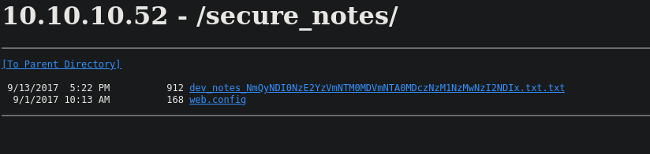
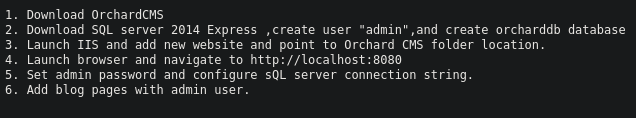
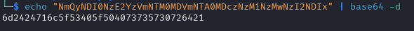
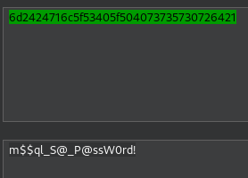
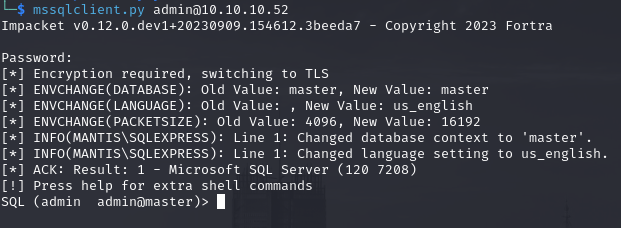
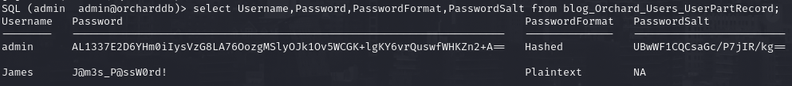
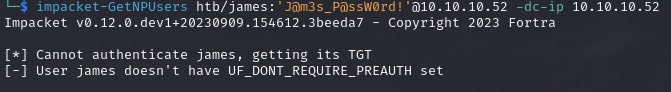
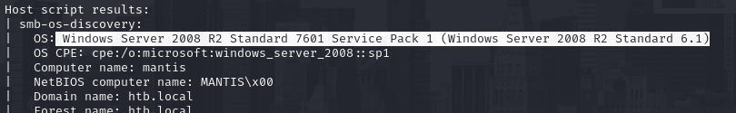
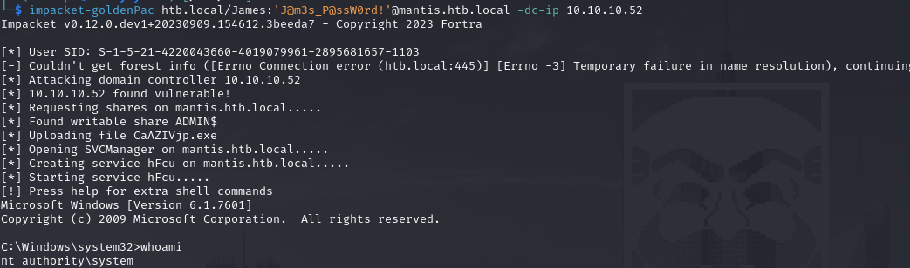

# PORT SCAN
* **53** &#8594; DNS
* **88** &#8594; KERBEROS
* **135** &#8594; MSRPC
* **389/636** &#8594; LDAP
* **139/445** &#8594; SMB
* **1337** &#8594; HTTP (IIS 7.5)
* **1433/50255** &#8594; MSSQL
* **8080** &#8594; HTTP (IIS 7.5)
* **47001** &#8594; UPnP

   

# USER & ROOT FLAG
Let's start from the website which is based on **Orchard** (CMS based on ASP.NET) on port 8080

There is a faeture to Sign In but not to register so some credentials are needed if we want to get some type of web admin access, moreover we know that MSSQL service is up on this domain controller so some SQL attack can be tried if we found some credentials. Actually nothing more here with some enumeration but we can try to investigate port 1337 which welcome us with a defult IIS wallpaper.
Here after some dirbusting we can access the web directory `/secure_note`

The first file is pretty interesting it include the steps to setup the website locate at port 8080

Cool stuff, we know that the user `admin` is valid and same thing with the database `orcharddb`, we can go a little deeper taking the base64 string which is the name of the file 

Pretty strange string, playing with the burp decoder I was able to retrieve the plaintext from `ASCII Hex`, which I assume is the password of the MSSQL account

Some SQL KUNG FU now, <u>xpcmdshell</u> is disabled. <u>dirtree</u> is enabled and with the dummy smbserver trick I was able to get the hash of the machine account but I will just wast my time trying to crack it (also signing is enabled and required so no relay is possible). As always I need to chill down and do simple things as first so I just enumerate the well known `orcharddb` database, We have a table with 2 user one of them have a plaintext password saved while the other one have an hashed version and corresponding salt

Juyst to be 100% sure that james is a valid account I checked it with `GetNPUsers` from impacket and good news, it is!

The james user doesnt work with the orchid website (and nothing can be accessed with SMB we dont have enough permissions) and I was pretty lost so I do some backtracking on the few information I retrieved and look at the namp scan we have a pretty old Windows Server version

Looking aound in the internet I understood that this version is vulnerable to [CVE-2014-6324](https://nvd.nist.gov/vuln/detail/CVE-2014-6324) also labeled with [MS14-068](https://learn.microsoft.com/en-us/security-updates/securitybulletins/2014/ms14-068). A brief explanation before going through the exploitation itself, this vulnerability allows to modify a TGT with a false addition (for instance the Admin Group membership) that will be parsed by the KDC as valid giving us more privilege than we would! Yes, is worse than golden ticket because we can perform this directly without knowning the KRBTGT user hash! Why this happen? Is pretty simple if we claim to be inside the Administrator group Kerberos would not "enumerate" our membership to groups (PAC validation) but just check the crypto signature made by KRBTGT, if valid a TGS with the injected permission would be released. **<u>Python Kerberos Exploitation Kit</u>** ([pykek](https://github.com/mubix/pykek)) contains a script for this vulnerability but is pretty quick and dirty and I wasn't able to use it but impacket is here to save the day with **<u>GoldenPac</u>**

Now we are inside as `nt authority / system` so we can grab both user and root flag!

   

#

