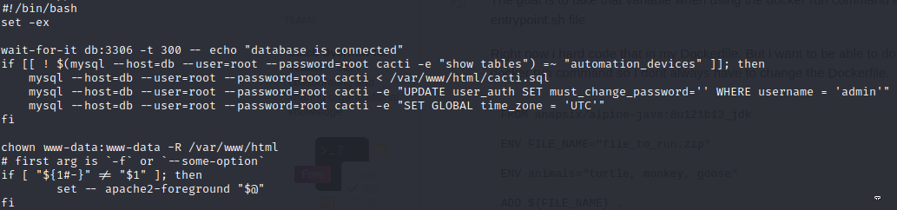

# PORTS SCAN

* **22** [ssh]
* **80** [http]

What we have here (port 80) is just a login with the title **Welcome to Cacti**

Cacti is a open source framework for fault management and operational monitoring

I tried with a bunch of credentials. The default ones are `admin:admin` but when you have the fresh install as soon as you log in ask you to change the password

We know the version of cacti is **1.2.22** and is vulnerable to `CVE-2022-46169` which allows RCE to unauthenticated users 

We have a [POC](https://github.com/FredBrave/CVE-2022-46169-CACTI-1.2.22/blob/main/CVE-2022-46169.py) ready to being used

Just set the NC listener and boom we got the first shell

With my surprise there are no folders inside the **/home** fodler...WHAT THE HELL!

With linpeas nothing interesting, I was hoping for some hardcoded crednetials or similar but nothing cool :(

 

In the `/` path we got something which can turn usefull

 

* The **<u>.dockerenv</u>** is an file used as indicator to identify whether a process is inside a container or not. Docker automatically create it inside the container filesystem (is normal that this file is empty is just used to check the existance or not)

 

* the bash script **<u>entrypoint.sh</u>**  is (as the name suggest) th entry point of the docker container. The entry point is the first command executed when a the container is created

 

The enigma is solved, we see no user folder in the home path because we are inside a docker container.

Let's take a look at the **entry point**

We have the credentials of the `mysql` application also the database schema is at `/var/www/html/cacti.sql` (the reverse shell doesn't allows me to check the output of the mysql queries so I had to check manually)

What's interesting is the table **user_auth** so I used `mysql` with the credential root:root and redirect the output in text file

Over the admin and guest default user we got the **marcus** user and his hash o we can crak it

We got the plain text password and we can move on the ssh shell with this credentials nd grab the user flag

 

# PRIVILEGE ESCALATION

After some enumaration I found a **mail** in `/var/mail/marcus` and this is the content gicing us not just some hints but also the motivation of the machine name

The first CVE described in the mail (**CVE-2021-33033**) in order to be exploited need the linux kernel version < 5.11.14 and the version of the machine is 5.4.0 so potentially we have space for PE.
This vulnerability is a **<u>UAF</u>** (use-after-free) and is related at a wrong usage of heap during program operation. When a memory section is freed the program doesn't clear the pointer to that memory section and the attacker can use that piece of mempry to exploit with costum malicious command

The second vulnerability is useless for us because the target is a version below the current in use of cacti (1.2.22)

The third (**CVE-2021-41091**) is pretty interesting because it target a docker version below 20.10.9 and make possibile to execute programs outside the docker container. When a containersincude executable with extended permission (like **SUID**) unpriviledged users can execute it.

For a shorter and clener explantaion if we got root on the container and we can set the SUID bit in a executable (like BASH) we can exfiltrated that and execute it on the host gaining root permission on the host

Well we are goiing to use the third reported CVE and try to follow this steps 

1) Get root on the conainer 
2) Set SUID bit on the bash
3) Run this [POC](https://github.com/UncleJ4ck/CVE-2021-41091) on the host

Let's dive in and try to find a way to get root on the container running for a secon time linpeas. Actually with some attention we have a possible use of a binary called **capsh**

And we can use it to leverage our permissions

Now we just need to set the **SUID** at `/bin/bash` and we can upload an run the PoC

After the PoC is executed it provide us the vulnerable path where we can execute the malicious **bash** which we can use to impersonat the root user 

Just grab the root flag and we are done!

