# PORT SCAN
* **22** &#8594; SSH
* **80** &#8594; HTTP (APACHE 2.4.56)
* **389** &#8594; LDAP (OpenLdap 2.2.X-2.3.X)
* **443** &#8594; HTTPS (APACHE 2.4.56)

   

# ENUMERATION & USER FLAG
The HTTP(S) port redirect to subdomain `nagios` which run the well known Open-Source software [NagiosXI](https://library.nagios.com/)

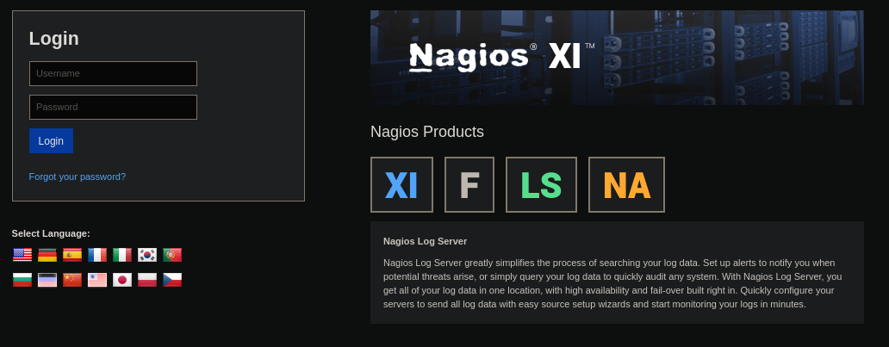

Nagios use LDAP and SNMP to work, we can enumerate the OBJECTID with **<u>snmpwalk</u>** it will list a good amount of records but this one is pretty pretty good

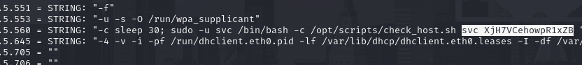

This can be a valid set of credentials so I tried on `NagiosXI` but it didn't worked. With some enumeration I found the endpoint `/nagios` asking for credentials in a simple HTTP auth, this time the `svc` username and the password found worked!

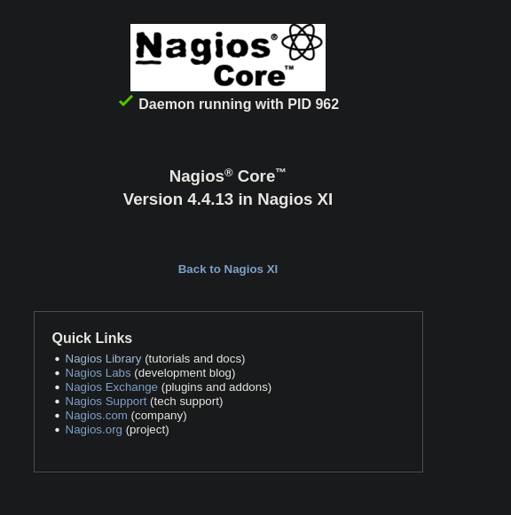

Here we are a low privilege user and the standard admin `nagiosadmin` is present, my idea right now to get access of the admin user and move on `NagiosXI` where we can (probably) exploit some CVE and get access

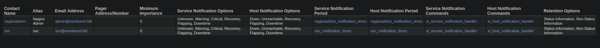

I spend a klot of time on look what I can do with this service but nothing usefull the creds is all we have here. Some enumeration exfiltrate the `nagiosxi/api/v1` allows to interface with API but we need an API token which we don't have at the moment. With some more (and more more more more) enumeration on SNMP I found that there is a process running [shellinabox](https://github.com/shellinabox/shellinabox) and `/nagiosxi/terminal` is where we can interface with it

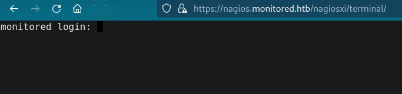

[Here](https://support.nagios.com/forum/viewtopic.php?f=16&t=58783) I found a forum thread where one of the answer allows us to retrieve the authentication token

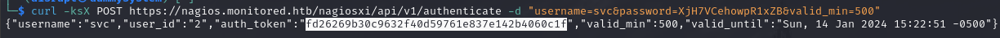

Now that we have our token we can follow the [CVE-2023-40931](https://nvd.nist.gov/vuln/detail/CVE-2023-40931), I am not sure of the NagiosXI version but was worth to try with SQLMap. Luckly is vulnerable!

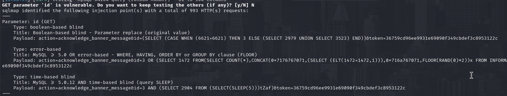

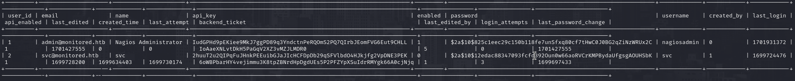

Cool finally we have the API key (and b2crypt hash) that we can use with the API and we can use `curl -XPOST "https://nagios.monitored.htb/nagiosxi/api/v1/system/user?apikey=[API_KEY]" -d "username=admin2&password=idontlikeyou&name=adm&email=pawn@localhost&auth_level=admin"` to create a new admin (with existing admin API key)

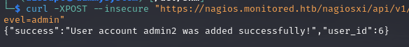

Finally we are inside **<u>NagiosXI</u>** as admin, I can finally try to create a costum command from here and run it. Is a good opportunity to check if I can ping my local machine so I crete the command as it follows (`check command` as Command Type)

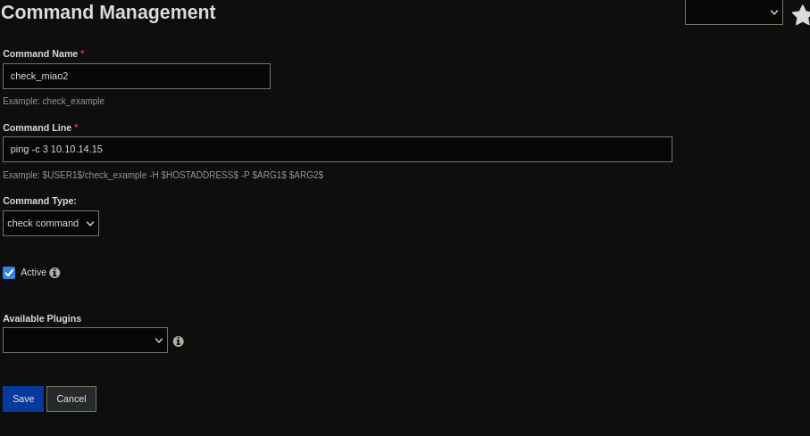

Than under `Configure` I select the host and when creating a new service I used `check command` to the one I have created. It work really well!

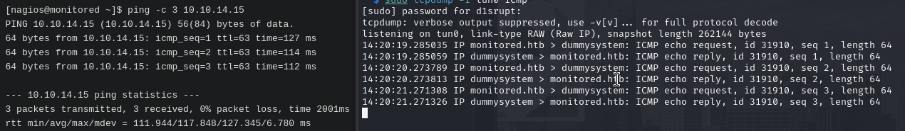

We know have a way to call a reverse shell via `bash`

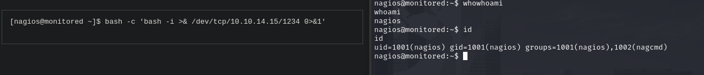

Gottch'a the user flag can be grabbed on the home directory!

   

# PRIVILEGE ESCALATION
We can run a lot of program with sudo without password, most of them are related to nargios but one in particlar is pretty interesting

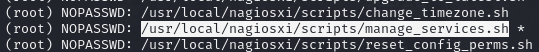

This script allows us to stop, reset, stop and check status of different service, one of these is `npcd`

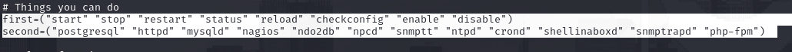

Looking at linpeas, t highlight the user permission to write on that specific service. this means we can write a reverse shell inside of it and than use the script to restart the service as root (you need to stop it before write on it obviously)

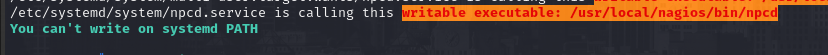

When the service will run back again the reverse shell will be triggered and we have access as root!

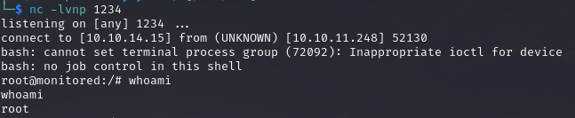
