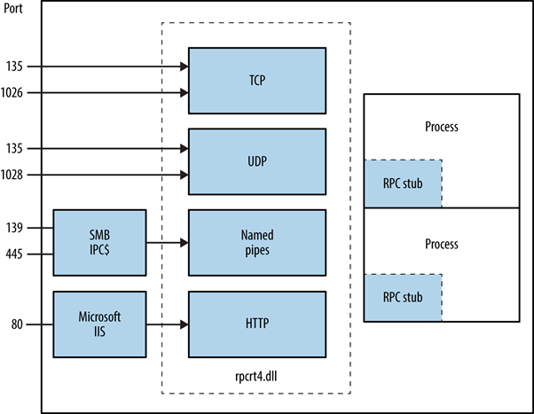
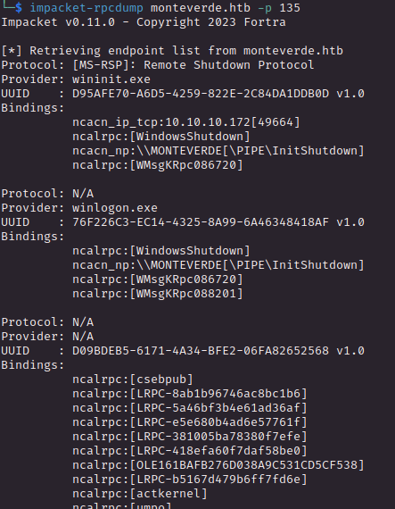
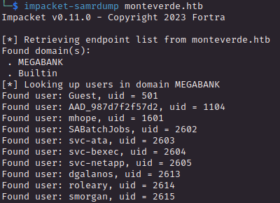
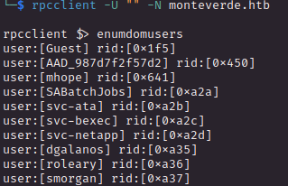
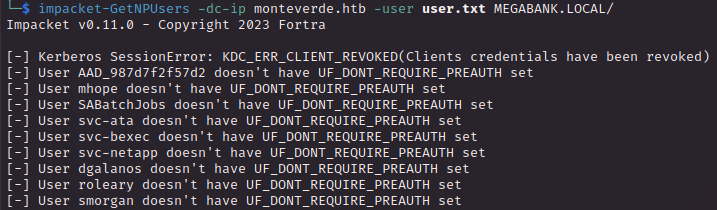
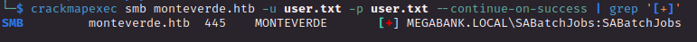
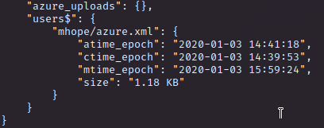
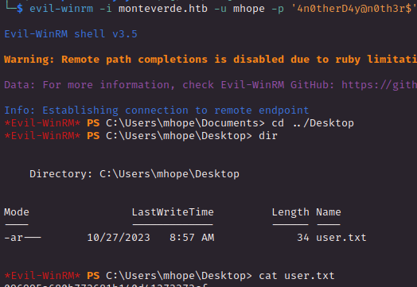
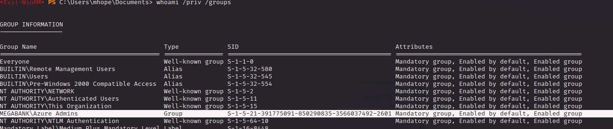
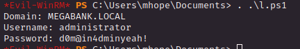

# PORT SCAN
* **53** &#8594; DNS
* **88** &#8594; Kerberos
* **135** &#8594; Microsoft RPC
* **139** &#8594; SMB over NetBios
* **389** &#8594; LDAP
* **445** &#8594; SMB
* **3268** &#8594; AD LDAP 
* **9839** &#8594; AD Web Services

The box is a Domain Controller on the `MEGABANK.LOCAL` domain

   

# ENUMERATION & USER FLAG
SMB doesn't accept anonymous login so no enumeration or RID bruteforcing from there, LDAP is not usefull (at least whitou valid credential) so I decide to move on RPC and check what we can retrieve 

<u>But how does **(MS)RPC** works</u>?

RPC is well known because allows to call subroutine through the so called <u>stub</u>, use the client address space to retrieve the parameters and transate in a NDR format (Network Data Rappresentation) which are transmitted to the server. If the server is located remotely the client untime have to decide which protocol use in order to successfully delivered the requested procedure plus the parameter

 

Every request is sent to an endpoint with **4 distinct attributes** : 
1) **<u>PROTOCOL</u>** &#8594; Rules and conventions for format and interaction client (TCP / UDP / HTTP / etc...)
2) **<u>PROVIDER</u>** &#8594; Entity responsible for the RPC service, can be a software or service located on the server side. It handles the client request, execute the procedure and send back the results
3) **<u>UUID</u>** &#8594; <u>Universally Unique Identifier</u> is a 128-bit ID unique and adressed on a particular interface/service. Used to ensure client is communicating with the correct endpoint when a procedure is invoked in order to avoid conflicts
4) **<u>BINDINGS</u>** &#8594; Network addresses and configuration information associated with the RPC endpoint including IP protocol, address and other info (like ports)

 

Returning back on `monteverde`, I used the impacket script called `rpcdump` to retrieve all the endpoints available

Cool, we can enumerate user from a well-known pipe called `\pipe\samr` which is a pubblic access to the SAM (Remote) database which list user and system shares present in the local network nonetheless is a good vector to get a users list. Impackets kicks in again with `samrdump` script which interrogate SAMR for us

Thanks to god RPC accept anonymous login and this allows us to interract with the endpoints. Same thing can be done "manually" with `RPC client`

I implemente some ASREP roasting but everyone have the PREAUTH enabled

So now I can use the same list as username and password for crackmapexec

Now we can enumerate the shares (I used the flag `-M spider_plus`) and we have an interesting file

This is cool because now we know that we are dealing with AD AZURE and an XML file of the user `mhope` and inside we can retrieve the plaintext password `4n0therD4y@n0th3r$`, niw we can get the user flag

   

# PRIVILEGE ESCALATION

The user `mhope` is part of the group **<u>Azure Admins</u>**

What's new here is the  `.Azure` directory inside the home folder but nothing nteresting for now.

On `Program Files` we can see the **<u>Microsoft Azure AD Conncet</u>** software which is used for groups, users and objects synchronization as long as password hashes, cool!

Using [this PoC](https://gist.github.com/xpn/0dc393e944d8733e3c63023968583545) and modify the first line in order to communicate with the serve I am able to perform an Azure Connect Attack (same thing can be used with `AdDecrypt.exe`), essential we are extracting and decrypting the credentials strore in the Azure AD Connect Server, inside there is alway a high-privilege account (in this case administrator). All of this make **<u>Azure Connect a High Valuable Target</u>**

The PoC makes extract this info from the SQL server:
1) The `XML` configuration from the **mms_management_aget** (encrypted data)
2) `instance_id`, `keyset_id` and `entropy` from the **mms_server_configuration** 
3) `encryption key` and `DPAPI secrets` (for registry)

Lastly use all this info to encrypt the data which are the username and password ([here](https://www.slideshare.net/DirkjanMollema/im-in-your-cloud-reading-everyones-email-hacking-azure-ad-via-active-directory) the full details)

  

Here's what we get as output

Now we can connect with WinRM and get the root flag

Cool stuff! This was my first machine based on Azure and is something that I need to start study soon or later but first I need to sharp my (simple) AD skills! 
