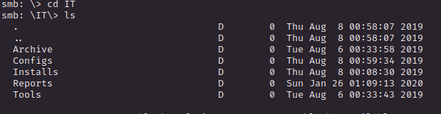

# PORT SCAN
* **445** &#8594; SMB
* **4836** &#8594; Reporting Service V1.2

   

# ENUMERATION & USER FLAG
Uau a Windows Machine with just 2 ports open, rare!
The SMB accept anonymous login and we can read `Data` and `User` shared folder

Let's dive in! Starting with `Data`

All but `Shared` cannot be access with anonymous permission and I found the following files

Uau cool stuff we have a temp user credentials but I want to try to enumerate `User` directory before trying to use it some how

Ok cool stuff seems that we will deal only with this 2 ports without shell of some sorts, maybe(?). We can't access none of this directories as anonymous so we will use the `TempUser` and check his directory. Within it we just have a single TXT file

And this is empty...WTF! (I used exiftool to read metadat but nothing lol)
Don't lose the hope because we have access to the `Secure$` shared folder

But we cant access anything here...let's take a look at other shared folder and see if we can light up folder that are still in the shadow 

For instance now we can access the `Data/IT` folder

Interesting stuff right here 

`config/RU Scanner` try to hide something from us :)

This seems encrypted password and at the same time encrypted so not easy to brute-force it 

Another file that catch my eye was `Configs/NotepadPlusPlus/config.xml` especilly the <u>Find History tag</u> 

Cool let's try for the `Secure$` folder

`Docs` have something new for me

What is really cool here is the `VB Project` which contain a lot of Visual Studio files and we will aim here is the `Module1.vb`

Let's use Visual Studio and try to use this code to decrypt the string we have.

[dotnetfiddle](https://dotnetfiddle.net/) will be our buddy now, I copied the content of `Utils.vb` and added a Main() method printing the DecryptString output given the crypted string

`xRxRxPANCAK3SxRxRx` is the password now let's use it and see if we can grab the user flag for `c.smith` user

Gottch'a let's submit it and move on!

   

# PRIVILEGE ESCALATION

Not only the flag was present on the C.Smith folder but also a `HQK Reporting` direcotry (maybe now we will deal with the custom service on <u>port 4836</u>)

We have a XML configuration file

The `exe` running behind the curtains

and a empty txt file (again oh god)

But here's a little trick, if we use `allinfo` pointing the TXT file on the smbclient prompt we can see the alternative data stream in this case we have the standard `DATA` and `Password`

> Alternate Data Stream (ADS) are a feature of NTFS file system created and designed to improve compatibility of Windows and Macintosh system that use Hierical File System (HFS). HFS use streams (or fork) linked to a single name on the Macintosh file system and usually store metadata but also independent data streams to an NTFS file ([resource](https://vox.veritas.com/t5/Articles/What-you-need-to-know-about-alternate-data-streams-in-windows-Is/ta-p/807740))
> Also ADS are described as a security vulnerability and something that can be used by attackers like a "hidden compratment within a suitcase", [this article](https://blog.netwrix.com/2022/12/16/alternate_data_stream/) is really cool and exhaustive

We can use a simple GET command with a little enachment in order to retrieve the stream of our choice

Cool we have a password now and seems to be used for DEBUG option on the service on 4386

We have 3 Query

We are currenly in the `C:\Program Files\HQK\ALL QUERIES` directory so let's take a step back in the tree and use `LIST` command again

uu LDAP seems cool 

Again we have a password that seems in the same format as before but looking at the `EXE` (decompiled with dnSpy) we have the optionsu sed to encrypt the password

Inside the **CR** class we have all the functions (in `C#`), so I create an exe putting all togheter and hardcoding the strings the results is our cool

Now with a simple PSEXEC we have access as root!

