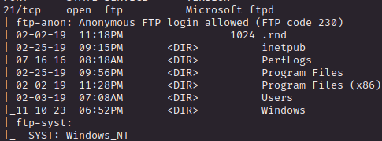
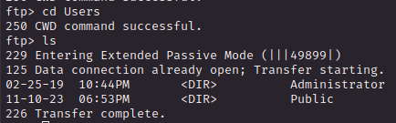
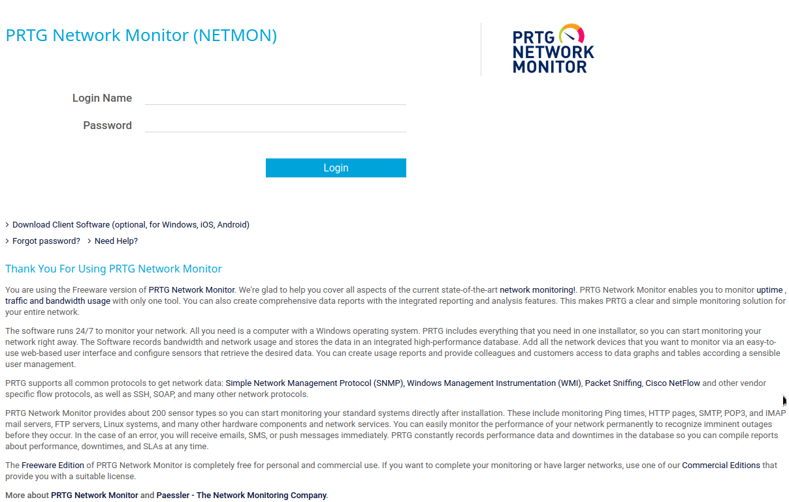
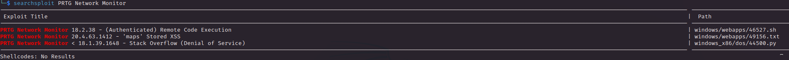
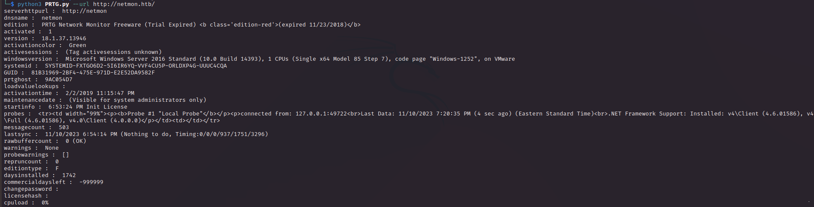
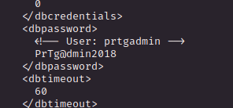
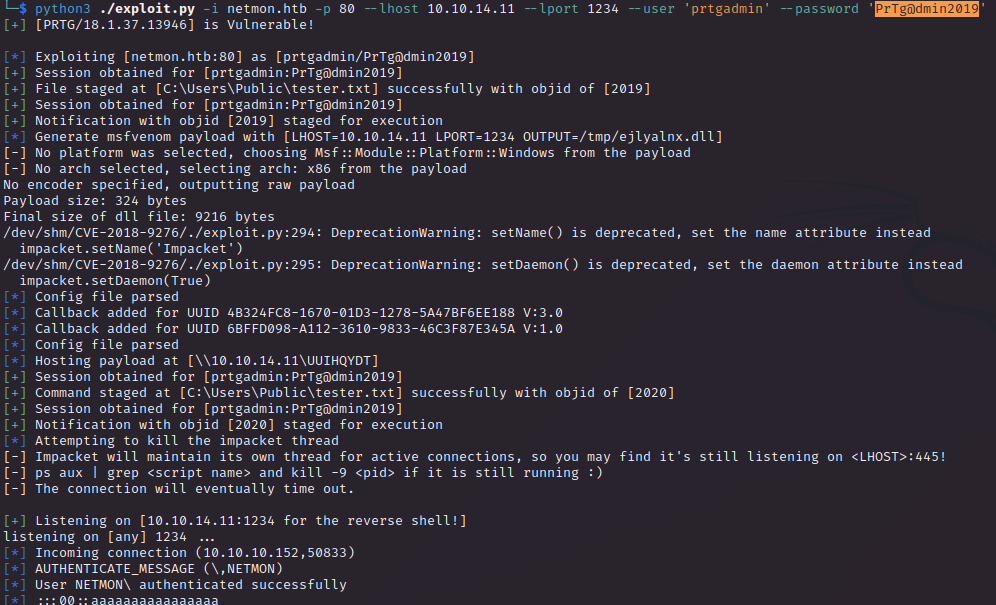
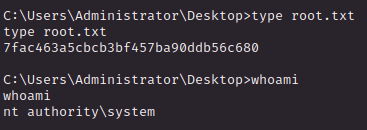

# PORT SCAN
* **21** &#8594; FTP
* **80** &#8594; HTTP (Paessler PRTG bandwidth monitor)
* **135** &#8594; MSRPC
* **139 / 445** &#8594; SMB

   

# ENUMERATION & USER FLAG
The FTP protocol accept anonymous login so I want to start from here 

The only user present on the box is the Administrator

Inside the `Public` folder we have the user flag which can be downloaded and submitted, LOL (I've noted that given the same difficult level Windows boxes are easier than linux one, probably because dealing with windows may be confusing at first but this is letteraly too much). Well we have the first flag in a blink of an eye!

   

# PRIVILEGE ESCALATION
The web interface host the **<u>PRTG NETWORK MONITOR</u>** software (tried default credentials but no catch, unlucky)

Appear to have multiple known vulnerability, I am interested in the RCE obviousy but we need to find the version and the credentials to authenticate with

About the version can be found at the bottom (I missed at first)

So no RCE here (for now) but we can use [this PoC](https://github.com/titanssystems/PRTG-Exploit/tree/main) to perform some information disclosure exploit in order to gain more information

Nothing interesting, rip

On the same results page I get [this exploit](https://github.com/A1vinSmith/CVE-2018-9276) which allows to get a reverse shell for our version but we need to get the credentials so let's visit FTP again and check something for us. Was not that hard because we have access to the whole WIndows Filesystem (obviously not the high privilege directories) and the file `/ProgramData/Paessler/PRTG Network Monitor/PRTG Configuration.old.bak` contains the password for the default user

Now we can use the exploit to get access on the box but the credentials are wrong. Looking at the password we note the year 2018 is used so I checked when the machine was published on HTB and use it instead of the one on the old configuration file. In this case with the password `PrTg@dmin2019` everything is smooth

