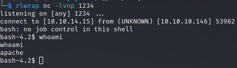

# PORT SCAN
* **22** &#8594; SSH
* **80** &#8594; HTTP (APACHE 2.4.6)

   

# ENUMERATION & USER FLAG

This is the homepage

The source code suggest there is a lot more "covered"

GoBuster has been my best friend for some dirbusting (I found no subdomain) all of them pretty interesting especially the `/backup`

In the last endpoint we can download a tar file called **backup** that contained the PHP code of the other endpoints, that's cool!

`upload.php` have a strange behaviour it ask for a image file but when I ty with a standard PNG or JPG return an error so I will start looking there.
First of all the PHP code check the file type using a function from `lib.php`

Okay so now we can take a look on the library php file to get a look how this function work and is a wrapper of the `file_mime_type($file)` function

"[...] magic MIME [...]" in the comment is a hint, we can play with magic number to change the MIME of a PHP reverse shell. I used `hexeditor` to change the first 4 bytes into the JPG MIME magic bytes `FF D8 FF E0` 

Using **file** returned as JPG so I changed the extension to `php.jpg` and I was finally able to upload it!

On `/photos,php` we can find our file but when we access it something strange occured

Ok let's not give up we have a piece of the puzzle placed correctly, well was actually pretty easy to make it work. Is a good practice to try create a JPG (or whatever other file) from scratch. I always forgot this type of things (I have a bad memory lol) so I used the official walkthrough and here the step to create a fake JPG file

After the upload we have gained RCE successfully! It create a small difference when we overwrite the magic bytes and when we create a file starting from the magic bytes

Nice we can now use this RCE to spawn a reverse shell

Gottch'a, this is not enough to grab the user flag so we need to explore further (finally in a turf that I am more comfortable with) but we can get inside the `guly` home directory and there is an interesting file called `crontab.guly`

et's take a look at the `check_attack.php` (obviously we cannot change it)

We "control" the `$value` variable (every 3 minute the `/uploads` directory scan all the name of the file) and is "injected" inside the `exec()` function, so I created a dummy file with `touch ';ping -c 3 10.10.14.15'` and after 3 minutes the command executed correctly!

With the same approach I can retrieve a reverse shell, this time as **<u>guly</u>** with the netcat binary installed in the target machine!

Now we can grab the flag and free to move on privilege escalation!

   

# PRIVILEGE ESCALATION

We can execute the script `/usr/local/sbin/changename.sh` as root without password thanks on how SUDO has been cofnigured, thanks for that sysadmin! The script is the following

What's interesting here is the `regexp` we can't inject something like `/bin/bash` but `lolol /bin/bash` would pass smoothly (because hte space character is part of the regular expression, bad choice). This is a good combo with the file we are going to write on the way **<u>network-scripts</u>** (CentOS) are parsed permis to execute what ever is after a space in the parameters field so something like `NAME=dsa /bin/bash` will execute a bash as root.

Cool, regular expression are something confusing at first but with some experience are pretty easy to understand and is essential if we need to work with bash script!
