# PORT SCAN
* **22** &#8594; SSH
* **53** &#8594; DNS
* **80** &#8594; HTTP (LIGHTTPD 1.4.35)
* **1624 / 32469** &#8594; UPnP (Platinum 1.0.5.13)
* **32400** &#8594; PLEX MEDIA SERVER (HTTPD)

   

# ENUMERATION & USER FLAG
The name of the machine is reference of the Mirai botnet which abused missconfiguration and vulnerabilities in IoT device (is a well known fact that this type of device are highly insecure especially if interfaced with the public net). The port 80 is not interesting for now

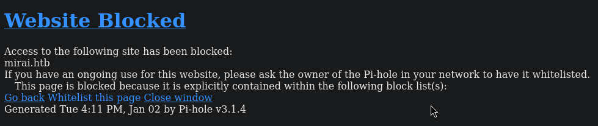

Well the port 32400 is more more interesting, a login form is blocking us!

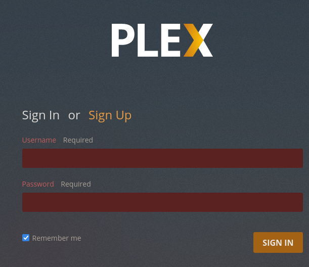

I tried some default credendtials I found [online](https://forums.plex.tv/t/what-is-the-default-ssh-user-password/30613/19) but now ay to get in (same thing to signup is disabled). I tired to play a little with UPnP but I wasn't able to retrieve something usefull.
Returning back to the port 80 we can see is using [Pi-Hole](https://github.com/pi-hole/pi-hole) an AD blocking that is widely used in raspberry device. Looking at the GitHub repository I have found the `/admin/api.php` path

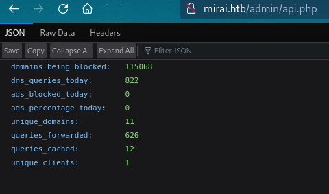

If we go directly to `/admin` we are inside the dashboard

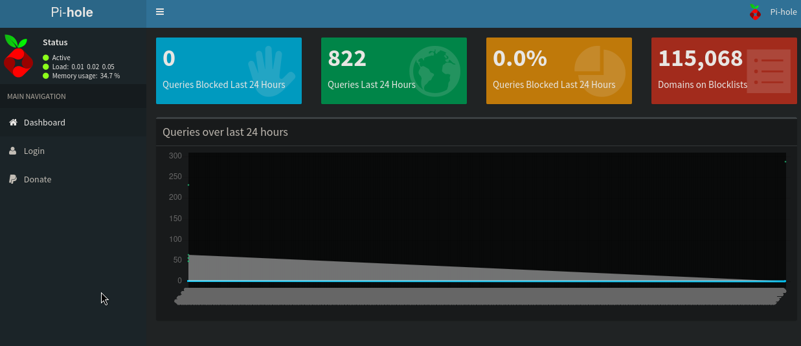

I have previously used **searchsploit** to find some well known CVE and all of them are authenticated, we have a form where we have to insert a password and after trying some weak ones I decide to give up. The solution here was not that tricky, we know the device is a raspberry and the machine is based on the fact of IoT device are not that secure so was worth trying the default credentials on SSH `pi:raspberry` and was worth it becuase we have access!

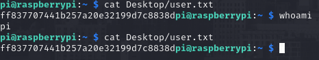

   

# PRIVILEGE ESCALATION
Now we are in the sudoers group so I used to spawn a root shell and read the last flag but something different popup

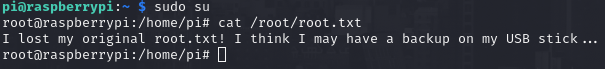

Interesting stuff! We actually don't know where this USB stick can be accessed but `mount -l` can help us understand it

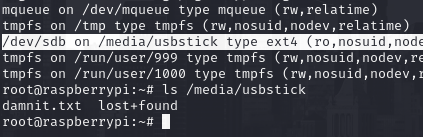

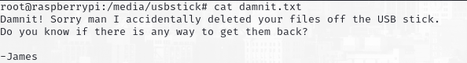

Lucky lucky me finally some of the course I did can return usefull somehow, someone deleted the file accidentaly but doesn't mean is lost forever. When you delete a file you are not actually "free the space" (**unlink**) occupied by that file but you are <u>removing the siymbolic link to that space</u> that will be overidden if needed! That's a small detail but really important especcialy for forensics activity. `dd` is a command utility in linux is as simple as foundamnetals and was used since earliest version of Linux. Essentially copies byte-per-byte and clone it on an utput file, this type of cloning doesn't care about symbolic link and will retrieve everything so even if we "delete" a file will be cloned too. In our case I can use it on the raw mount point and save it locally 

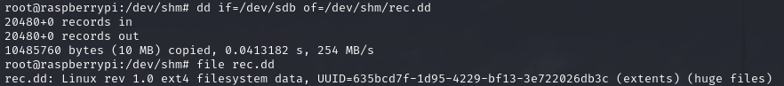

The recovery of the usb stick will be saved in `rec.dd` and moved in the local machine which will be used with `testdisk` where we can retrieve the deleted file

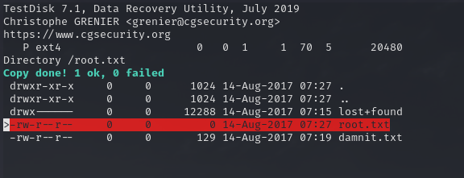

As you can see the file is still present in the DD file so we can use `strings` on this file to retrieve the flag

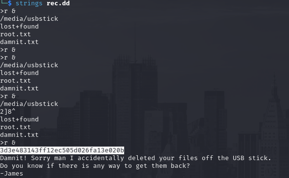

Same thing can be done directly on the raw mount point 

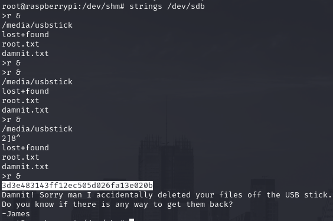
