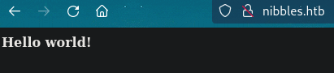

# PORT SCAN

* **22** &#8594; SSH
* **80** &#8594; HTTP (APACHE 2.4.18)

   

# ENUMERATION & USER FLAG

We have a grateful message in the homepage of port 80!

The source code have a commenttelling us to visit `/nibblenlog` because there is nothing in the homepage, LOL

The blog is made with [nibbleblog](https://github.com/dignajar/nibbleblog), if we enumerate this part we have better results than the homepage

at `/admin.php` we have the login form while at `/content/private/users.xml` exfiltrate the **admin** user

So I tried some weak credentials and `admin:nibbles` work smoothly, now we are inside the dashboard of nibbleblog

I need to find the version of nibbleblog and in the settings section can be found at the bottom, the `4.0.3` which is vulnerable to [CVE-2015-6967](https://github.com/FredBrave/CVE-2015-6967) a file upload vulnerability which can be used for a php reverse shell!	

I used the PoC but can easily performed manually uploading whatever extension you want (in this case php) through the **<u>MyImage</u>** plugin which existence can be checked with a little enumeration on the XML files

This is enough to exfiltrate the first flag of the day!

   

# PRIVILEGE ESCALATION

Inside the `nibbler` directory we have a zip file which contains a `monitor.sh` script moreover this script can be run as **root**

Well pretty easy, I just add at the end of the script the command bash to spawn a shell as root!

Now after the execution we have our high privilege shell!

