# PORT SCAN
* **22** &#8594; SSH
* **5000** &#8594; NODE.JS (Express Middleware)

   

# ENUMERATION & USER FLAG
The NODE.JS service i a simpl blog 

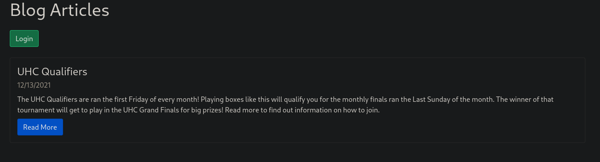

I am pretty confused on what to do because it lacks of contents, pretty bad stuff here. Well let's focus on the login form first of all `admin` is a valid account because otherwise will return invalid username error, that's great!

I tried some SQLi and the SQLMAP instance but none return nothing so probably they are using something else like NoSQL. The request is sent with POST so we need to change the content type to `application/json` if we want to inject.

Luckly I have already mess up with some NoSQL database so I know a little on how to check if there is a injection or not. This is the case!

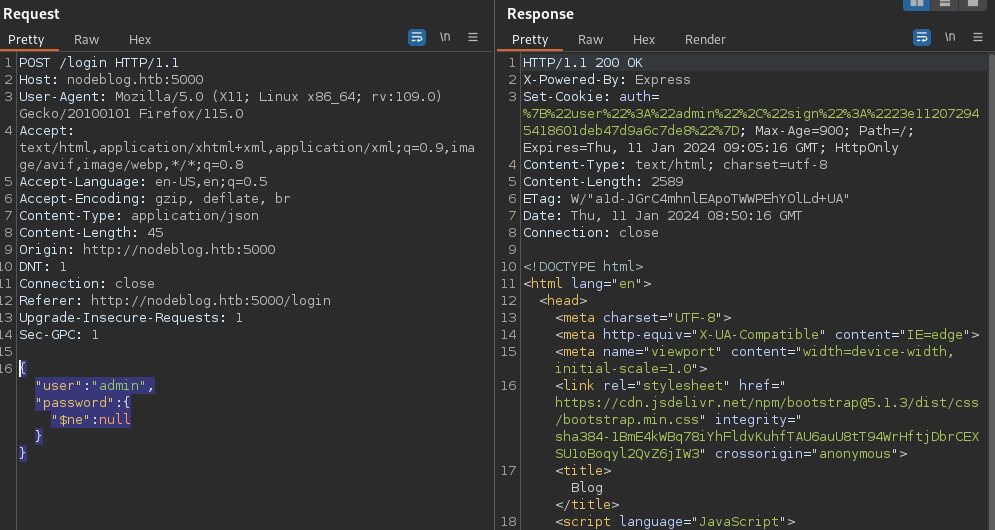

As you can see we have an authentication cookie thismeans we can access as admin in this way

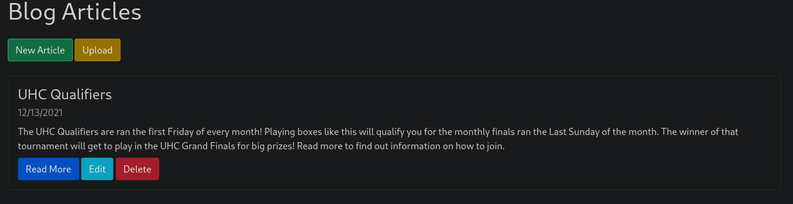

On the `UPLOAD` section I tried to upload a (what I think it was) innocent image file but actually is not what the server was expecting

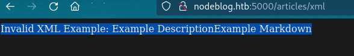

XML....interesting, this means we can try to perform some XXE but I want to understand what type of schema is the server expecting (because I pick a random XML in the web and was not working lol), just see the source code and everything will be clear

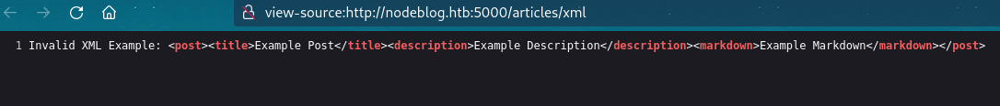

After that we can create a simple test XML and te XML will be read and use it for creating a new article, makes sense

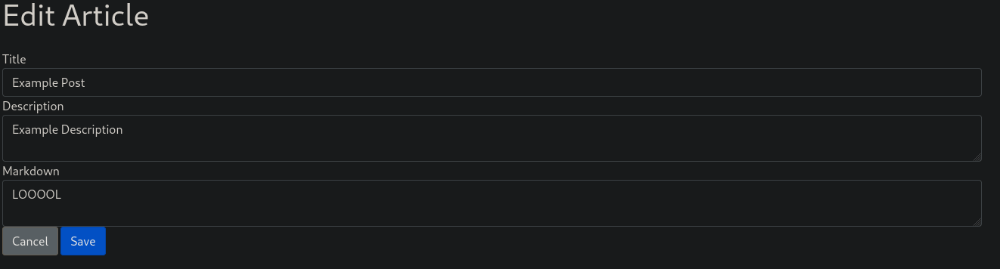

We can now perform the XXE Injection!

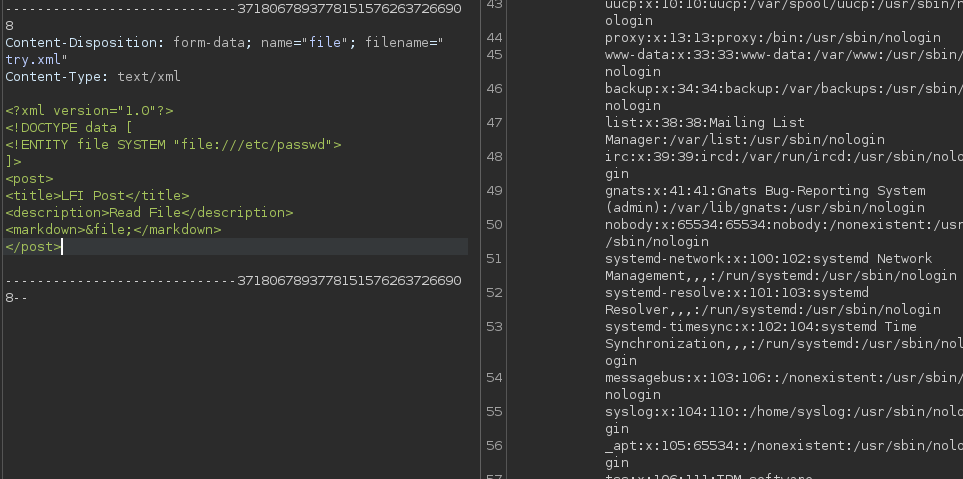

Pretty useless the password file so I try to enumerate a little bit (and actually with the help of walkthrough) I was able to retrieve the `server.js` file commonly used for code that run the whole app.
What's interesting here is the `serialize` and `unserialize` on the cookie

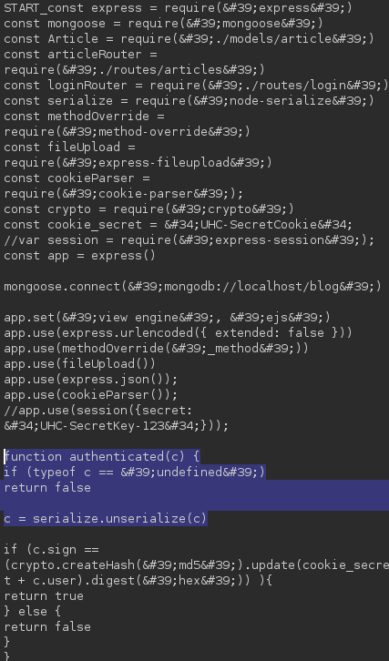

Taking a closer look to the cookie we have something interesting

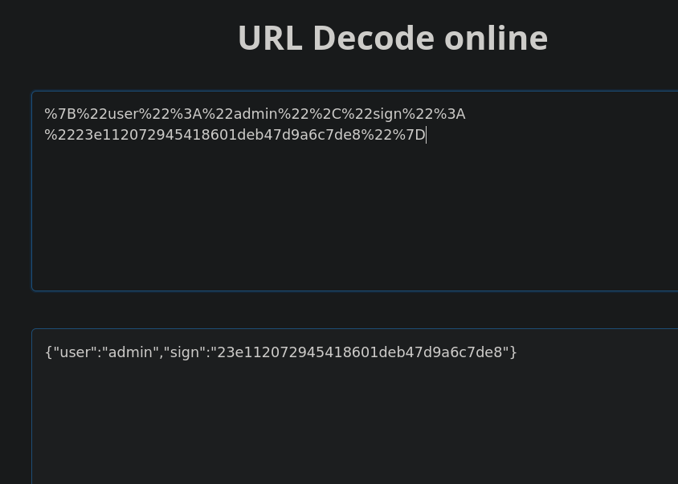

Now we found a way, we can change the JSON cookie in something else in order to perform RCE and than encoded in URL and use it as cookie. If everything work well we should be able to perfrom the RCE (I followed [HackTricks](https://book.hacktricks.xyz/pentesting-web/deserialization#nodejs) guide as always is gold!)

With this payload I was able to ping my machine

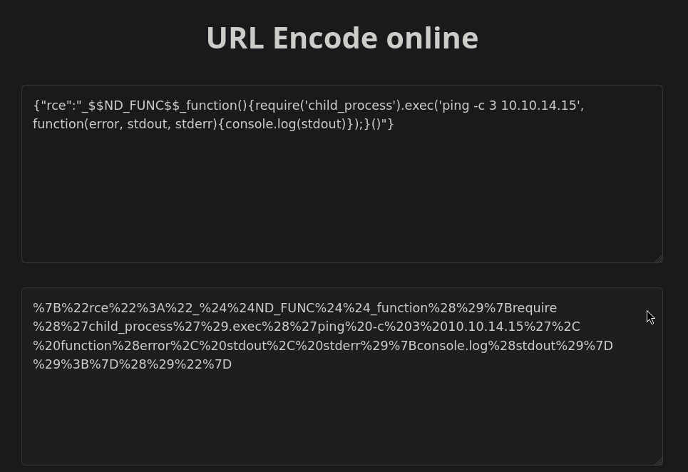

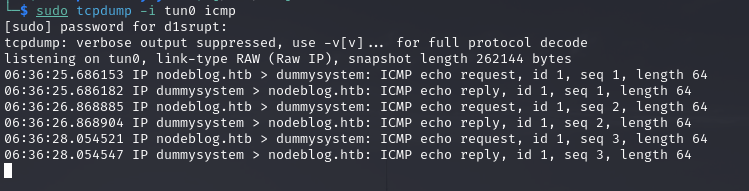

Now that we have RCE I used to download and execute a reverse shell I had saved on my local machine, now we havea feet inside the target! The user flag is there waiting for us!

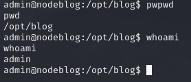

   

# PRIVILEGE ESCALATION
We don't have much inside the directory and we can't run `sudo -l` without a password so is time to find something usefull. I saw in the previous LFI through XE that the DBMS used is MongoDB so is worth trying to check it out.

The configuration file is located at `/etc/mongodb.conf` and we know is running on port **27017**

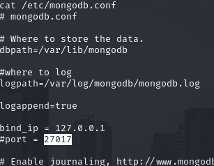

We can connect whitout a password and we found the admin cleartext password!

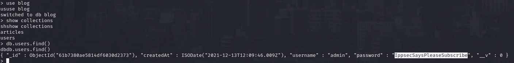

Now we can see what we can run with sudo and actually everything can be executed as root, bash included

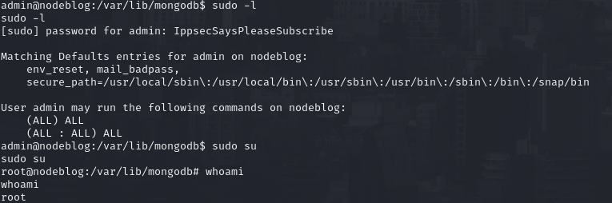

Root flag is ready to be grabbed!
