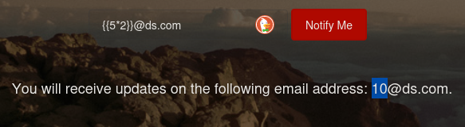
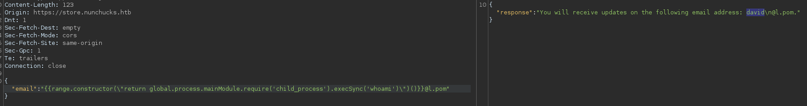

# PORT SCAN
* **22** &#8594; SSH
* **80** &#8594; HTTP (NGINX 1.18)
* **443** &#8594; HTTPS (NGINX 1.18)
* 
   

# ENUMERATION & USER FLAG

We have a HTTPS website which use **Express** as web framework (implemented with NodeJS) and the machine name can be a hint, in HackTricks we can found under the SSTI section the [NUNJUCKS](https://book.hacktricks.xyz/pentesting-web/ssti-server-side-template-injection#nunjucks) template injection. Pretty interesting! 

Signup and signin form are disabled and we need to find some dynamic page which use a input to create the page. At `/privacy` we have a Privacy Policy which idk if can turn usefull or not. Same thing when we access the `/terms`.

Apparently here is nothing interesting so I will run some subdomain/vhost enumeration

Cool we have a new target

We can try to inject on the email form on the bottom and guess what? Is vulnerable!

Interesting, RCE now can be easily performed thanks to hacktricks notes

And with that the reverse shell is served!

The first flag is inside the home directory of `david` user

   

# PRIVILEGE ESCALATION
On this machine `PERL` have **<u>CAP_SETUID</u>** set

Capabilities are speciall attribute which can be allocated to allow specific privileges that are reserved for high-level user, interesting stuff are that even if `whoami` work correctly if we spawn a bash or read the root flag we mantain the user permissions...

This requires a bit of knowleadge, the **<u>AppArmor Kernel Enhancement</u>** can confine programs and binaries restricting their use through **program profile**. We can enumerate the profiles on `/etc/apparmor.d`

As we can see in the <u>perl profile</u> we have no access in the `/root` directory but we can modify the `/opt/backup.pl` which automatically set the capabilities for us (so we can just fire it up adn we are running as `root`)

As normal user we can't modify it I tried to modify using the GTFO one liner but was harder than expected, always HackTricks is here to save the day becuase in the AppArmor section have some notes about `sheabang bypass` we can create our costum perl script with high capabilities and just execute after setting the `+x permissions`

