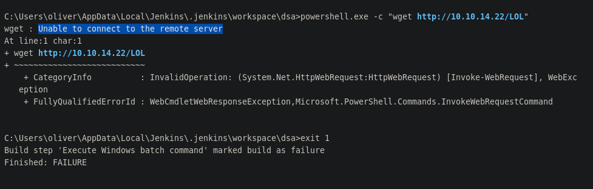
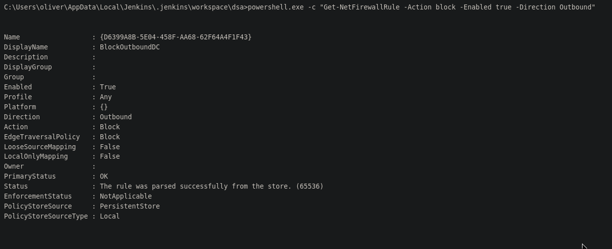
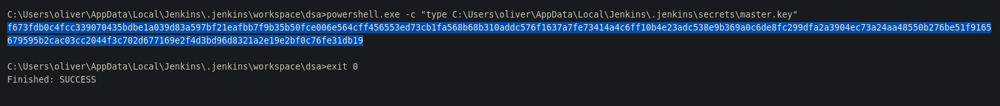

# PORT SCAN
 * **80** &#8594; HTTP (IIS 10.0)
 * **5985** &#8594; WinRM
 * **8080** &#8594; Jetty (9.4.43)

<br><br><br>

# ENUMERATION & USER FLAG
Jetty on port 8080, pretty uncommon but that's fine. As always ready, steady, go into port 80


Uff, not what I expected but fine we know that port 80 needs only to redirecto on the **<u>automation server</u>** which is just the Jetty port, cool!


Yeah, Jenkins! I created an account and obviously the other one existing is `admin`


I have created a standard build with a simple powershell commands to run during the build. 


Unlucky no way to start a build, probably we need admin access becuase with the prmissions I have now no build can be performed. I read the manual and try to find something that can help me, after I while I looked back to the configuration of the build. Stupid stupid me I overlooked the section **<u>Build Triggers</u>**, I looked [here](https://www.toolsqa.com/jenkins/jenkins-build-jobs/) and we can use the **<u>build periodically</u>** option to run the build periodically every minute


Hell yeah if I mean every minute! Now save the configuration and just wait...but nothing, nothing is built....UUUUHM.Ok cool let's chill is everything fine.
Again, back to the settings we need to use the API tokens thing to trigger the build. On the top right user icon we access the setttings and on **<u>API Token</u>** section we add our costum token (this would called the **user token**).


Last back to our build we should set the **Authetication token** of the build


Now we need to communicate with the REST API, there is a lot of documentation online and from the various one that I tried


It worked! Now we can see the results on the **<u>Console Output</u>**.


I tried the usual web delivery metasploit module but when using the powershell one liner an interesting error occured


Same thing for a simple WGET on the attacker machine, things are not that funny now uff!



Probably a firewall, damn! But we can execute internal Windows so I check [this resource](https://medium.com/@calfcrusher/windows-powershell-red-team-cheatsheet-part-1-ee2814a516fe) and extracted the one liner to check the firewalls rules

```
Get-NetFirewallRule | select DisplayName, Enabled, Description
```

Too many rules to check, some filtering is required


We need all about the blocking outgoing connection, looking at the official doumentation I was able to get a cleaner output with the following oneliner

```
powershell.exe -c "Get-NetFirewallRule -Action block -Enabled true -Direction Outbound"
```

With "cleaner" I mean just a single rule, LOL!



**<u>BlockOutboundDC</u>** is the infamous rule, you little bastard! When I try to kill this little bitch an error occured. Obviously we don't have permissions but a try was worth.


Well at least I have learned playing with firewall rules using powershell and the full list of rules allows Kerberos communication, we would deal with Actve Directory again but this machine is not the DC. I expect to do perform pivoting later but let's chill and don't rush too much.
[HackTricks](https://cloud.hacktricks.xyz/pentesting-ci-cd/jenkins-security#post-exploitation) gives us an overview about  post-exploitation in Jenkins and we need to finds a file called `cred.xml` into teh machine to grab sme credentials. We can execute powershell scripts inside the machine so what about listings all the files inside the directory of `oliver`?


Hell yeah the flag! Pretty soon but I will take the shell first before reading it. I retry to list the directory but with the `-Force` flag to return the "hidden" directories as well, **AppData** there should be something there.


Hell yeah! now we are talking, let me explore some more. Finally I get interesting Jenkins file at `C:\Users\oliver\AppData\Local\Jenkins\.jenkins` but you know what? I am an idiot. Yeah, because if I look all the **Console Output** I would notice the path was already there, LOOOOL


That's fine, I'm just a little bit distracted lately but we have our way now! Without showing all the enumeration process. The interesting content is inside the file located at `C:\Users\oliver\AppData\Local\Jenkins\.jenkins\users\admin_17207690984073220035\config.xml`


We need to decrypt it, I just google and found [this tool](https://github.com/gquere/pwn_jenkins/tree/master), we need something more to get the plaintext


`credential.xml` is `config.xml` so no need to search it. The `master key` is located at `C:\Users\oliver\AppData\Local\Jenkins\.jenkins\secrets\master.key`. Is pretty loooong!



`hudson.util.Secret` is in the same directory but needs to be encoded in base64 if we want to save it on our Kali machine because is a bytestream.


Cool time to get our plantetxt!


We can login and get our flag!


<br><br><br>

# PRIVILEGE ESCALATION

Finally I am on my favorite turf, the terminal. Great we are inside as `oliver` but we have 2 more user with a home directory on this machine, **<u>maria</u> and <u>smith</u>**


Our machine is inside as domain as expected, the FQDN is **<u>jenkins.object.local</u>**, surprising the Domain Controller is the same machine we are inside


Never panic, never panic. I redo the nmap scan and no SMB, LDAP or Kerberos port have been identified. We are behind a firewall now so let me check the incoming rule


Uhm, that's fine because we know firewall is in play but before moving over I wanted to get off my comfrot zone and enumerate a little bit Active Directory with PowerShell. Yeah, I know PS is not the best idea if we care about OPSEC but better learn a new skill in this labs. The membership of `oliver` are not usefull at all, bad bad bad


We cannot set ligolo because the shitty firewall, I want to get some data with BloodHound so the only way to get the data is through the executable ingestor. I tried wth different way (executable, script, loading in memory with EvilWinRM and Bypass-4MSI) but no way for that, probably the firewall is blocking all of this.
We should do this manually, time to roll! So no group is interesting for us but what about single user permissions on other objects? I tried checking the other 2 users and et' voila' we can reset `smith` password while `maria` is untouched for now!


Cool stuff, since I am used to the edges in bloodhound I could look directly at their [edges documentation](https://support.bloodhoundenterprise.io/hc/en-us/articles/17223286750747-ForceChangePassword) so I can be sure how to abuse this. Thanks to Evil-WinRM capabilities I loaded into memory PowerView powershell script.

Now is easy, let's create a securestring object and use it with `Set-DomainUserPassword` function


Re login as smith and we have control of this user, boom!


Let's recheck if we can play with `maria` right now


**"<u>SPECIAL ACCESS</u>"**, interesting let's investigate what this edge is all about. removing the filtering I have now the real full permissions that makes it more clear.


Fine this is `GenericWrite` there are 2 ways to abuse this, forcing a SPN or through the `msds-KeyCredentialLink` attribute (shadow credentials). Obviously I tried to perform it but no wrk at all, same thing for the SPN, I mean it worked but looks uncrackable, grrrr.

Actually these are not the only way to abuse it, potentially we can set a [scriptpath to execute when the user login](https://book.hacktricks.xyz/windows-hardening/active-directory-methodology/acl-persistence-abuse#genericwrite-on-user).  We need to take of the firewall, we cannot host the script on SMB (my idea was to grab the NTLM hash and crack it) because firewall would block it and reverse shell cannot be performed for the same motivation. I tried to keep thing very very basics just to see if it works


I moved the PS script into programdata so everyone can access it and set the logon script path with the following oneliner.
```
Set-ADObject -SamAccountName maria -SET @{scriptpath="C:\\programdata\\yoyo.ps1"}
```


Just wait a few seconds and we have the results, cool we have an asynchronus RCE on maria, cool


Now I can just cange the PS scritpt and I did the simple thing I could do, listing the contents of the **maria home directory**


Hell yah we have something in the Desktop!


Cool last cahnge of the logon script to exfiltrate `Engines.xls` and download it locally. Looks really really fun, we have 3 passwords to try now!


Let's bet 10 euros, in my opinion the last one is correct.


I WON! Yeah was an easy guess, lol. Well you have noticed the **PW3ND!** message, that's **not because we are inside the Domain Admins group but because we can <u>change owner</u> of that group**. Easy peasy we can add ourselves into that group . We can check this looking the DACL of `Domain Admins`


So thi are the powershell command to use for being to be part of Domain Admins groups

1) Set ourselves as **Owner**
```
Set-DomainObjectOwner -Identity 'Domain Admins' -OwnerIdentity 'maria'
```
2) Join the groups with all te possible permissions
```
Add-DomainObjectAcl -TargetIdentity "Domain Admins" -PrincipalIdentity maria -Rights All
```
3) Finally add ourselves into the group!
```
net group "Domain Admins" maria /add
```

Just login back to enjoy your new permissions!


FUCK YOU FIREWALL!
