# PORT SCAN
* **53** &#8594; DNS
* **80** &#8594; HTTP (APACH 2.4.56)
* **88** &#8594; KERBEROS
* **139 / 445** &#8594; SMB
* **389 / 636** &#8594; LDAP
* **443** &#8594; HTTPS
*  **5985** &#8594; WINRM

   

# ENUMERATION & USER FLAG
Port HTTPS start with a 403 error while the simple HTTP port return with a blog website

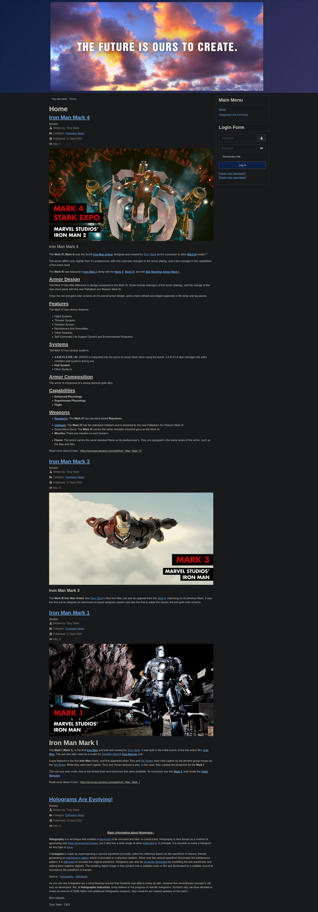

Using some traditional enumeration tool (like GoBuster or FFUF) is not working, after a few attempts we get blocked somohow and we can't access the website for a while. With some manual enumeration I found that **<u>Joomla</u>** is the CMS used (just take a look at the website tab-logo or the source code) and with droopescan I was ablot to retireve an endpoint that contains the **<u>Joomla version</u>** at `/administrator/manifests/files/joomla.xml`

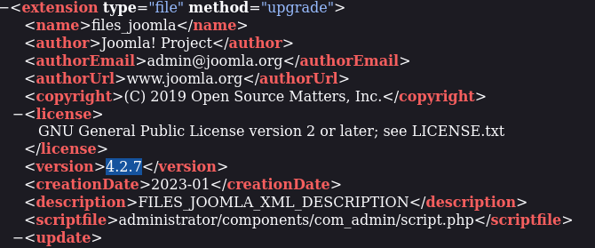

This specific version is vulnerable to [CVE-2023-23752](https://nvd.nist.gov/vuln/detail/CVE-2023-23752), this is the second time I encounter this vulnerability and instead of do it manually I want to try this [PoC](https://github.com/Acceis/exploit-CVE-2023-23752) to exfiltrate some juicy information

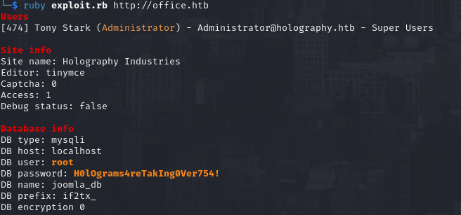

All right, this is cool! Both username displayed doesn't work with the password on the login page and brute force it with hydra would just lock us outside. SMB turned to be usefull using a long list of username (provided by SecList) I was able to find a pair of credentials that worked!

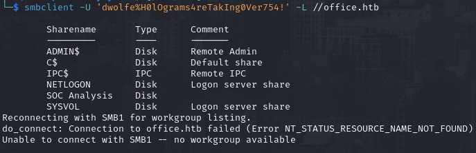

Inside `SOC Analysis` share we have a PCAP file with 1900 packets captured, interesting. I used [BustaPcap](https://github.com/abaker2010/bustaPcap) for some static analysis, this is pretty usefull especially for long PCAP and get an overview of the contents. Interesting we have some Kerberos Traffic in a small percentage

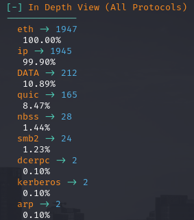

There are just 2 packets which are AS-REQ data so they contins an hash that we can crack (cipher value). The hash is of the `tstark` user which belong to `office.htb` and use the mode 18 of kerberos (`-m 19900` on hashcat)

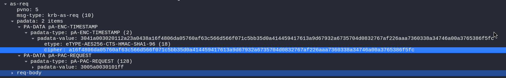

After setting the right hash, hashcat would able to retrieve the plaintext

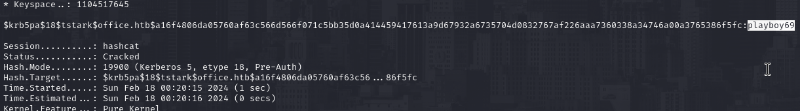

This password work with `administrator` user on the admin dashboard, now is pretty straightforward and common with Joomla. I am going to cange a template php page into a php reverse shell

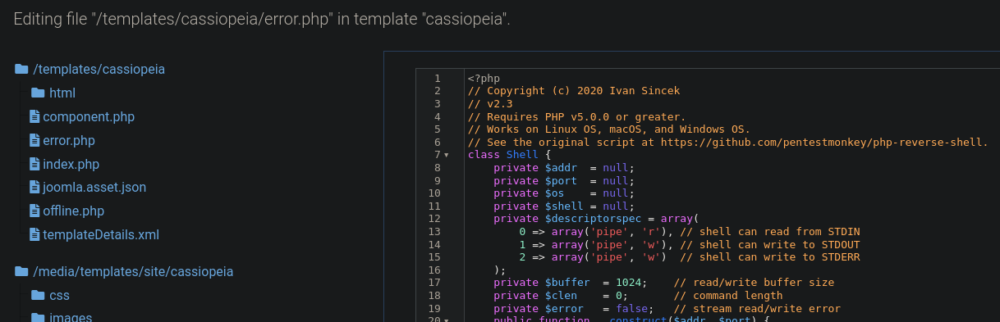

After that just visit `/templates/cassiopeia/error.php` will trigger the reverse shell

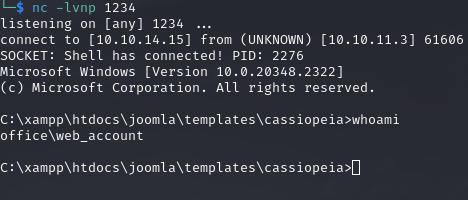

We are inside as the service account `web_account` so we need to leverage a little more to grab the user flag. But we already have the password for `tstark` taht we retrieved thanks the kerberos hash on the PCAP file so we can use `RunAScs.exe` to read the FLAG

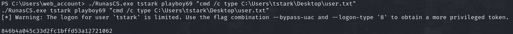

Now I used the same approach to have areverse shell as tstark and continue my journey on this machine.

   

# PRIVILEGE ESCALATION
The machine from the inside looks pretty empty, no interesting software installed, scheduled task or something that catch my eye for a potential privilege escalation. MySQL (xampp) can be accessed just within the machine itself so I tried to use the credential I've found before, luckly it worked (I'v spawned a [ConPtyShell](https://github.com/antonioCoco/ConPtyShell?tab=readme-ov-file) to achieve full powershell interaction)

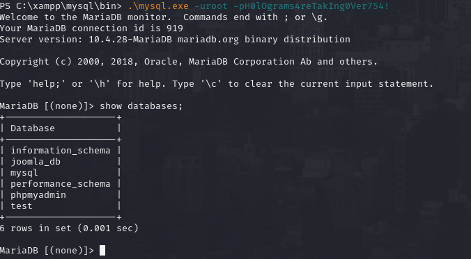

After a few research I was able to abus User Defined Functions (UDF) and get `NT AUTHORITY` access, first we need to locate the plugins directory used by MySQL in order to know where we have to upload our malicious DLL

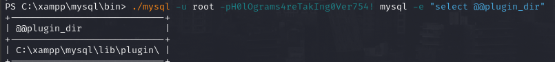

In that directory I have uploaded the DLL in [this repository](https://github.com/koparmalbaris/MySQL-UDF-Exploitation) (`sys_64.dll` version) which also include a cheatsheet of the command we need to use to load the UDF into mysql, `sys_eval` is the one I am pointing to so we can execute OS command.

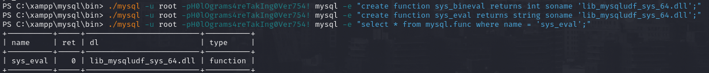

I tried with a simple `whoami /all` and we are impersonating again `web_account` user but with the infamous **<u>SeImpersonatePrivilege</u>** privilege enabled, this is perfect!

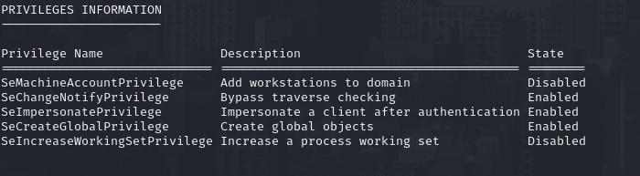

I get reverse shell on this uer and simply used run [GodPotato](https://github.com/BeichenDream/GodPotato) to execute command as root!

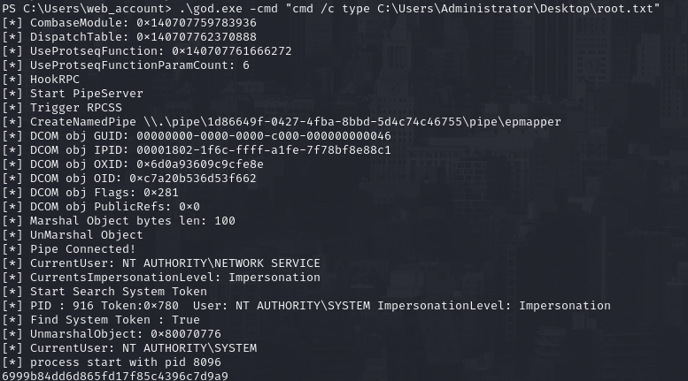
