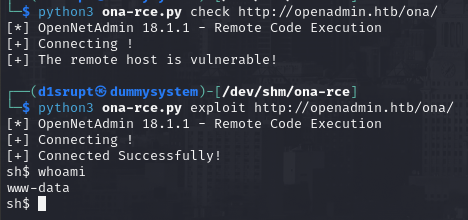

# PORT SCAN
* **22** &#8594; SSH
* **80** &#8594; HTTP (APACHE 2.4.29)

   

# ENUMERATION & USER FLAG
Port 80 welcome us with the <u>default Apache2 page</u> but with a littlebit of dirbusting I discovered the `/music` endpoint which apparently host the actual website!

Same thing with `/artwork`, we have a plenty of website on different endpoint (apparently). Pretty peculiar.
All the website pages are static and nothing where I can interract (upload, register, login or blog. NOTHING!) so I decide to google `Open Admin` and I found that exist a fork of [Laravel](https://open-admin.org/) with this name.
While I was checking the pages I found that the button **<u>Login</u>** points to something different `/ona`.

I was pretty near with my "intuition", the adminpanel is not the one I found before but [OpenNetAdmin](https://opennetadmin.com/) and we have a dialog box telling us the current version `v18.1.1`. Jackpot!
This version is weel-known because is vulnerable to [RCE](https://github.com/amriunix/ona-rce).

Cool now we need to made some horizzontal movement on `jimmy` or `joanna` user so we need to dig some more. [Here](https://opennetadmin.com/forum_archive/4/t-85.html) (after ending the machine I noted is the same link on the official walkthrough but I swear I didn't read it loool) I found where the standard location of the database configuration file where hardcoded credential are stored

This password is exactly what a boy would use so I tried to use it with SSH on user `jimmy`. It worked and now we have a persistent and robust user shell. Unluckly we have no user flag in the home directory so we have to move a little bit more. We have know access to `/var/www/internal` where the **<u>index.php</u>** contains something some hardcoded hash 

I used hashcat (with `best64` rule) and the password retrieved is **Revealed**...I mean letteraly

The `internal` subdomain should present us with a login page and than retrieve the SSH key but I can't access from the outside so maybe port forwarding is needed. Looking at apache cofnigurations file we know that `internal` is running on port **52846**. Luckly we have access with SSH so we can enable port forwarding without external binaries, finally we have access to the login form

Interesting, now we can crack the password with `john the ripper` (obviously extracting the hash with **ssh2john**)

Now we can decrypt the SSH private key and login as Joanna, the user flag is waiting on her home directory!

   

# PRIVILEGE ESCALATION
Pretty easy compared to the user part, we can use `SUDO` to open a specific file with nano.

When we are inside the editor we need to this combination : `CTRL+R`, `CTRL+X` and execute `reset; bash 1>&0 2>&0`, This should be enough to spawn a root shell!

