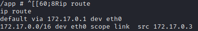

# PORT SCAN
* **22** &#8594; SHH
* **80** &#8594; HTTP (Werkzeug/2.1.2 - Python3)

   

# ENUMERATION & USER FLAG

The webpage run Werkzeug and, like flask, have a debug console but this time is blocked with a pin on **/console**

Usually to get access to the debug console protected by a PIN we need a LFI and read the init python file where the code is stored

We have an uploa feature at **/upcloud**

After the upload the file is stored in the **/upload** directory

On the "`Try Upload Section`" we can upload the source code and inside we have a `.git` folder (bad bad bad)

We have 2 branch <u>public</u> and <u>dev</u>, obviously switch into the **dev branch** and check with some dif the logs and we have some credentials

They don't work with ssh but good to know it in casewe have login form of some sort

Returning back at the Upload feature, I found a way to read file 

And with some perseverance we have the path for the **init file of wekzeug**

What we need now to reverse the pin is : 

1) `/proc/self/cgroup`
2) `/proc/sys/kernel/random/boot_id`
3) `/sys/class/net/eth0/address` &#8594; convert it in decimal (chec the devices using `/proc/net/arp`)

With this variable set we can use some script that can be found online (for instance [here](https://www.daehee.com/werkzeug-console-pin-exploit/)), cool we have access to the debug console 

Probably the webapp is running inside docker wince we are root user, let's get the shell

We are inside a docker environment as previously assumed (`.deckerenv` placeholder file)

Usin IP Route we have the gateway

The port 3000 (of `172.17.0.1`, the victim outside the container) can be accessed so I will sue chisel to port forwarding and check what is running. An instance of **<u>Gitea</u>** is running nd we can use the credentials find before to get access. We have a rsa key pair that we can use to gain access trhough SSH

Gottch'a

   

# PRIVILEGE ESCALATION
There is a cron job running calling this file 

This script just makes a backup of the `dev01` user home directory

We can use [git hooks](https://git-scm.com/book/en/v2/Customizing-Git-Git-Hooks) to abuse it, specifically I have changed the `pre-commit.sample` to this 

Than just renamed `pre-commit` and before the commit the script will be executedas root. Let's wait a few seconds and we have access to our flag (we could do same thing with the private ssh key to gin persistence)

