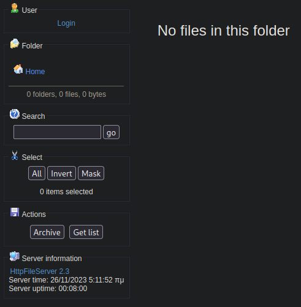

# PORT SCAN
* **80** &#8594; HTP (HttpFileServer 2.3)

   

# ENUMERATION & USER FLAG

This is the website we get when visiting Optimum website running **<U>HttpFileServer</U> (HFS)** service designed for file sharing. The version is `2.3` and we have a public exploit for this

Really cool we can grab this flag really fast running this exploit which trigger an invalid pointer write access through some HTTP header abuse. The command would be a powershell reverse shell command obviously and catched by our netcat listener

Grab this piece of cake flag and move on

   

# PRIVILEGE ESCALATION
The box is hosting a `Windows Server 2012 R2 Standard (6.3.9600)` with some enumeration we have credentials inside AutoLogon

In addition the machine is vulnerable to `MS15-032`, a lack of sanitization of standard handles in windows secondary logon service through a crafted webpage through internet explorer

Mwtasploit have a script ready for us, after spawning a meterpeter session I was free to run the exploit

Really easy!
