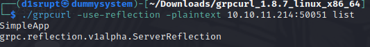
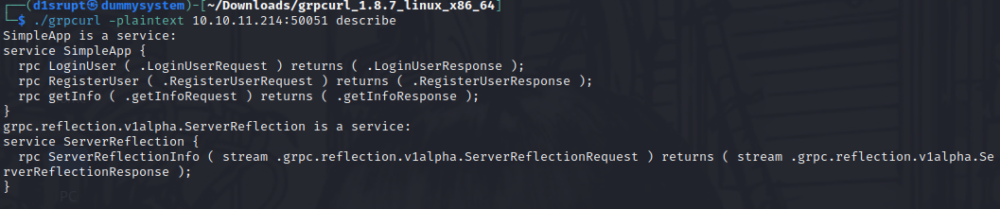
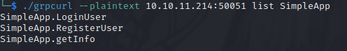
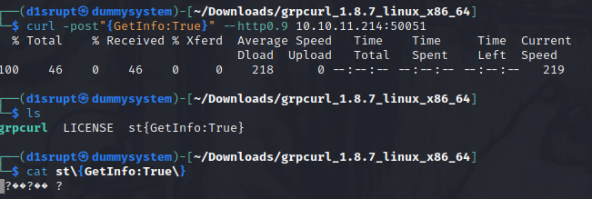
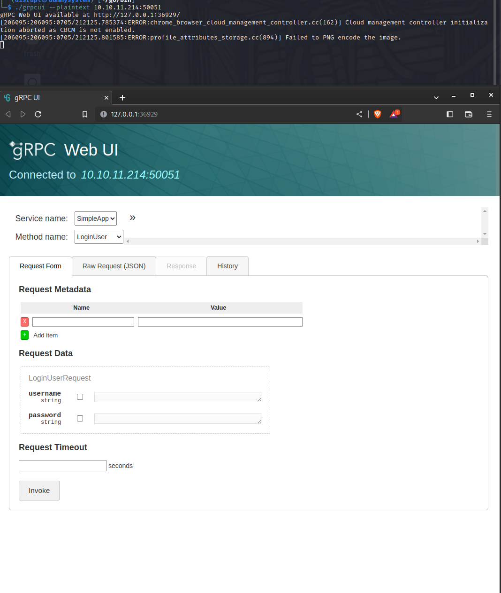
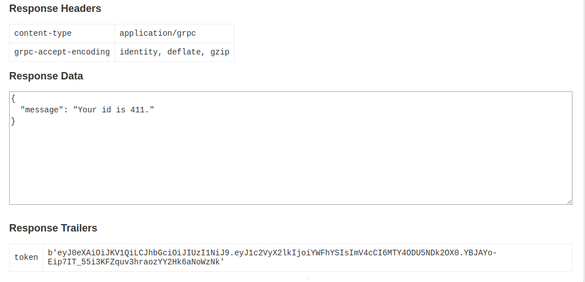
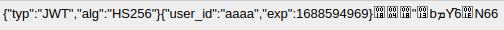
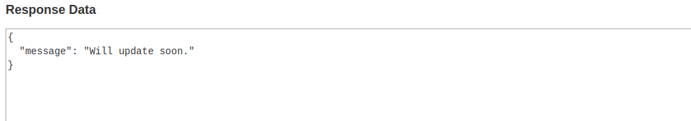
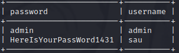
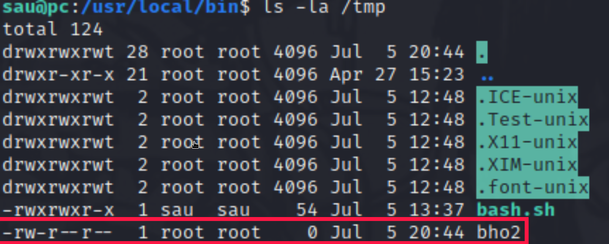

## PORTS
* **22** [SSH]
* **50051** [UNKNOWN]

In my case the **<u>standard nmap scan</u>** and the **<u>sC + sV + -p-</u>** didn't work ("Host seems down") so I had to add the **-Pn** flag to have some results. This could mean a network filter or a firewall is in the middle interfering with the host discovery.

So there is nothing about a webapp (for now) so we need to focus on port **50051** and discover why is open, what is running and how we can use it. I used firefox to access directly to that port and this is what I had


Interesting, I used some comparison tool of different decoder online but nothing interesting, with some quick research the port 50051 is usually connected to **<u>gRPC protocol** (Google Remote Procedure Call)</u>.

I found this [tool](https://github.com/fullstorydev/grpcurl) that can help me to interface with this protcol



So this is the 2 app running, the last one seems something standard but the first one can help us, with **grpcurl "describe" option** we can get some more info






Let's focus on SimpleApp, we can login, register or get information I would use the last option so we can gain more information about it, using curl should not be hard to get a response



We need to specify the HTTP version otherwise an error will occur and sadly the output is not in plaintext and I can't define the encoding, cool thing is that there is GUI version of grpcurl called **gprcui** let's try using it and see if the output would be more clear, the standard usage is simple `grpcui --plaintex [IP]:[PORT]`



Ok, this tool is awsome make the use of gprcurl simplier and encode automatically so we can interract with the API now.

The `.getInfo` return me an error telling me no token as been set, so I decided to create an account with `RegisterUser` and than use `LoginUser` to access and here we are



So I decoded the token and is just the base64 encoding of the following JWT 



Than for the `getInfo` we just need to specify the ID as parameter and on "MetaData" section set the value `token:[TOKEN_VALUE]` and the output is quite strange....



So the flow is right but something is wrong, I tried to fuzz some dummy credentials manually and `admim:admin` worked so let's try to get the info with this token and....same output (uff). I took some time to think about what's wrong here I thought about an **SQL Injection** but idk how to exploit it. My bad here but I look at some writeup and there was this method to make the SQL injection through `SQLmap` : I just need to save the request file (.req) and use that as paramter of SQLmap flag `-r`, cool I learned a new thing.

The results of SQLmap tell us that the dbms is **SQLite** and the injectable parameter is **id** and here is the full dump, we got some ssh credentials



Let's get inside and with linpeas I found this process going on


The `app.py` is what we where interfacing through gRPC so is nothing that can help us with priv-esc.

More curios about `pyload` which is a download manager written in python I checked the version is `0.5.0` and pretty interesting is there is a RCE affecting this version (**[CVE-2023-0297](https://github.com/bAuh0lz/CVE-2023-0297_Pre-auth_RCE_in_pyLoad#exploit-code)**)

I've tried a simple command to be sure it works and yes here we are, we can execute RCE with root privilege

```
`curl -i -s -k -X $'POST' \
     --data-binary $'jk=pyimport%20os;os.system(\"touch%20/tmp/bho2");f=function%20f2(){};&package=xxx&crypted=AAAA&&passwords=aaaa' \
     $'http://127.0.0.1:8000/flash/addcrypted2'
```



Now the process is simple, I've just injected the command `chmod u+x+s /bin/sh` and than execute `/bin/sh -p`, et voila' we got access as **root**. Machine completed!
