# PORT SCAN
* **80** &#38594; HTTP (IIS 10.0)

   

# ENUMERATION & USER FLAG
The webpage is static and without outlinks or interaction at all

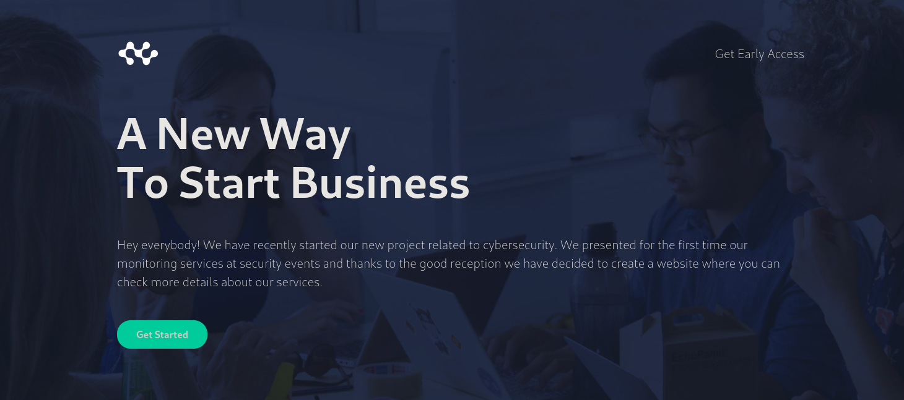

With `ffuf` I was able to discover the `dev.pov.htb` subdomain which is pretty pretty interesting and redirect to a default path `/portfolio/default.aspx`

This is the first time I saw something like that, we can download the CV of he author (shoutout to the box creator) and can be a good hints of the technology we can find inside

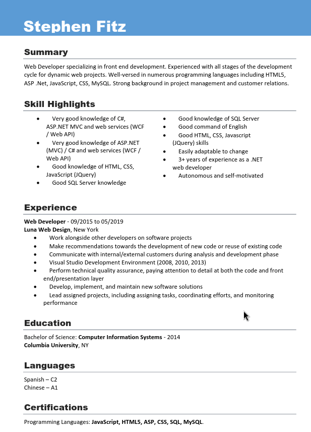

I can try to see if we can redirect the download to somehing on my local machine and use responder to get the hash. After changing the `file` parameter the hash pop up on responder interface 

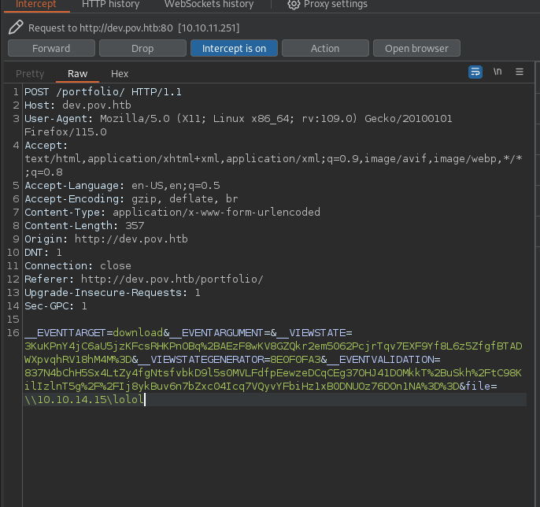

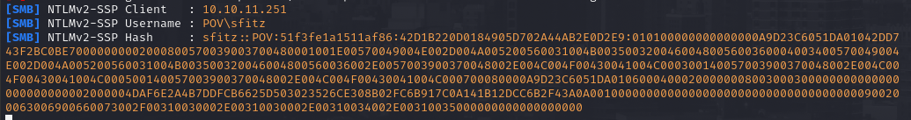

There is no way to crack the hash but we have a username, cool enough! Playing a little more with this function I was able to perform some **<u>LFI</u>**!

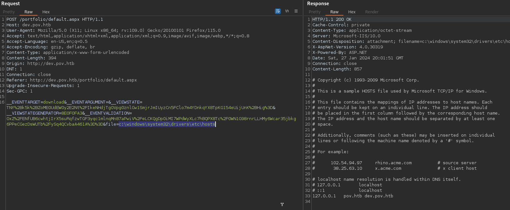

With this method I was able to retrieve the content of `..\web.config`

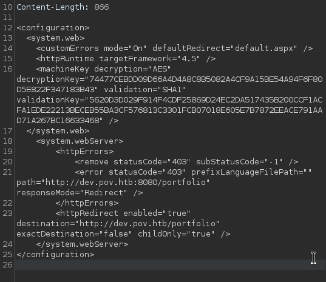

Cool stuff is that we have decryptio, validation key and use SHA1 so maybe we can exploit the **<u>VIEWSTATE</u>** parameter (makes sense, Point-of-View....viewstate, bingo!). thanks to the [HackTricks blog](https://book.hacktricks.xyz/pentesting-web/deserialization/exploiting-__viewstate-knowing-the-secret) I was able to create the malicious viewstate to gain RCE. First of all I have targeted the `/contact.aspx` page using that as `--path=/portfolio/contact.aspx` argument of **<u>ysoserial</u>**, for the rest we just need to specify the 2 keys and alghorithm using for decoding/validation. We have all we need the command I used is a powershell command returned from `web delivery module` of metasploit

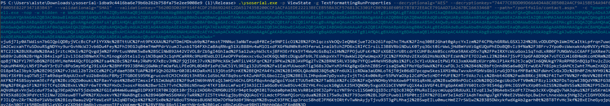

Just replace this **VIEWSTATE** with the one on the web request and we shoudl be fine!

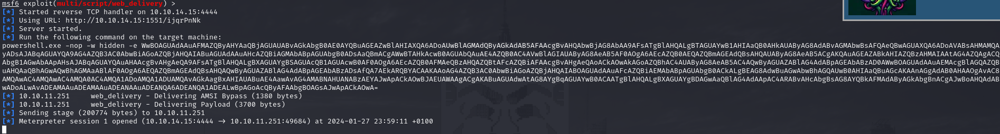

After that the meterpeter shell will popup as the user we have previously identified but no flag with this user. It didn't take much before I identify a xml file located at `/Documents/connection.xml` containing something I am pretty familiar with (all the windows machine I have done returned usefull!)

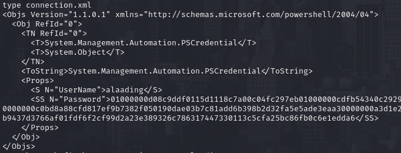

This are a predefined PS Credential whih we can "import" through a default PowerShell command `import-Clixml -Path connection.xml` and after that we can execute command with the usual `Invoke-Command -ComputerName localhost -ScriptBlock {}`. When I used the powershell command to spawn another meterpeter shell it worked and we are free to grab the user flag!

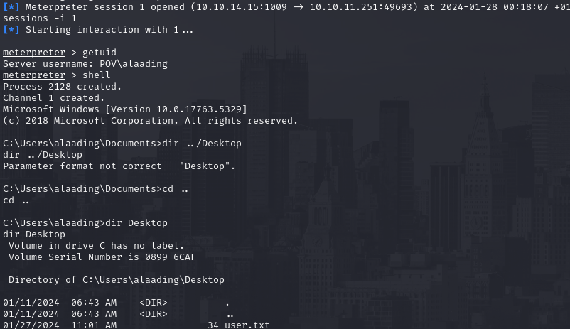

   

# PRIVILEGE ESCALATION

We need to enable the `SeDebugPrivilege` in order to migrate our session in a high privilege process environment and root the box, so I used [RunasCs](https://github.com/antonioCoco/RunasCs/releases) to spawn a meterpeter shell where the privilege we have targeted is now enabled

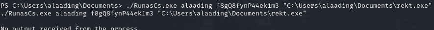

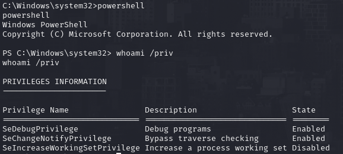

With this privilege we can now migrate on every process we like, a common choice is `winlogon.exe` which always run as system! 

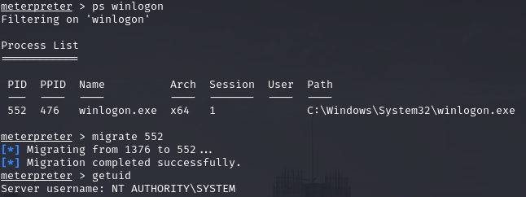

