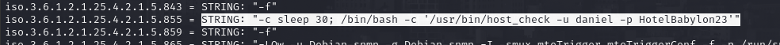
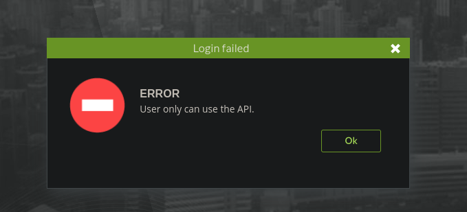
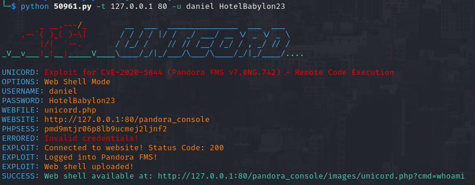
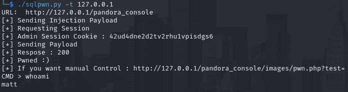
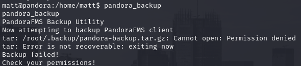
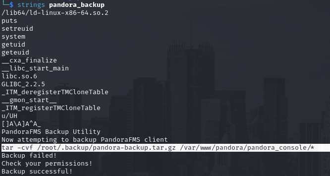
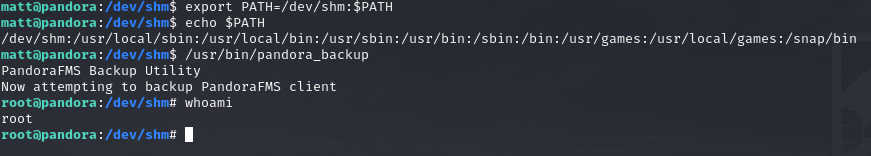

# PORT SCAN 
* **22** &#8594; SSH
* **80** &#8594; HTTP (APACHE 2.4.41)  
* **161** &#8594; SNMP

   

# ENUMERATION & USER FLAG
The webpage is just a brochure, no subdomains, no dirbusting results and nothing to interact with. Pretty bad so I decided to run a UDP port scan while I was searching for a gap or vulnerability. Port **<u>161</u>** is open and we can use `snmpwalk` and extract some public community string and as usual we have some sensitive data exfiltration

Using this credentials allows to get access as `daniel` through SSH but we need to impersonate `matt` if we want to grab the user flag. Inside `/var/www` there is a subdomain called `pandora` but we can't access from the outside.

So I take a look at apache configuration files and the (target) local port 80 is using this specific subdomain which is interesting because there multiple file called `console`.
So I used SSH port forwarding to get alook on my own browser

The version of PandoraFM is `v7.0NG.742`, I used te daniel credentials and something curios happened

Well, the good news is that the credentials are valid but we can abuse some well known vulnerabilities and a [SQL injection](https://nvd.nist.gov/vuln/detail/CVE-2021-32099) is possibile!

This [PoC](https://github.com/shyam0904a/Pandora_v7.0NG.742_exploit_unauthenticated) leverage the attack to spawn an interactive shell and this time we are `matt`

I just leverage my shell with python and grab the flag inside the matt folder!

   

# PRIVILEGE ESCALATION
There is a costum binary that can be run with SUID bit called `pandora_backup`

I moved it on my local machine becuase `strings` was not present on the target so I can take a look at how is structured, pretty good because it call `tar` without the absolute path

Interesting we can do some PATH hijacking and create our own version of `tar` that wil spawn a interactive shell in `/dev/shm` than change the PATH enviroment variable to `/dev/shm:$PATH` and than just calling the `pandora_backup` to receive the shell as root!

> You need to import your ssh public keys and login with SSH somehow the simple reverse shell doesn't use the binary with SUID

Rooted!
