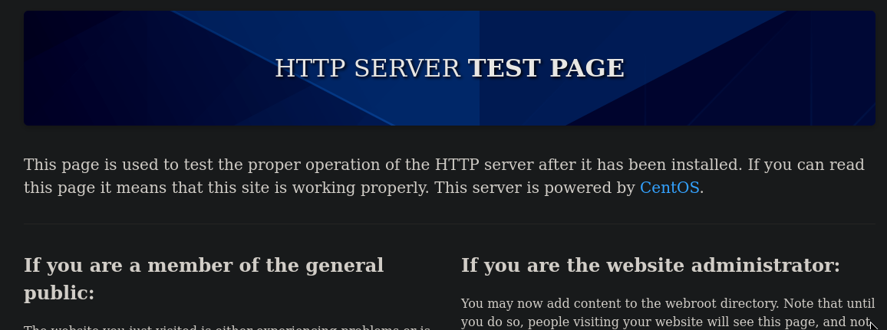
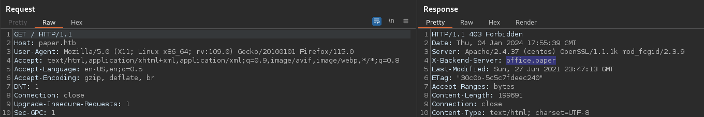
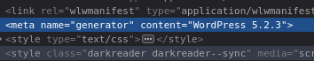
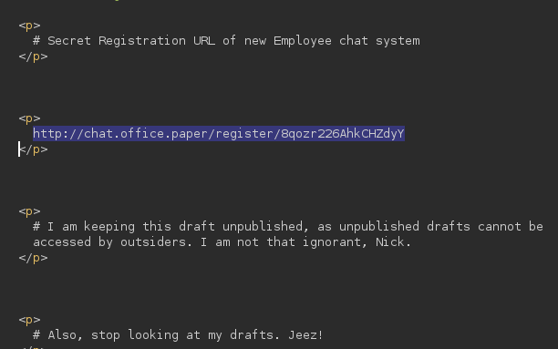
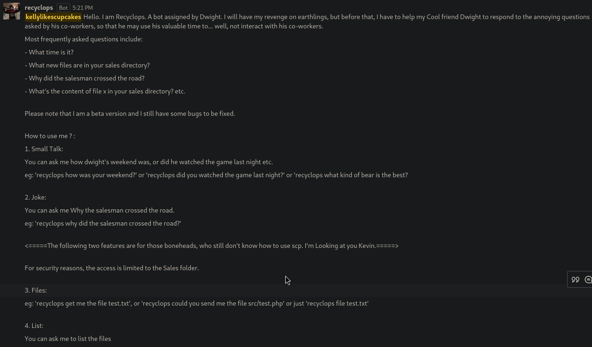
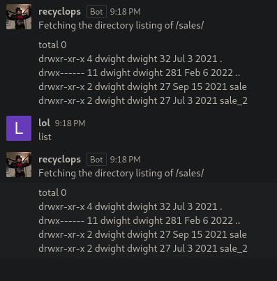
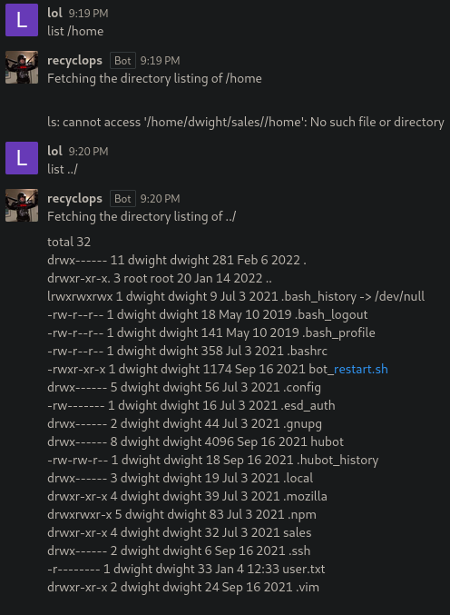
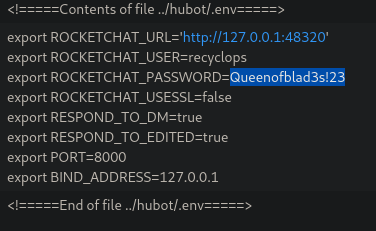
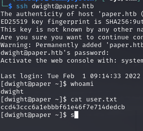
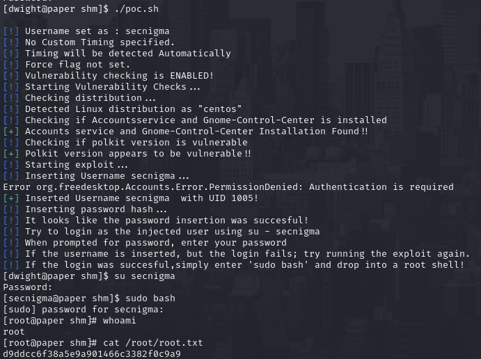

# PORT SCAN

* **22** &#8594; SHH
* **80** &#8594; HTTP (APACHE 2.4.37)
* **443** &#8594; HTTPS (APACHE 2.4.37)

   

# ENUMERATION & USER FLAG

The HTTP service is a **CentOS** test page (same thing on port 443)

Some standard web enumeration return nothing valuable so I decide to look at the response when accessing the webpage and 1 header have a sub domain in it

After adding this to the hosts file we have a better looking website made with WordPress

Looking at the source doe is enough to find the wordpress version

This version is vulnerable to [CVE-2019-17671](https://www.exploit-db.com/exploits/47690) where we can view unauthenticated posts

Hell yeah! Wordpress is always full of surpise, now we have a new host and a "secret" link we can access to register to a `rocket.chat` instance and inside there is a bot called **<u>recyclops</u>**

Hell yeah! Interesting

Now let's see if we can perform some OS injection or something similar

The bot to be implemented use [hubot](https://github.com/RocketChat/hubot-rocketchat) (you can see listing the files on the home directory), according to the documentation the configuration file is `.env` so now we can use the command `file` of the bot to retrieve the configuration file and exfiltrate the password

We try to use this password to SSH as `dwight` user and get the first flag

   

# PRIVILEGE ESCALATION
Pretty clean machine just a cronjob that restart the bot during system reboot, the sudo version is a bad signal `1.8.29` vulnerable to [CVE-2021-3560](https://github.blog/2021-06-10-privilege-escalation-polkit-root-on-linux-with-bug/#history) which abuse **<u>polkit</u>**  (use it for dialog box running in the background). Without going too much in details we can trick polkit bypassing credentials request for **<u>D-BUS request</u>** (IPC mechanism) and this [PoC](https://github.com/secnigma/CVE-2021-3560-Polkit-Privilege-Esclation) abuse it create a new local administrator (the basic user we have access is not in sudoers) it can require multiple tries because the time-based nature of the attack

Gotch'a!
