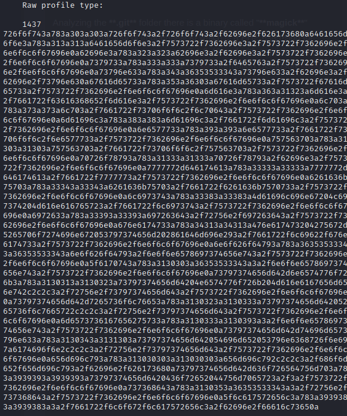

## PORTS
- **22** [SSH]
- **80** [HTTP] nginx 1.18.0 &#8594; /.git

On port 80 just a simple webapp where you can upload a file in order to shrink it (probably a file upload vulnerability can be exploited). Also a login and register form are available.
#
 
I decided to enumarate the **`/.git`** directory, when atry to accessing it error 403 occurs but the file **`/.git/HEAD`** is available and this is the content : `ref: refs/heads/master`.

This is the current branch so when try to access **`/.git/refs/heads/master`** the output is `e1a40beebc7035212efdcb15476f9c994e3634a7` which is the object stored on the HEAD.

I downloaded the object directly from `/.git/objects/e1/a40beebc7035212efdcb15476f9c994e3634a7` and the output is below (first 2 characters are the name of the directory)

For the better understanding of the repository we should have the git folder locally, I used **`git-dumper`** to obtain the directory

Now we can work locally with the .git directory

I've discovered that the site is using **bulletproof** a pghp module for a safe and secure file upload, to prove that I've created a reverse php shell renamed with .png extension and try to upload for the shrink but it failed.
With a non-malicious png the upload succed and save it on the dashboard of the user

Analyzing the **.git** folder there is a binary called "**magick**" (command line tool of imagemagick) which is a PHP extension for processing images, the version is 7.1.0-49 and with a quick search is vulnerable to **CVE-2022-44268** (<u>Information Disclosure</u>)

The vulnerability allow to read a file (if theuser using magick have the permission to do it) and save it on the "shrinked" image.

1) We need to create a malicious PNG with the path of the file we want to read embeeded on it (I used this [PoC](https://github.com/Sybil-Scan/imagemagick-lfi-poc))

2) Just upload the image and save the results of the process provided by the webapp
3) With "**identify**", we can output the format and characteristic of the image and we can find (in HEX) the results of the file reading (same thing can be achived with **exiftool**)

4) Copy the HEX and use python to translate in a human-readable format

  

Cool stuff! with this output we can recover the low-priv user called "**emily**" (also other candidate are "\_laurel") so we can try same procedure to obtain the user flag. Somehow the dafult path of user flag doesn't exist so this is not the right path to obtain the user flag.

From the previous GIT folder enumaration we discovered that the server is using **sqlite**

 

So using the CVE-2022-44268 I was able to retrieve the DB file **`/var/db/pilgrimage`** and we can see that the processed image have the file in HEX

Is a huge string of HEX (makes sense is not a simple text file but a file used as database) so I used a online hex converter to make an overview of the contents

As expected we have evidence that the password for emily is `abigchonkyboi123` and we get access through ssh.
  

Someone left `linpeas.sh` there so I would use it to get some info about the system and try to find a way for privelege escalation.

I've tried the dirty-pipe and CVE-2021-3490 but both of them doesn't work so I decided to move on and take a look at the other info.

In the **processes** section over the simple configuration and automation process one that we can take advantage of.

The things that made me focus on this exact process are 2 :
* Running as **root**
* Is a **costum script**, so have more probability to have some logic errors inside
 

This is the script

1) We have a blacklist of string 
2) with **inotifywait** will controll every creation of file inside the directory where image to shrink are saved and read all the FILES inside
3) extract the filename of the files
4) use binwalk to extract the contents of the files
5) if inside the files there is 1 occurence of 1 word of the blaklist would remove the file

 

Here I took some time to reason, the only thing I pop out with is to abuse somehow the binwalk binary maybe path traversal maybe changing the content of the script (we can't obv we don't have enough permissions). The <u>version of binwalk is **2.3.2**</u> and boom...is vulnerable to RCE through a path traversal

I used searchsploit to find the python script for this CVE

The flow for explotation is quite simple : 
1) Use the pyton script with the parameters of a png file, ip and port of the attacker 
2) The script would create `binwalk\_exploit.png` which would be the malicious file that binwalk should "eat" (open the listener on the decided port)

3) To gain access as root we need to copy this png file in the path where the script is working on the background ("/var/www/pilgrimage.htb/shrunk")

4) After the upload we should gain the reverse shell as root and we can gain the flag

